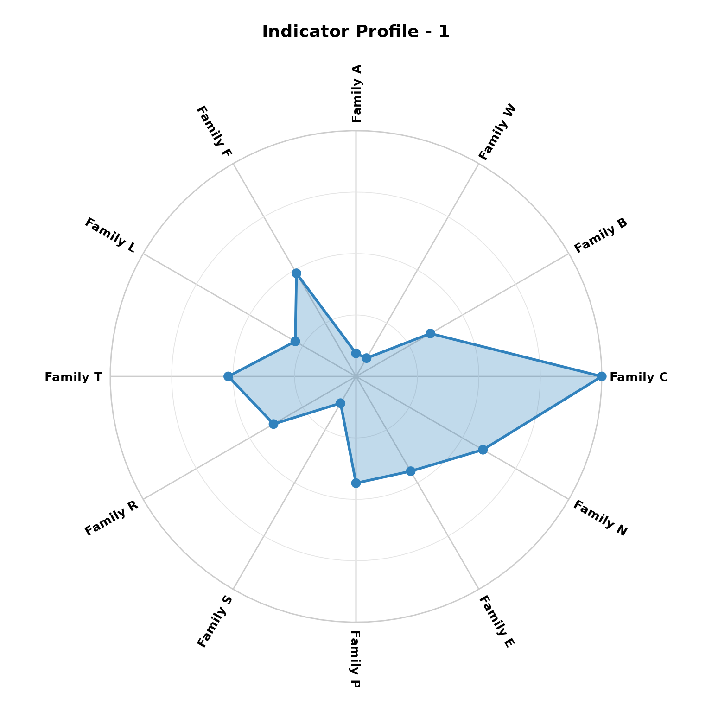
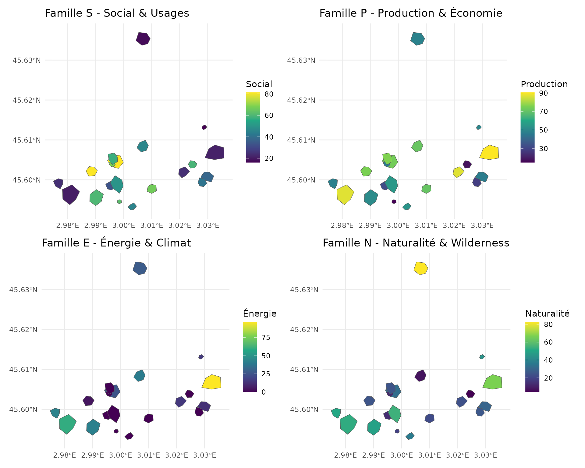
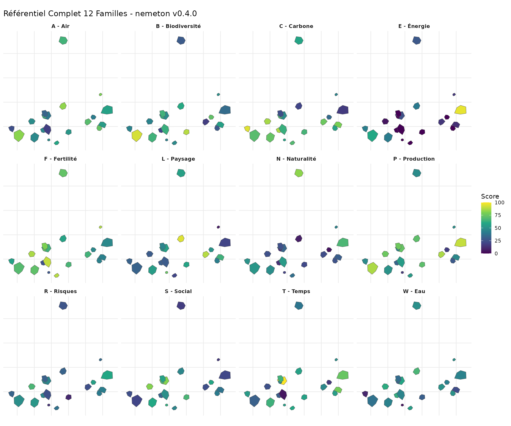
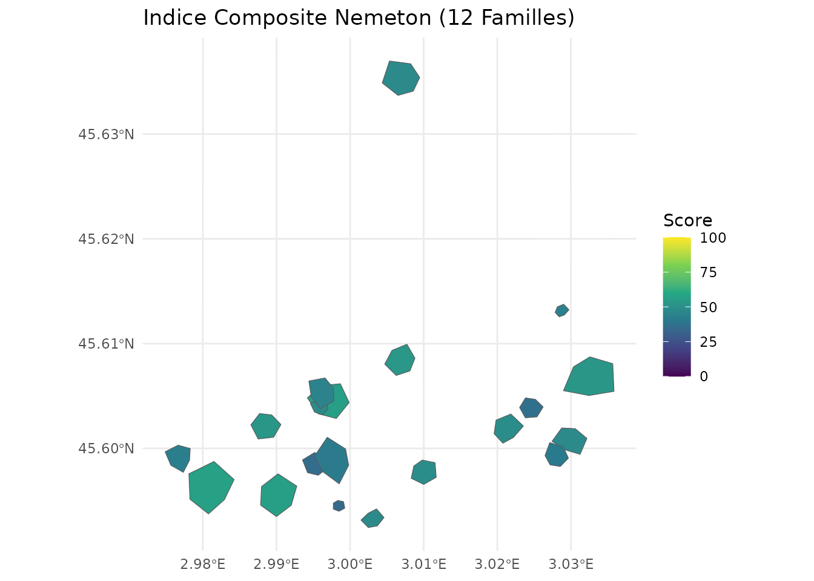
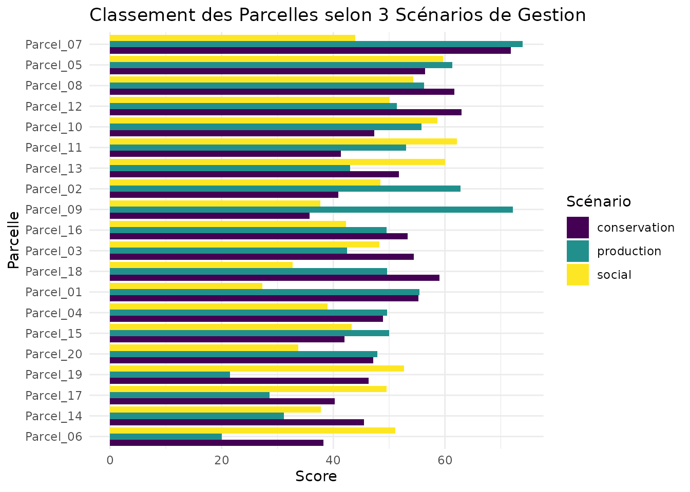

# Référentiel Complet 12 Familles

## Introduction

Avec la version 0.4.0, le package `nemeton` propose un référentiel
complet de **12 familles d’indicateurs** pour l’évaluation
multi-critères des services écosystémiques forestiers. Cette vignette
démontre l’utilisation de l’ensemble du référentiel avec le jeu de
données étendu `massif_demo_units_extended`.

### Les 12 Familles

| Code  | Famille                 | Indicateurs                                          | Version |
|-------|-------------------------|------------------------------------------------------|---------|
| **C** | Carbone & Vitalité      | C1 (biomasse), C2 (NDVI)                             | v0.2.0  |
| **B** | Biodiversité            | B1 (protection), B2 (structure), B3 (connectivité)   | v0.3.0  |
| **W** | Eau                     | W1 (réseau hydro), W2 (zones humides), W3 (TWI)      | v0.2.0  |
| **A** | Air & Microclimat       | A1 (couverture), A2 (qualité air)                    | v0.3.0  |
| **F** | Fertilité des Sols      | F1 (fertilité), F2 (érosion)                         | v0.2.0  |
| **L** | Paysage                 | L1 (fragmentation), L2 (lisière)                     | v0.2.0  |
| **T** | Temps & Dynamique       | T1 (ancienneté), T2 (changements)                    | v0.3.0  |
| **R** | Risques & Résilience    | R1 (incendie), R2 (tempête), R3 (stress)             | v0.3.0  |
| **S** | Social & Usages         | S1 (sentiers), S2 (accessibilité), S3 (proximité)    | v0.4.0  |
| **P** | Production & Économie   | P1 (volume), P2 (productivité), P3 (qualité)         | v0.4.0  |
| **E** | Énergie & Climat        | E1 (bois-énergie), E2 (évitement CO2)                | v0.4.0  |
| **N** | Naturalité & Wilderness | N1 (distance infra), N2 (continuité), N3 (composite) | v0.4.0  |

## Chargement des Données

``` r
library(nemeton)
library(ggplot2)
library(dplyr)
```

``` r
# Le jeu de données étendu avec toutes les 12 familles est disponible via LazyData
# Aperçu des données
head(massif_demo_units_extended)
#> Simple feature collection with 6 features and 81 fields
#> Geometry type: POLYGON
#> Dimension:     XY
#> Bounding box:  xmin: 698041.8 ymin: 6499388 xmax: 702507.7 ymax: 6504159
#> Projected CRS: RGF93 v1 / Lambert-93
#>   parcel_id      forest_type age_class   management surface_ha
#> 1       P01     Futaie mixte    Mature        Mixte   4.989211
#> 2       P02 Futaie résineuse     Moyen   Production   5.867935
#> 3       P03  Futaie feuillue  Surannée Conservation   6.557777
#> 4       P04  Futaie feuillue  Surannée   Production   9.989553
#> 5       P05 Futaie résineuse     Moyen   Production   5.906395
#> 6       P06 Futaie résineuse    Mature   Production   1.048296
#>                         geometry id      name species  area_ha       C1
#> 1 POLYGON ((698299.9 6499928,...  1 Parcel_01    FASY 4.989211 258.9182
#> 2 POLYGON ((701702.2 6500418,...  2 Parcel_02    PIAB 5.867935 228.1229
#> 3 POLYGON ((702240.4 6500270,...  3 Parcel_03    QUPE 6.557777 193.5217
#> 4 POLYGON ((700641.3 6504129,...  4 Parcel_04    ABAL 9.989553 187.2273
#> 5 POLYGON ((699268.2 6500307,...  5 Parcel_05    PISY 5.906395 269.4859
#> 6 POLYGON ((699943.5 6499421,...  6 Parcel_06    QURO 1.048296 277.5413
#>            C2 B1       B2        B3        W1       W2        W3        A1
#> 1  0.03279953  0 2.556369 0.8262637 0.1862923 1.119890  5.089475 0.5293842
#> 2  0.01631406  0 2.387431 0.3583569 0.5393849 8.374436  8.400556 0.6934514
#> 3  0.03085372  2 2.482645 0.6591732 0.4476438 2.896998  6.050851 1.0000000
#> 4  0.00574035  0 2.177975 0.6150537 1.1437187 4.913373  8.110192 0.8866660
#> 5  0.01794201  1 2.455282 0.6392320 1.0737964 3.125075 13.072421 0.5849180
#> 6 -0.02087305  2 1.853111 0.5374482 0.0000000 0.000000  5.470996 0.3000000
#>         A2 F1        F2        L1        L2        T1        T2 R1 R2        R3
#> 1 41.31477  3 15.017516 0.2521898 0.3017459  88.06364 11.324896  1  4 0.3397302
#> 2 54.25911  3 18.802915 0.5743217 0.3891689  82.82317  9.198844  1  2 0.5299777
#> 3 40.10522  3  8.778060 0.3701597 0.4164985 126.47324 14.819030  2  3 0.5582243
#> 4 47.07552  4 16.643021 0.3389725 0.3934184  62.19125  9.117684  1  3 0.3980824
#> 5 48.98128  4 23.180358 0.3539412 0.1889777  10.00000 11.052026  3  3 0.8985756
#> 6 56.56038  2  6.919386 0.3858981 0.4691661 130.42042  6.040972  1  1 0.4755124
#>            S1       S2        S3       P1        P2       P3        E1       E2
#> 1 0.473262981 49.06710  1904.090 383.7837  2.000000 65.29495 0.6332431 1.286294
#> 2 0.004570495 77.80352  1000.000 303.2654 10.150362 84.57162 0.5003880 1.135298
#> 3 0.963719475 51.13707  2866.255 268.2949  4.796243 60.26851 0.5000000 1.037217
#> 4 0.817609054 20.00000  1000.000 250.9696  6.134844 56.03258 0.5000000 1.679691
#> 5 1.162277601 75.09220 15643.478 317.5492  8.705667 73.76151 0.5239562 0.500000
#> 6 1.556537495 70.17784  4351.499  50.0000  4.414458 39.45421 0.5000000 0.500000
#>          N1        N2        N3   C1_norm  C2_norm  B1_norm  B2_norm  B3_norm
#> 1 1823.0542 200.27051  73.73125  91.81550 98.02844  0.00000 41.55096 90.87085
#> 2  670.1452 125.83536  52.89941  78.28157 72.74375  0.00000 35.94171 17.21558
#> 3 1365.9276 101.35012  50.19713  63.07502 95.04404 66.66667 39.10309 64.56840
#> 4 2734.2239 384.00619 100.00000  60.30875 56.52626  0.00000 28.98713 57.62336
#> 5  628.5385 238.93704  46.84107  96.45981 75.24062 33.33333 38.19456 61.42937
#> 6 1259.2921  20.07441  37.03275 100.00000 15.70780 66.66667 18.20065 45.40713
#>     W1_norm  W2_norm   W3_norm   A1_norm   A2_norm F1_norm  F2_norm   L1_norm
#> 1  9.782561 10.45221  9.242271  32.76917 15.769170      50 63.53406  10.97026
#> 2 28.324119 78.16072 46.156887  56.20735 83.462924      50 79.54881 100.00000
#> 3 23.506618 27.03841 19.960465 100.00000  9.443733      50 37.13702  43.57440
#> 4 60.058825 45.85774 42.919675  83.80943 45.895638      75 70.41103  34.95499
#> 5 56.387074 29.16711 98.242638  40.70258 55.861977      75 98.06830  39.09197
#> 6  0.000000  0.00000 13.495779   0.00000 95.497643      25 29.27359  47.92413
#>     L2_norm  T1_norm  T2_norm R1_norm R2_norm   R3_norm     S1_norm  S2_norm
#> 1  51.69377 57.29425 50.93189       0      75  21.27261  30.4048558 36.33387
#> 2  76.91820 53.44804 39.76386       0      25  48.07374   0.2936322 72.25440
#> 3  84.80367 85.48470 69.28638      25      50  52.05299  61.9143116 38.92133
#> 4  78.14431 38.30539 39.33753       0      50  29.49298  52.5274243  0.00000
#> 5  19.15645  0.00000 49.49852      50      50 100.00000  74.6707102 68.86525
#> 6 100.00000 88.38171 23.17574       0       0  40.40094 100.0000000 62.72230
#>      S3_norm  P1_norm   P2_norm   P3_norm    E1_norm  E2_norm   N1_norm
#> 1   6.174013 79.52972   0.00000  63.53244 48.4520928 37.35401  66.05463
#> 2   0.000000 60.34486 100.00000 100.00000  0.1410856 30.18071  23.10333
#> 3  12.744614 52.01252  34.30821  54.02344  0.0000000 25.52125  49.02451
#> 4   0.000000 47.88446  50.73203  46.00991  0.0000000 56.04287 100.00000
#> 5 100.000000 63.74822  82.27447  79.54946  8.7113699  0.00000  21.55329
#> 6  22.887318  0.00000  29.62394  14.64700  0.0000000  0.00000  45.05183
#>     N2_norm   N3_norm family_C family_B  family_W family_A family_F family_L
#> 1 24.049640  62.55485 94.92197 44.14061  9.825682 24.26917 56.76703 31.33202
#> 2 14.560032  32.85982 75.51266 17.71910 50.880574 69.83514 64.77440 88.45910
#> 3 11.438453  29.00781 79.05953 56.77938 23.501831 54.72187 43.56851 64.18903
#> 4 47.473781 100.00000 58.41750 28.87016 49.612081 64.85253 72.70551 56.54965
#> 5 28.979168  24.22387 85.85022 44.31909 61.265609 48.28228 86.53415 29.12421
#> 6  1.076754  10.24246 57.85390 43.42482  4.498593 47.74882 27.13680 73.96207
#>   family_T family_R family_S family_P  family_E family_N
#> 1 54.11307 32.09087 24.30425 47.68739 42.903050 50.88637
#> 2 46.60595 24.35791 24.18268 86.78162 15.160900 23.50773
#> 3 77.38554 42.35100 37.86009 46.78139 12.760627 29.82359
#> 4 38.82146 26.49766 17.50914 48.20880 28.021436 82.49126
#> 5 24.74926 66.66667 81.17865 75.19072  4.355685 24.91877
#> 6 55.77872 13.46698 61.86987 14.75698  0.000000 18.79035
```

## Créer les Indices de Famille

Le système de famille permet d’agréger les indicateurs individuels en
indices synthétiques par famille :

``` r
# Créer tous les indices de famille (12 familles)
# create_family_index() détecte automatiquement toutes les familles par préfixe
result <- create_family_index(massif_demo_units_extended)

# Afficher les indices de famille
result |>
  sf::st_drop_geometry() |>
  select(name, starts_with("family_")) |>
  head()
#>        name family_C family_B  family_W family_A family_F family_L family_T
#> 1 Parcel_01 94.92197 44.14061  9.825682 24.26917 56.76703 31.33202 54.11307
#> 2 Parcel_02 75.51266 17.71910 50.880574 69.83514 64.77440 88.45910 46.60595
#> 3 Parcel_03 79.05953 56.77938 23.501831 54.72187 43.56851 64.18903 77.38554
#> 4 Parcel_04 58.41750 28.87016 49.612081 64.85253 72.70551 56.54965 38.82146
#> 5 Parcel_05 85.85022 44.31909 61.265609 48.28228 86.53415 29.12421 24.74926
#> 6 Parcel_06 57.85390 43.42482  4.498593 47.74882 27.13680 73.96207 55.77872
#>   family_R family_S family_P  family_E family_N
#> 1 32.09087 24.30425 47.68739 42.903050 50.88637
#> 2 24.35791 24.18268 86.78162 15.160900 23.50773
#> 3 42.35100 37.86009 46.78139 12.760627 29.82359
#> 4 26.49766 17.50914 48.20880 28.021436 82.49126
#> 5 66.66667 81.17865 75.19072  4.355685 24.91877
#> 6 13.46698 61.86987 14.75698  0.000000 18.79035
```

## Visualisation Radar 12-Axes

Le radar 12-axes permet de visualiser le profil complet d’une parcelle
sur l’ensemble des 12 familles :

``` r
# Radar pour la parcelle 1 (toutes les 12 familles)
nemeton_radar(
  result,
  unit_id = 1,
  mode = "family"
)
```



## Analyse Croisée Inter-Familles

### Matrice de Corrélation

``` r
# Calculer les corrélations entre toutes les familles
families_all <- c(
  "family_C", "family_B", "family_W", "family_A",
  "family_F", "family_L", "family_T", "family_R",
  "family_S", "family_P", "family_E", "family_N"
)

correlations <- compute_family_correlations(result, families = families_all)

# Visualiser la matrice de corrélation
plot_correlation_matrix(correlations)
```


### Hotspots Multi-Critères

Identifier les parcelles qui excellent simultanément sur plusieurs
familles :

``` r
# Hotspots pour conservation (C, B, N)
hotspots_conservation <- identify_hotspots(
  result,
  families = c("family_C", "family_B", "family_N"),
  threshold = 0.7,
  min_families = 2
)

# Hotspots pour production durable (P, C, E)
hotspots_production <- identify_hotspots(
  result,
  families = c("family_P", "family_C", "family_E"),
  threshold = 0.7,
  min_families = 2
)

# Hotspots pour services sociaux (S, A, L)
hotspots_social <- identify_hotspots(
  result,
  families = c("family_S", "family_A", "family_L"),
  threshold = 0.7,
  min_families = 2
)

# Afficher les hotspots
table(hotspots_conservation$is_hotspot)
#> 
#> TRUE 
#>   20
table(hotspots_production$is_hotspot)
#> 
#> TRUE 
#>   20
table(hotspots_social$is_hotspot)
#> 
#> FALSE  TRUE 
#>     1    19
```

## Cartographie Multi-Familles

### Familles Nouvelles (v0.4.0)

``` r
# Visualiser les nouvelles familles S, P, E, N
library(patchwork)

p_social <- ggplot(result) +
  geom_sf(aes(fill = family_S)) +
  scale_fill_viridis_c(name = "Social") +
  labs(title = "Famille S - Social & Usages") +
  theme_minimal()

p_production <- ggplot(result) +
  geom_sf(aes(fill = family_P)) +
  scale_fill_viridis_c(name = "Production") +
  labs(title = "Famille P - Production & Économie") +
  theme_minimal()

p_energy <- ggplot(result) +
  geom_sf(aes(fill = family_E)) +
  scale_fill_viridis_c(name = "Énergie") +
  labs(title = "Famille E - Énergie & Climat") +
  theme_minimal()

p_naturalness <- ggplot(result) +
  geom_sf(aes(fill = family_N)) +
  scale_fill_viridis_c(name = "Naturalité") +
  labs(title = "Famille N - Naturalité & Wilderness") +
  theme_minimal()

(p_social + p_production) / (p_energy + p_naturalness)
```



### Toutes les Familles

``` r
# Créer une facette pour toutes les 12 familles
result_long <- result |>
  sf::st_drop_geometry() |>
  tidyr::pivot_longer(
    cols = starts_with("family_"),
    names_to = "famille",
    values_to = "valeur"
  ) |>
  left_join(
    result |> select(name, geometry),
    by = "name"
  ) |>
  sf::st_as_sf()

# Labels des familles pour la facette
family_labels <- c(
  family_C = "C - Carbone",
  family_B = "B - Biodiversité",
  family_W = "W - Eau",
  family_A = "A - Air",
  family_F = "F - Fertilité",
  family_L = "L - Paysage",
  family_T = "T - Temps",
  family_R = "R - Risques",
  family_S = "S - Social",
  family_P = "P - Production",
  family_E = "E - Énergie",
  family_N = "N - Naturalité"
)

ggplot(result_long) +
  geom_sf(aes(fill = valeur)) +
  facet_wrap(~famille, ncol = 4, labeller = labeller(famille = family_labels)) +
  scale_fill_viridis_c(name = "Score") +
  labs(title = "Référentiel Complet 12 Familles - nemeton v0.4.0") +
  theme_minimal() +
  theme(
    strip.text = element_text(face = "bold"),
    axis.text = element_blank(),
    axis.ticks = element_blank()
  )
```



## Normalisation et Indice Composite

``` r
# Normaliser tous les indicateurs
result_norm <- normalize_indicators(
  result,
  indicators = c(
    paste0("C", 1:2), paste0("B", 1:3), paste0("W", 1:3),
    paste0("A", 1:2), paste0("F", 1:2), paste0("L", 1:2),
    paste0("T", 1:2), paste0("R", 1:3), paste0("S", 1:3),
    paste0("P", 1:3), paste0("E", 1:2), paste0("N", 1:3)
  ),
  method = "minmax"
)

# Créer un indice composite global (toutes familles)
result_composite <- create_composite_index(
  result_norm,
  indicators = families_all,
  weights = rep(1, 12), # Poids égaux pour toutes les familles
  name = "nemeton_index_12"
)

# Visualiser l'indice composite
ggplot(result_composite) +
  geom_sf(aes(fill = nemeton_index_12)) +
  scale_fill_viridis_c(name = "Score", limits = c(0, 100)) +
  labs(title = "Indice Composite Nemeton (12 Familles)") +
  theme_minimal()
```



## Comparaison de Scénarios

``` r
# Créer différents indices pour différents objectifs de gestion

# Scénario 1: Conservation intégrale
composite_conservation <- create_composite_index(
  result_norm,
  indicators = c("family_C", "family_B", "family_W", "family_N"),
  weights = c(0.3, 0.4, 0.15, 0.15),
  name = "conservation"
)

# Scénario 2: Production durable
composite_production <- create_composite_index(
  result_norm,
  indicators = c("family_P", "family_E", "family_F", "family_C"),
  weights = c(0.4, 0.25, 0.2, 0.15),
  name = "production"
)

# Scénario 3: Services sociaux
composite_social <- create_composite_index(
  result_norm,
  indicators = c("family_S", "family_A", "family_L", "family_R"),
  weights = c(0.35, 0.25, 0.2, 0.2),
  name = "social"
)

# Comparer les scénarios
comparison <- result |>
  mutate(
    conservation = composite_conservation$conservation,
    production = composite_production$production,
    social = composite_social$social
  ) |>
  sf::st_drop_geometry() |>
  select(name, conservation, production, social) |>
  tidyr::pivot_longer(cols = -name, names_to = "scenario", values_to = "score")

# Visualiser le classement des parcelles selon les scénarios
ggplot(comparison, aes(x = reorder(name, score), y = score, fill = scenario)) +
  geom_col(position = "dodge") +
  coord_flip() +
  scale_fill_viridis_d() +
  labs(
    title = "Classement des Parcelles selon 3 Scénarios de Gestion",
    x = "Parcelle",
    y = "Score",
    fill = "Scénario"
  ) +
  theme_minimal()
```



## Conclusion

Cette vignette a démontré l’utilisation complète du référentiel 12
familles de nemeton v0.4.0. Le package permet maintenant :

1.  **Évaluation holistique** : Couvre l’ensemble des dimensions des
    services écosystémiques (biophysiques, écologiques, sociaux,
    économiques)
2.  **Flexibilité** : Possibilité de créer des indices composites
    adaptés à différents objectifs de gestion
3.  **Analyse croisée** : Identification des synergies et trade-offs
    entre familles
4.  **Visualisation** : Radars 12-axes, cartes multi-familles, matrices
    de corrélation

Pour aller plus loin, consultez la vignette **“Multi-Criteria
Optimization”** qui présente les outils d’analyse Pareto, de clustering
et de trade-off analysis.

## Références

- Obstétar, P. (2025). *nemeton: Ecosystem Services Assessment for
  Forest Management*. R package version 0.4.0.
- MEA (2005). *Millennium Ecosystem Assessment*. Island Press.
- Boitani, L., et al. (2008). *Wilderness: Earth’s Last Wild Places*.
  Conservation International.
