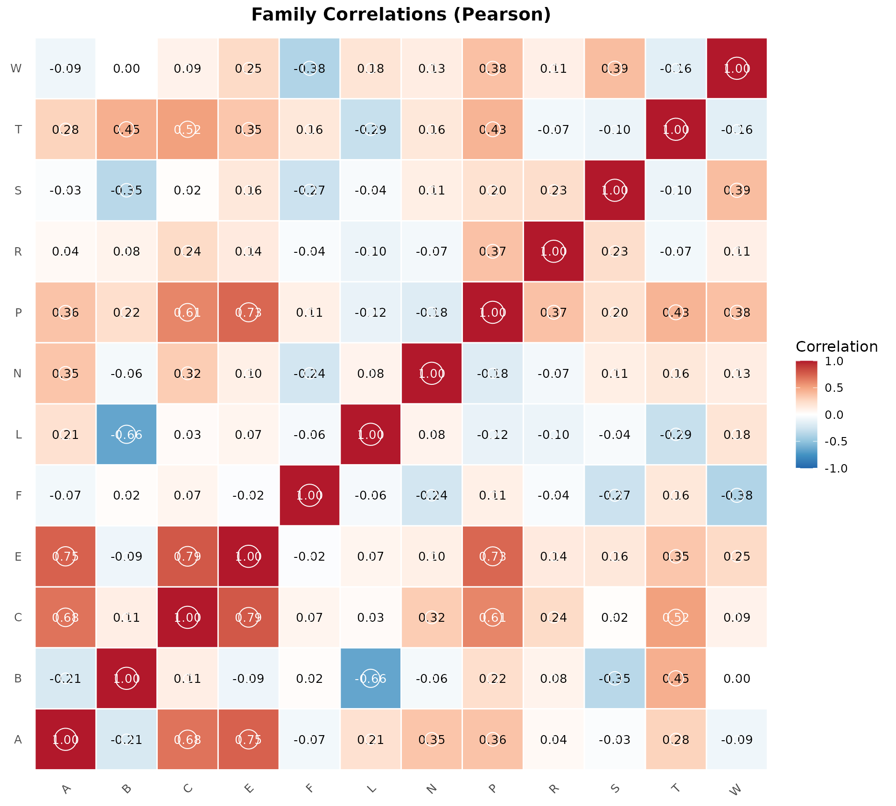
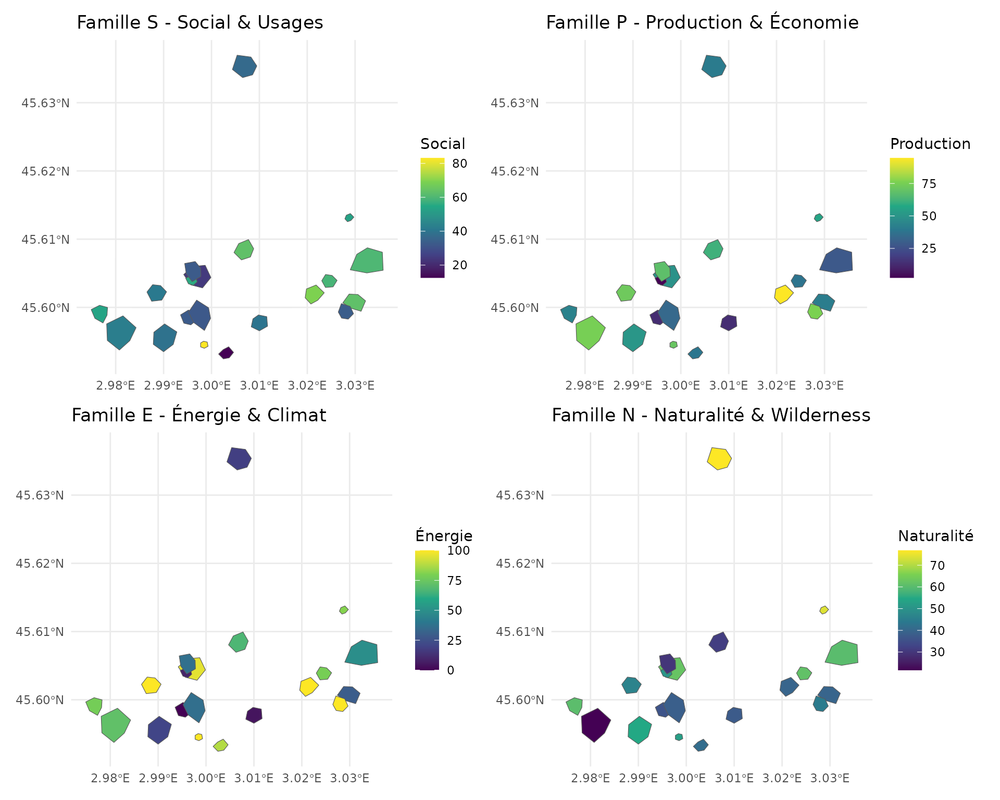
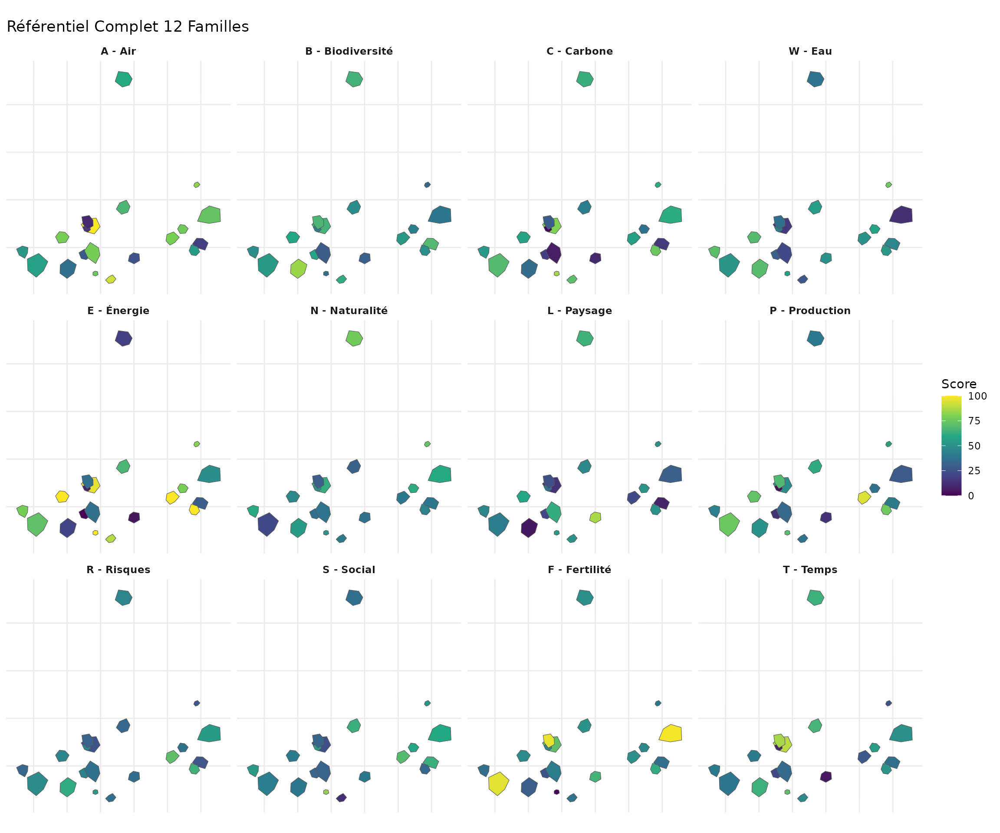
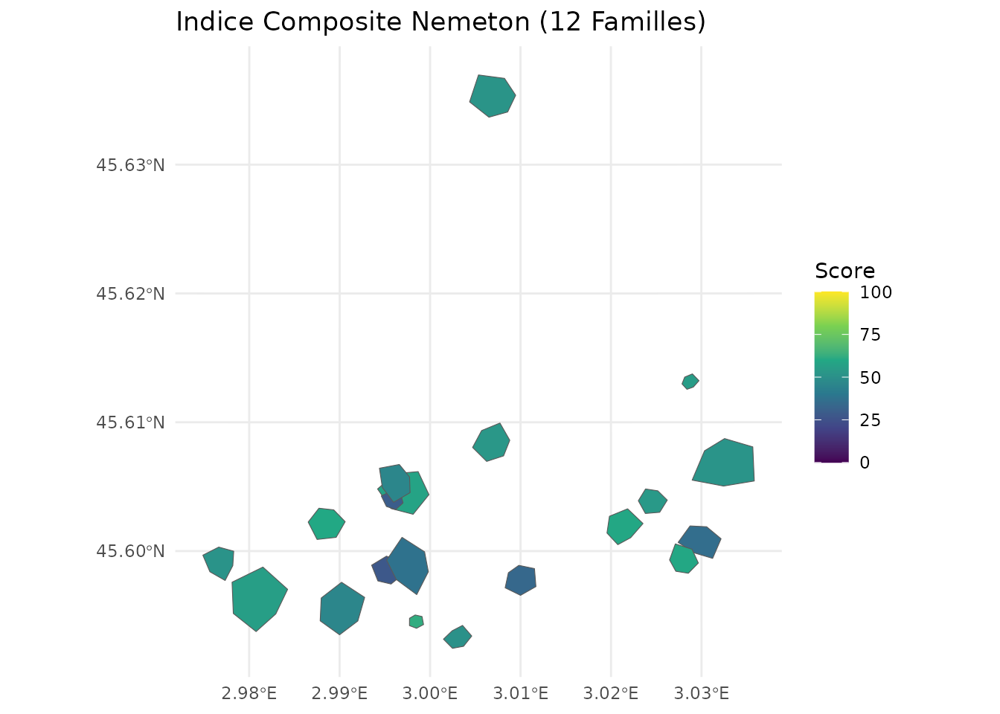
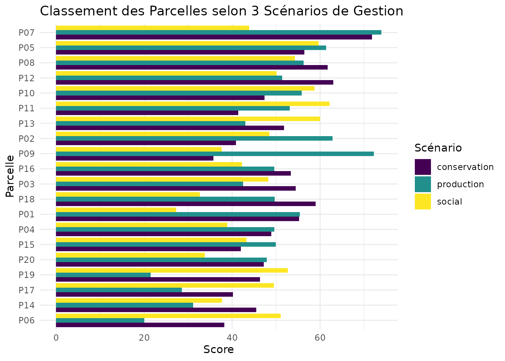

# Référentiel Complet 12 Familles

## Introduction

Le package `nemeton` propose un référentiel complet de **12 familles
d’indicateurs** pour l’évaluation multi-critères des services
écosystémiques forestiers. Cette vignette démontre l’utilisation de
l’ensemble du référentiel avec le jeu de données `massif_demo_units`.

### Les 12 Familles

| Code | Famille | Indicateurs | Nb |
|----|----|----|----|
| **C** | Carbone & Vitalité | C1 (biomasse), C2 (NDVI) | 2 |
| **B** | Biodiversité | B1 (protection), B2 (structure), B3 (connectivité) | 3 |
| **W** | Eau | W1 (réseau hydro), W2 (zones humides), W3 (TWI) | 3 |
| **A** | Air & Microclimat | A1 (couverture), A2 (qualité air) | 2 |
| **F** | Fertilité des Sols | F1 (fertilité), F2 (érosion) | 2 |
| **L** | Paysage | L1 (fragmentation), L2 (lisière), L3 (TVB) | 3 |
| **T** | Temps & Dynamique | T1 (ancienneté), T2 (changements) | 2 |
| **R** | Risques & Résilience | R1 (incendie), R2 (tempête), R3 (stress), R4 (gibier) | 4 |
| **S** | Social & Usages | S1 (sentiers), S2 (accessibilité), S3 (proximité) | 3 |
| **P** | Production & Économie | P1 (volume), P2 (productivité), P3 (qualité) | 3 |
| **E** | Énergie & Climat | E1 (bois-énergie), E2 (évitement CO2) | 2 |
| **N** | Naturalité & Wilderness | N1 (distance infra), N2 (continuité), N3 (composite) | 3 |
|  | **Total** |  | **32** |

## Chargement des Données

``` r

library(nemeton)
library(ggplot2)
library(dplyr)
```

``` r

# Le jeu de données de démonstration
data(massif_demo_units)

# Aperçu des données de base
head(massif_demo_units)
#> Simple feature collection with 6 features and 89 fields
#> Geometry type: POLYGON
#> Dimension:     XY
#> Bounding box:  xmin: 698041.8 ymin: 6499388 xmax: 702507.7 ymax: 6504159
#> Projected CRS: RGF93 v1 / Lambert-93
#>   parcel_id      forest_type age_class   management species age
#> 1       P01     Futaie mixte    Mature        Mixte      09  68
#> 2       P02 Futaie résineuse     Moyen   Production      64  33
#> 3       P03  Futaie feuillue  Surannée Conservation      03 104
#> 4       P04  Futaie feuillue  Surannée   Production      03 166
#> 5       P05 Futaie résineuse     Moyen   Production      61  47
#> 6       P06 Futaie résineuse    Mature   Production      61  79
#>   establishment_year density height  dbh volume strata fertility     climate
#> 1               1958     266   30.3 45.8  557.7      4         1 continental
#> 2               1993     465   30.4 57.5 1541.7      1         3  atlantique
#> 3               1922     128   31.7 41.7  232.7      2         2  atlantique
#> 4               1860     104   29.9 42.6  186.1      2         1  atlantique
#> 5               1979     324   27.5 51.5  779.5      2         2  atlantique
#> 6               1947     281   38.6 76.1 2072.1      2         1  atlantique
#>   surface_ha                       geometry        C1        C2       B1
#> 1   4.989211 POLYGON ((698299.9 6499928,... 271.52938 0.6447576 67.56073
#> 2   5.867935 POLYGON ((701702.2 6500418,... 300.00000 0.6056744 98.28172
#> 3   6.557777 POLYGON ((702240.4 6500270,... 110.16193 0.5285871 75.95443
#> 4   9.989553 POLYGON ((700641.3 6504129,...  93.23794 1.1674470 56.64884
#> 5   5.906395 POLYGON ((699268.2 6500307,... 300.00000 0.6314632 84.96897
#> 6   1.048296 POLYGON ((699943.5 6499421,... 300.00000 0.9846671 18.94739
#>         B2       B3        W1       W2        W3        A1       A2 F1
#> 1 48.05999 46.75415 1.1875729 37.39292 11.262508 100.00000 48.38184  1
#> 2 30.72276 50.79763 0.6421157 22.01976 10.763668 100.00000 73.07190  3
#> 3 65.58163 63.01069 3.7125564 24.07065  5.852777  68.22187 48.53609  2
#> 4 71.39962 64.22587 6.2349453  7.87978  5.333345 100.00000 55.56960  1
#> 5 25.31719 73.97430 5.8682237 21.40946  9.680398 100.00000 72.48102  2
#> 6 53.99485 49.62298 6.5378436  7.18223  9.726250 100.00000 69.09907  1
#>          F2       L1       L2  T1        T2        R1       R2       R3
#> 1 25.019879 57.94143 49.02609  68  7.745998 35.404437 63.67438 10.97556
#> 2  4.315520 32.99353 46.67417  33  7.087985 56.732381 55.62368 75.73944
#> 3 10.886737 41.24140 23.62314 104  2.554360  5.098883 67.18918 37.15549
#> 4 33.100871 88.95956 39.65036 166  5.036521 73.789178 40.38996 33.31784
#> 5 17.500878 49.69644 72.70574  47 10.166800 57.295560 40.61244 44.91239
#> 6  4.733067 40.25978 75.83629  79 16.832511 36.984480 93.48662 35.74830
#>          R4        S1       S2       S3        P1       P2       P3        E1
#> 1 24.564726 0.6142734 80.64513 57354.57  582.4222 4.990758 60.95405 11.132573
#> 2 48.959040 0.7971139 89.99527 76907.49 1000.0000 9.520484 79.39129 15.000000
#> 3  5.968351 2.3380220 82.53975 41461.33  215.6208 6.577982 62.21006  4.219383
#> 4 20.677678 3.6500435 29.52521 13962.24  205.1654 6.470144 62.59759  2.608120
#> 5 24.612972 0.5191291 68.70905 45003.21  780.8117 6.207055 89.59382 15.000000
#> 6 22.180692 4.0203980 71.77637 60740.65 1000.0000 4.884225 87.84672 15.000000
#>          E2       N1       N2          N3   C1_norm   C2_norm   B1_norm
#> 1 24.491660 1961.124 9009.219  70.3324503  89.83192  18.18404  68.69188
#> 2 30.000000 5976.014 5456.947   0.3475665 100.00000  12.06639 100.00000
#> 3  9.282643 1398.919 5089.703  59.2891167  32.20069   0.00000  77.24599
#> 4  5.737864 3606.938 8946.680 100.0000000  26.15641 100.00000  57.57144
#> 5 30.000000 3052.444 8478.450  20.5651477 100.00000  16.10308  86.43282
#> 6 30.000000 7762.738 3903.807  36.2273780 100.00000  71.38969  19.14945
#>    B2_norm  B3_norm   W1_norm    W2_norm   W3_norm   A1_norm   A2_norm F1_norm
#> 1 50.33336 28.62731 13.035855 100.000000 100.00000 100.00000  5.025117       0
#> 2 26.95334 34.97861  5.589419  53.053237  93.59175 100.00000 58.750856     100
#> 3 73.96207 54.16226 47.506263  59.316263  30.50498  30.98201  5.360775      50
#> 4 81.80788 56.07101 81.941248   9.872349  23.83220 100.00000 20.665725       0
#> 5 19.66369 71.38334 76.934862  51.189497  79.67574 100.00000 57.465104      50
#> 6 58.33678 33.13352 86.076335   7.742161  80.26477 100.00000 50.105960       0
#>      F2_norm   L1_norm  L2_norm  T1_norm   T2_norm   R1_norm   R2_norm
#> 1  71.926722  46.37097 45.50493 35.66879  45.88045  44.11912  55.33710
#> 2   0.000000   3.23710 41.29189 13.37580  41.96130  75.16855  43.27603
#> 3  22.828336  17.49732  0.00000 58.59873  14.95889   0.00000  60.60275
#> 4 100.000000 100.00000 28.70996 98.08917  29.74272 100.00000  20.45379
#> 5  45.805793  32.11573 87.92288 22.29299  60.29882  75.98843  20.78710
#> 6   1.450555  15.80015 93.53071 42.67516 100.00000  46.41936 100.00000
#>      R3_norm   R4_norm   S1_norm   S2_norm    S3_norm   P1_norm   P2_norm
#> 1   2.480901 32.323036  2.685042  86.59194  71.857692  58.23268  17.55010
#> 2 100.000000 67.877065  7.844928 100.00000 100.000000 100.00000 100.00000
#> 3  41.901695  5.219342 51.330450  89.30881  48.982723  21.54416  46.44068
#> 4  36.123091 26.657773 88.356628  13.28616   9.403583  20.49838  44.47782
#> 5  53.581750 32.393354  0.000000  69.47563  54.080517  78.07616  39.68908
#> 6  39.782798 28.848373 98.808295  73.87417  76.731251 100.00000  15.61098
#>     P3_norm   E1_norm   E2_norm   N1_norm  N2_norm     N3_norm famille_carbone
#> 1  53.89207  74.21715  81.63887 12.965307 98.39928  70.3324503        54.00798
#> 2  83.57467 100.00000 100.00000 61.069681 57.39465   0.3475665        56.03319
#> 3  55.91417  28.12922  30.94214  6.229248 53.15548  59.2891167        16.10034
#> 4  56.53806  17.38747  19.12621 32.684614 97.67738 100.0000000        63.07820
#> 5 100.00000 100.00000 100.00000 26.040953 92.27251  20.5651477        58.05154
#> 6  97.18730 100.00000 100.00000 82.477298 39.46642  36.2273780        85.69484
#>   famille_biodiversite famille_eau famille_air famille_sol famille_paysage
#> 1             49.21751    71.01195    52.51256  35.9633611       45.937952
#> 2             53.97732    50.74480    79.37543  50.0000000       22.264494
#> 3             68.45678    45.77583    18.17139  36.4141678        8.748662
#> 4             65.15011    38.54860    60.33286  50.0000000       64.354982
#> 5             59.15995    69.26670    78.73255  47.9028964       60.019306
#> 6             36.87325    58.02776    75.05298   0.7252773       54.665429
#>   famille_temporel famille_risque famille_social famille_production
#> 1         40.77462       33.56504       53.71156           43.22495
#> 2         27.66855       71.58041       69.28164           94.52489
#> 3         36.77881       26.93095       63.20733           41.29967
#> 4         63.91594       45.80866       37.01546           40.50475
#> 5         41.29591       45.68766       41.18538           72.58841
#> 6         71.33758       53.76263       83.13790           70.93276
#>   famille_energie famille_naturalite
#> 1        77.92801           60.56568
#> 2       100.00000           39.60397
#> 3        29.53568           39.55795
#> 4        18.25684           76.78733
#> 5       100.00000           46.29287
#> 6       100.00000           52.72370

# Calculer les indicateurs pour la démonstration
# Les indicateurs sont générés de manière synthétique pour les besoins de cette vignette
set.seed(42)
n <- nrow(massif_demo_units)

# Générer des valeurs synthétiques pour tous les indicateurs
massif_demo_units$C1 <- runif(n, 50, 300)  # Biomasse t/ha
massif_demo_units$C2 <- runif(n, 0.3, 0.9)  # NDVI
massif_demo_units$B1 <- runif(n, 0, 100)    # Protection %
massif_demo_units$B2 <- runif(n, 20, 80)    # Structure diversity
massif_demo_units$B3 <- runif(n, 100, 3000) # Distance corridor m
massif_demo_units$W1 <- runif(n, 0, 500)    # Distance hydro m
massif_demo_units$W2 <- runif(n, 0, 50)     # Zones humides %
massif_demo_units$W3 <- runif(n, 2, 15)     # TWI
massif_demo_units$A1 <- runif(n, 40, 95)    # Couverture %
massif_demo_units$A2 <- runif(n, 1, 5)      # Qualité air (ATMO)
massif_demo_units$F1 <- runif(n, 30, 90)    # Fertilité
massif_demo_units$F2 <- runif(n, 0, 50)     # Érosion
massif_demo_units$L1 <- runif(n, 0.1, 0.9)  # Fragmentation
massif_demo_units$L2 <- runif(n, 0, 200)    # Lisière m
massif_demo_units$T1 <- runif(n, 20, 150)   # Ancienneté ans
massif_demo_units$T2 <- runif(n, -20, 20)   # Changement %
massif_demo_units$R1 <- runif(n, 10, 90)    # Risque incendie
massif_demo_units$R2 <- runif(n, 10, 80)    # Risque tempête
massif_demo_units$R3 <- runif(n, 0, 100)    # Stress
massif_demo_units$S1 <- runif(n, 0, 5)      # Accessibilité
massif_demo_units$S2 <- runif(n, 0, 100)    # Sentiers
massif_demo_units$S3 <- runif(n, 0, 50000)  # Proximité m
massif_demo_units$P1 <- runif(n, 50, 500)   # Volume m³/ha
massif_demo_units$P2 <- runif(n, 2, 15)     # Productivité
massif_demo_units$P3 <- runif(n, 30, 90)    # Qualité
massif_demo_units$E1 <- runif(n, 1, 12)     # Bois-énergie
massif_demo_units$E2 <- runif(n, 5, 25)     # Évitement CO2
massif_demo_units$N1 <- runif(n, 100, 5000) # Distance infra m
massif_demo_units$N2 <- runif(n, 0, 100)    # Continuité
massif_demo_units$N3 <- runif(n, 20, 80)    # Naturalité composite
```

## Créer les Indices de Famille

Le système de famille permet d’agréger les indicateurs individuels en
indices synthétiques par famille :

``` r

# Créer tous les indices de famille (12 familles)
# create_family_index() détecte automatiquement toutes les familles par préfixe
result <- create_family_index(massif_demo_units)

# Afficher les indices de famille
result |>
  sf::st_drop_geometry() |>
  select(parcel_id, starts_with("famille_")) |>
  head()
#>   parcel_id famille_carbone famille_biodiversite famille_eau famille_air
#> 1       P01        54.00798             49.21751    71.01195    52.51256
#> 2       P02        56.03319             53.97732    50.74480    79.37543
#> 3       P03        16.10034             68.45678    45.77583    18.17139
#> 4       P04        63.07820             65.15011    38.54860    60.33286
#> 5       P05        58.05154             59.15995    69.26670    78.73255
#> 6       P06        85.69484             36.87325    58.02776    75.05298
#>   famille_sol famille_paysage famille_temporel famille_risque famille_social
#> 1  35.9633611       45.937952         40.77462       33.56504       53.71156
#> 2  50.0000000       22.264494         27.66855       71.58041       69.28164
#> 3  36.4141678        8.748662         36.77881       26.93095       63.20733
#> 4  50.0000000       64.354982         63.91594       45.80866       37.01546
#> 5  47.9028964       60.019306         41.29591       45.68766       41.18538
#> 6   0.7252773       54.665429         71.33758       53.76263       83.13790
#>   famille_production famille_energie famille_naturalite
#> 1           43.22495        77.92801           60.56568
#> 2           94.52489       100.00000           39.60397
#> 3           41.29967        29.53568           39.55795
#> 4           40.50475        18.25684           76.78733
#> 5           72.58841       100.00000           46.29287
#> 6           70.93276       100.00000           52.72370
```

## Visualisation Radar 12-Axes

Le radar 12-axes permet de visualiser le profil complet d’une parcelle
sur l’ensemble des 12 familles :

``` r

# Radar pour la parcelle 1 (toutes les 12 familles)
nemeton_radar(
  result,
  unit_id = 1,
  mode = "family"
)
```


## Analyse Croisée Inter-Familles

### Matrice de Corrélation

``` r

# Calculer les corrélations entre toutes les familles
families_all <- c(
  "famille_carbone", "famille_biodiversite", "famille_eau", "famille_air",
  "famille_sol", "famille_paysage", "famille_temporel", "famille_risque",
  "famille_social", "famille_production", "famille_energie", "famille_naturalite"
)

correlations <- compute_family_correlations(result, families = families_all)

# Visualiser la matrice de corrélation
plot_correlation_matrix(correlations)
```



### Hotspots Multi-Critères

Identifier les parcelles qui excellent simultanément sur plusieurs
familles :

``` r

# Hotspots pour conservation (C, B, N)
hotspots_conservation <- identify_hotspots(
  result,
  families = c("famille_carbone", "famille_biodiversite", "famille_naturalite"),
  threshold = 0.7,
  min_families = 2
)

# Hotspots pour production durable (P, C, E)
hotspots_production <- identify_hotspots(
  result,
  families = c("famille_production", "famille_carbone", "famille_energie"),
  threshold = 0.7,
  min_families = 2
)

# Hotspots pour services sociaux (S, A, L)
hotspots_social <- identify_hotspots(
  result,
  families = c("famille_social", "famille_air", "famille_paysage"),
  threshold = 0.7,
  min_families = 2
)

# Afficher les hotspots
table(hotspots_conservation$is_hotspot)
#> 
#> TRUE 
#>   20
table(hotspots_production$is_hotspot)
#> 
#> FALSE  TRUE 
#>     1    19
table(hotspots_social$is_hotspot)
#> 
#> TRUE 
#>   20
```

## Cartographie Multi-Familles

### Familles S, P, E, N

``` r

# Visualiser les nouvelles familles S, P, E, N
library(patchwork)

p_social <- ggplot(result) +
  geom_sf(aes(fill = famille_social)) +
  scale_fill_viridis_c(name = "Social") +
  labs(title = "Famille S - Social & Usages") +
  theme_minimal()

p_production <- ggplot(result) +
  geom_sf(aes(fill = famille_production)) +
  scale_fill_viridis_c(name = "Production") +
  labs(title = "Famille P - Production & Économie") +
  theme_minimal()

p_energy <- ggplot(result) +
  geom_sf(aes(fill = famille_energie)) +
  scale_fill_viridis_c(name = "Énergie") +
  labs(title = "Famille E - Énergie & Climat") +
  theme_minimal()

p_naturalness <- ggplot(result) +
  geom_sf(aes(fill = famille_naturalite)) +
  scale_fill_viridis_c(name = "Naturalité") +
  labs(title = "Famille N - Naturalité & Wilderness") +
  theme_minimal()

(p_social + p_production) / (p_energy + p_naturalness)
```



### Toutes les Familles

``` r

# Créer une facette pour toutes les 12 familles
result_long <- result |>
  sf::st_drop_geometry() |>
  tidyr::pivot_longer(
    cols = starts_with("famille_"),
    names_to = "famille",
    values_to = "valeur"
  ) |>
  left_join(
    result |> select(parcel_id, geometry),
    by = "parcel_id"
  ) |>
  sf::st_as_sf()

# Labels des familles pour la facette
family_labels <- c(
  famille_carbone = "C - Carbone",
  famille_biodiversite = "B - Biodiversité",
  famille_eau = "W - Eau",
  famille_air = "A - Air",
  famille_sol = "F - Fertilité",
  famille_paysage = "L - Paysage",
  famille_temporel = "T - Temps",
  famille_risque = "R - Risques",
  famille_social = "S - Social",
  famille_production = "P - Production",
  famille_energie = "E - Énergie",
  famille_naturalite = "N - Naturalité"
)

ggplot(result_long) +
  geom_sf(aes(fill = valeur)) +
  facet_wrap(~famille, ncol = 4, labeller = labeller(famille = family_labels)) +
  scale_fill_viridis_c(name = "Score") +
  labs(title = "Référentiel Complet 12 Familles") +
  theme_minimal() +
  theme(
    strip.text = element_text(face = "bold"),
    axis.text = element_blank(),
    axis.ticks = element_blank()
  )
```



## Normalisation et Indice Composite

``` r

# Normaliser tous les indicateurs
result_norm <- normalize_indicators(
  result,
  indicators = c(
    paste0("C", 1:2), paste0("B", 1:3), paste0("W", 1:3),
    paste0("A", 1:2), paste0("F", 1:2), paste0("L", 1:2),
    paste0("T", 1:2), paste0("R", 1:3), paste0("S", 1:3),
    paste0("P", 1:3), paste0("E", 1:2), paste0("N", 1:3)
  ),
  method = "minmax"
)

# Créer un indice composite global (toutes familles)
result_composite <- create_composite_index(
  result_norm,
  indicators = families_all,
  weights = rep(1, 12), # Poids égaux pour toutes les familles
  name = "nemeton_index_12"
)

# Visualiser l'indice composite
ggplot(result_composite) +
  geom_sf(aes(fill = nemeton_index_12)) +
  scale_fill_viridis_c(name = "Score", limits = c(0, 100)) +
  labs(title = "Indice Composite Nemeton (12 Familles)") +
  theme_minimal()
```



## Comparaison de Scénarios

``` r

# Créer différents indices pour différents objectifs de gestion

# Scénario 1: Conservation intégrale
composite_conservation <- create_composite_index(
  result_norm,
  indicators = c("famille_carbone", "famille_biodiversite", "famille_eau", "famille_naturalite"),
  weights = c(0.3, 0.4, 0.15, 0.15),
  name = "conservation"
)

# Scénario 2: Production durable
composite_production <- create_composite_index(
  result_norm,
  indicators = c("famille_production", "famille_energie", "famille_sol", "famille_carbone"),
  weights = c(0.4, 0.25, 0.2, 0.15),
  name = "production"
)

# Scénario 3: Services sociaux
composite_social <- create_composite_index(
  result_norm,
  indicators = c("famille_social", "famille_air", "famille_paysage", "famille_risque"),
  weights = c(0.35, 0.25, 0.2, 0.2),
  name = "social"
)

# Comparer les scénarios
comparison <- result |>
  mutate(
    conservation = composite_conservation$conservation,
    production = composite_production$production,
    social = composite_social$social
  ) |>
  sf::st_drop_geometry() |>
  select(parcel_id, conservation, production, social) |>
  tidyr::pivot_longer(cols = -parcel_id, names_to = "scenario", values_to = "score")

# Visualiser le classement des parcelles selon les scénarios
ggplot(comparison, aes(x = reorder(parcel_id, score), y = score, fill = scenario)) +
  geom_col(position = "dodge") +
  coord_flip() +
  scale_fill_viridis_d() +
  labs(
    title = "Classement des Parcelles selon 3 Scénarios de Gestion",
    x = "Parcelle",
    y = "Score",
    fill = "Scénario"
  ) +
  theme_minimal()
```



## Conclusion

Cette vignette a démontré l’utilisation complète du référentiel 12
familles de nemeton. Le package permet :

1.  **Évaluation holistique** : Couvre l’ensemble des dimensions des
    services écosystémiques (biophysiques, écologiques, sociaux,
    économiques)
2.  **Flexibilité** : Possibilité de créer des indices composites
    adaptés à différents objectifs de gestion
3.  **Analyse croisée** : Identification des synergies et trade-offs
    entre familles
4.  **Visualisation** : Radars 12-axes, cartes multi-familles, matrices
    de corrélation

Pour aller plus loin, consultez la vignette **“Multi-Criteria
Optimization”** qui présente les outils d’analyse Pareto, de clustering
et de trade-off analysis.

## Références

- Obstétar, P. (2025). *nemeton: Ecosystem Services Assessment for
  Forest Management*. R package.
- MEA (2005). *Millennium Ecosystem Assessment*. Island Press.
- Boitani, L., et al. (2008). *Wilderness: Earth’s Last Wild Places*.
  Conservation International.
