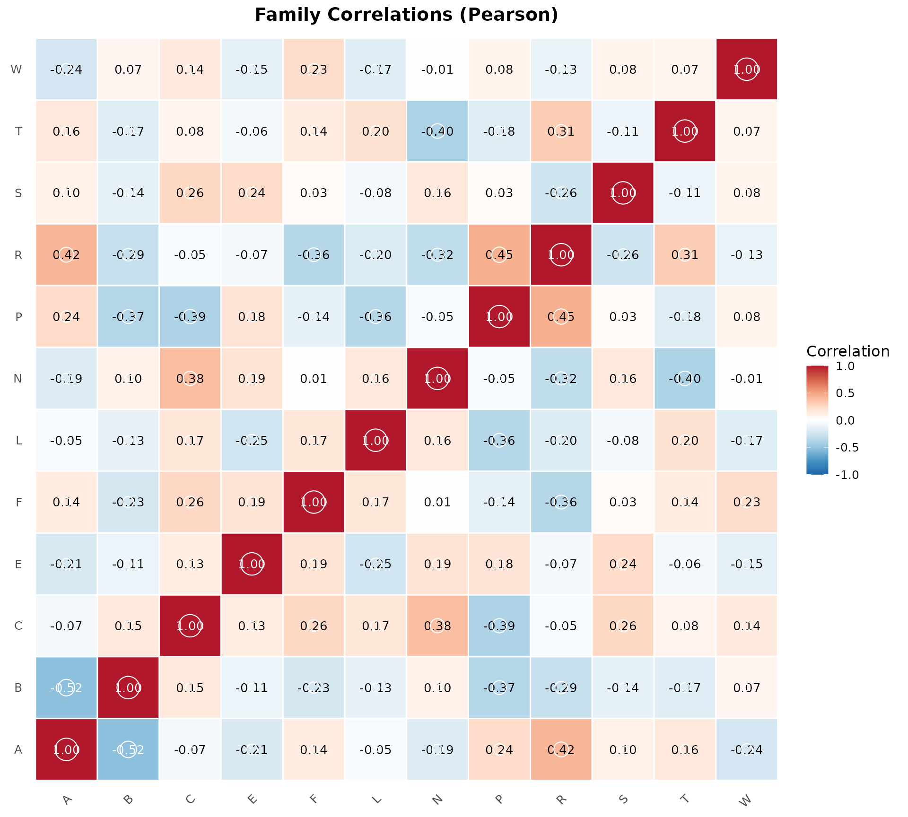
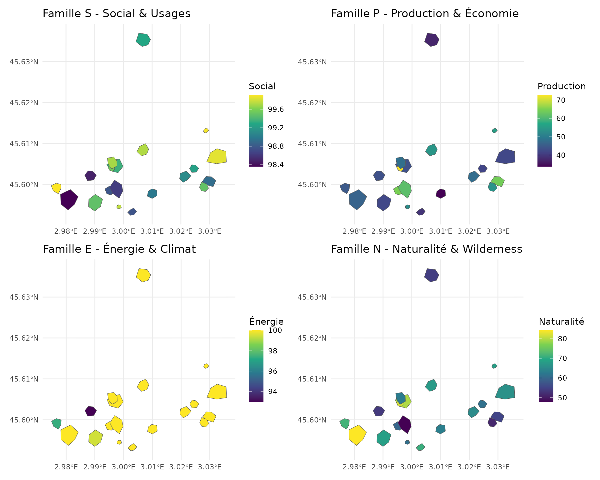
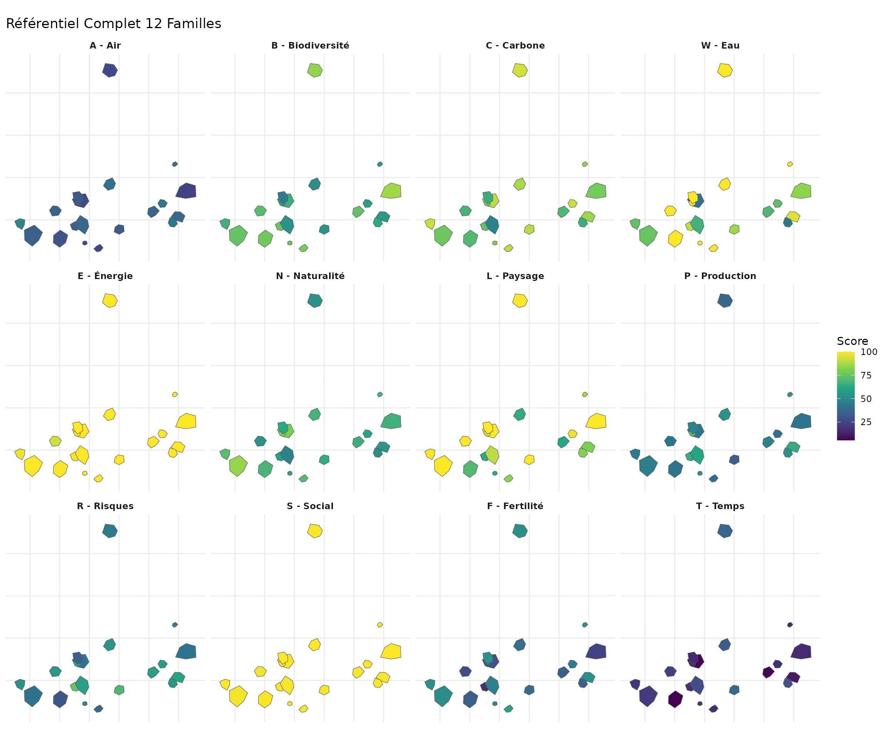
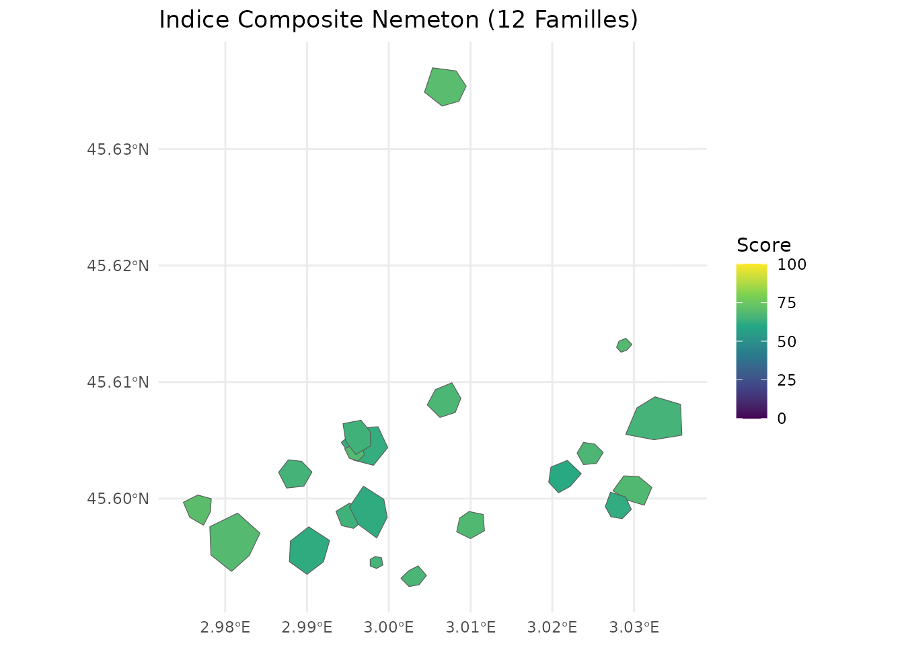
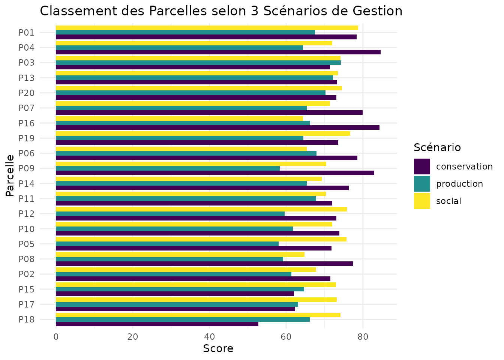

# Référentiel Complet 12 Familles

## Introduction

Le package `nemeton` propose un référentiel complet de **12 familles
d’indicateurs** pour l’évaluation multi-critères des services
écosystémiques forestiers. Cette vignette démontre l’utilisation de
l’ensemble du référentiel avec le jeu de données `massif_demo_units`.

### Les 12 Familles

| Code | Famille | Indicateurs | Nb |
|----|----|----|----|
| **C** | Carbone & Vitalité | C1 (biomasse), C2 (NDVI) | 2 |
| **B** | Biodiversité | B1 (protection), B2 (structure), B3 (connectivité) | 3 |
| **W** | Eau | W1 (réseau hydro), W2 (zones humides), W3 (TWI) | 3 |
| **A** | Air & Microclimat | A1 (couverture), A2 (qualité air) | 2 |
| **F** | Fertilité des Sols | F1 (fertilité), F2 (érosion) | 2 |
| **L** | Paysage | L1 (fragmentation), L2 (lisière), L3 (TVB) | 3 |
| **T** | Temps & Dynamique | T1 (ancienneté), T2 (changements) | 2 |
| **R** | Risques & Résilience | R1 (incendie), R2 (tempête), R3 (stress), R4 (gibier) | 4 |
| **S** | Social & Usages | S1 (sentiers), S2 (accessibilité), S3 (proximité) | 3 |
| **P** | Production & Économie | P1 (volume), P2 (productivité), P3 (qualité) | 3 |
| **E** | Énergie & Climat | E1 (bois-énergie), E2 (évitement CO2) | 2 |
| **N** | Naturalité & Wilderness | N1 (distance infra), N2 (continuité), N3 (composite) | 3 |
|  | **Total** |  | **32** |

## Chargement des Données

``` r

library(nemeton)
library(ggplot2)
library(dplyr)
```

``` r

# Le jeu de données de démonstration
data(massif_demo_units)

# Aperçu des données de base
head(massif_demo_units)
#> Simple feature collection with 6 features and 122 fields
#> Geometry type: POLYGON
#> Dimension:     XY
#> Bounding box:  xmin: 698041.8 ymin: 6499388 xmax: 702507.7 ymax: 6504159
#> Projected CRS: RGF93 v1 / Lambert-93
#>   parcel_id      forest_type age_class   management species age
#> 1       P01     Futaie mixte    Mature        Mixte      09  68
#> 2       P02 Futaie résineuse     Moyen   Production      64  33
#> 3       P03  Futaie feuillue  Surannée Conservation      03 104
#> 4       P04  Futaie feuillue  Surannée   Production      03 166
#> 5       P05 Futaie résineuse     Moyen   Production      61  47
#> 6       P06 Futaie résineuse    Mature   Production      61  79
#>   establishment_year density height  dbh volume strata fertility     climate
#> 1               1958     266   30.3 45.8  557.7      4         1 continental
#> 2               1993     465   30.4 57.5 1541.7      1         3  atlantique
#> 3               1922     128   31.7 41.7  232.7      2         2  atlantique
#> 4               1860     104   29.9 42.6  186.1      2         1  atlantique
#> 5               1979     324   27.5 51.5  779.5      2         2  atlantique
#> 6               1947     281   38.6 76.1 2072.1      2         1  atlantique
#>   surface_ha couvert        C1 C2 B1 B2  B3 B4       W1 W2       W3 W4
#> 1   4.989211    0.90  49.01124 NA NA NA 100 NA 0.000000  0 2.172398 NA
#> 2   5.867935    0.75  17.78697 NA NA NA 100 NA 0.000000  0 2.079708 NA
#> 3   6.557777    0.77  70.53634 NA NA NA 100 NA 0.000000  0 2.320038 NA
#> 4   9.989553    0.86 134.98574 NA NA NA 100 NA 8.677353  0 2.179088 NA
#> 5   5.906395    0.82  29.20340 NA NA NA 100 NA 0.000000  0 2.243098 NA
#> 6   1.048296    0.87  56.77781 NA NA NA 100 NA 0.000000  0 2.081669 NA
#>          A1    A2 A3 A4 A5 F1   F2   L1   L2 L3  T1 T2 T3        R1       R2
#> 1  99.86906 100.0 NA NA NA NA 15.0 52.4 91.8 NA  68 60 NA  99.92593 35.25631
#> 2  99.97049  99.4 NA NA NA NA 10.3 52.6 93.0 NA  33 60 NA 100.00000 41.96851
#> 3 100.00000  99.5 NA NA NA NA 14.9 51.3 91.2 NA 104 60 NA 100.00000 34.54891
#> 4  99.84681  98.6 NA NA NA NA 13.7 51.5 94.5 NA 166 60 NA  99.89067 35.61949
#> 5  99.77814  99.9 NA NA NA NA 13.1 51.2 94.6 NA  47 60 NA  99.52389 35.99775
#> 6  99.76134  99.9 NA NA NA NA 11.1 51.0 94.6 NA  79 60 NA  99.93789 35.12141
#>         R3 R4 R5 R6 R7        S1 S2 S3        P1  P2  P3       E1        E2 N1
#> 1 76.92404 NA NA NA NA 2000.0000 NA NA  625.5427  NA 100 2.074644 2.0725694 NA
#> 2 75.30786 NA NA NA NA  519.1841 NA NA 1916.2231  NA 100 5.735124 5.7293889 NA
#> 3 73.28855 NA NA NA NA  613.0613 NA NA  261.0616 6.5 100 0.865644 0.8647784 NA
#> 4 76.75013 NA NA NA NA  315.2487 NA NA  208.7976  NA 100 0.692292 0.6915997 NA
#> 5 74.29972 NA NA NA NA 1567.7493 NA NA  968.8934 6.5 100 2.899740 2.8968403 NA
#> 6 76.35914 NA NA NA NA 1231.9158 NA NA 2575.4125  NA 100 7.708212 7.7005038 NA
#>   N2 N3           b4_status        w4_status        a3_status        a4_status
#> 1 60 NA skipped_no_spectral skipped_no_micro skipped_no_micro skipped_no_micro
#> 2 60 NA skipped_no_spectral skipped_no_micro skipped_no_micro skipped_no_micro
#> 3 60 NA skipped_no_spectral skipped_no_micro skipped_no_micro skipped_no_micro
#> 4 60 NA skipped_no_spectral skipped_no_micro skipped_no_micro skipped_no_micro
#> 5 60 NA skipped_no_spectral skipped_no_micro skipped_no_micro skipped_no_micro
#> 6 60 NA skipped_no_spectral skipped_no_micro skipped_no_micro skipped_no_micro
#>        a5_status           l3_status          t3_status r1_status
#> 1 skipped_no_lst skipped_no_spectral skipped_no_sufosat  fire_exp
#> 2 skipped_no_lst skipped_no_spectral skipped_no_sufosat  fire_exp
#> 3 skipped_no_lst skipped_no_spectral skipped_no_sufosat  fire_exp
#> 4 skipped_no_lst skipped_no_spectral skipped_no_sufosat  fire_exp
#> 5 skipped_no_lst skipped_no_spectral skipped_no_sufosat  fire_exp
#> 6 skipped_no_lst skipped_no_spectral skipped_no_sufosat  fire_exp
#>           r5_status        r6_status       r7_status     p3_status  C1_norm
#> 1 skipped_no_method skipped_no_micro skipped_no_tmin diametre_seul 32.67416
#> 2 skipped_no_method skipped_no_micro skipped_no_tmin diametre_seul 11.85798
#> 3 skipped_no_method skipped_no_micro skipped_no_tmin diametre_seul 47.02422
#> 4 skipped_no_method skipped_no_micro skipped_no_tmin diametre_seul 89.99050
#> 5 skipped_no_method skipped_no_micro skipped_no_tmin diametre_seul 19.46893
#> 6 skipped_no_method skipped_no_micro skipped_no_tmin diametre_seul 37.85187
#>   C2_norm B1_norm B2_norm B3_norm B4_norm  W1_norm W2_norm W3_norm W4_norm
#> 1      NA      NA      NA     100      NA  0.00000       0       0      NA
#> 2      NA      NA      NA     100      NA  0.00000       0       0      NA
#> 3      NA      NA      NA     100      NA  0.00000       0       0      NA
#> 4      NA      NA      NA     100      NA 17.35471       0       0      NA
#> 5      NA      NA      NA     100      NA  0.00000       0       0      NA
#> 6      NA      NA      NA     100      NA  0.00000       0       0      NA
#>     A1_norm A2_norm A3_norm A4_norm A5_norm F1_norm F2_norm L1_norm L2_norm
#> 1  99.86906   100.0      NA      NA      NA      NA    15.0    47.6    91.8
#> 2  99.97049    99.4      NA      NA      NA      NA    10.3    47.4    93.0
#> 3 100.00000    99.5      NA      NA      NA      NA    14.9    48.7    91.2
#> 4  99.84681    98.6      NA      NA      NA      NA    13.7    48.5    94.5
#> 5  99.77814    99.9      NA      NA      NA      NA    13.1    48.8    94.6
#> 6  99.76134    99.9      NA      NA      NA      NA    11.1    49.0    94.6
#>   L3_norm T1_norm T2_norm T3_norm      R1_norm  R2_norm  R3_norm R4_norm
#> 1      NA    34.0      60      NA 7.406871e-02 64.74369 23.07596      NA
#> 2      NA    16.5      60      NA 1.421085e-14 58.03149 24.69214      NA
#> 3      NA    52.0      60      NA 1.421085e-14 65.45109 26.71145      NA
#> 4      NA    83.0      60      NA 1.093308e-01 64.38051 23.24987      NA
#> 5      NA    23.5      60      NA 4.761100e-01 64.00225 25.70028      NA
#> 6      NA    39.5      60      NA 6.211201e-02 64.87859 23.64086      NA
#>   R5_norm R6_norm R7_norm  S1_norm S2_norm S3_norm   P1_norm  P2_norm P3_norm
#> 1      NA      NA      NA  0.00000      NA      NA  78.19283       NA     100
#> 2      NA      NA      NA 74.04080      NA      NA 100.00000       NA     100
#> 3      NA      NA      NA 69.34694      NA      NA  32.63271 43.33333     100
#> 4      NA      NA      NA 84.23757      NA      NA  26.09970       NA     100
#> 5      NA      NA      NA 21.61254      NA      NA 100.00000 43.33333     100
#> 6      NA      NA      NA 38.40421      NA      NA 100.00000       NA     100
#>     E1_norm   E2_norm N1_norm N2_norm N3_norm famille_carbone
#> 1  78.58500  78.50642      NA      60      NA        32.67416
#> 2 100.00000 100.00000      NA      60      NA        11.85798
#> 3  32.78955  32.75676      NA      60      NA        47.02422
#> 4  26.22318  26.19696      NA      60      NA        89.99050
#> 5 100.00000 100.00000      NA      60      NA        19.46893
#> 6 100.00000 100.00000      NA      60      NA        37.85187
#>   famille_biodiversite famille_eau famille_air famille_sol famille_paysage
#> 1                  100    0.000000    99.93453        15.0           69.70
#> 2                  100    0.000000    99.68525        10.3           70.20
#> 3                  100    0.000000    99.75000        14.9           69.95
#> 4                  100    5.784902    99.22340        13.7           71.50
#> 5                  100    0.000000    99.83907        13.1           71.70
#> 6                  100    0.000000    99.83067        11.1           71.80
#>   famille_temporel famille_risque famille_social famille_production
#> 1            47.00       29.29790        0.00000           89.09642
#> 2            38.25       27.57454       74.04080          100.00000
#> 3            56.00       30.72085       69.34694           58.65535
#> 4            71.50       29.24657       84.23757           63.04985
#> 5            41.75       30.05955       21.61254           81.11111
#> 6            49.75       29.52719       38.40421          100.00000
#>   famille_energie famille_naturalite                       geometry
#> 1        78.54571                 60 POLYGON ((698299.9 6499928,...
#> 2       100.00000                 60 POLYGON ((701702.2 6500418,...
#> 3        32.77315                 60 POLYGON ((702240.4 6500270,...
#> 4        26.21007                 60 POLYGON ((700641.3 6504129,...
#> 5       100.00000                 60 POLYGON ((699268.2 6500307,...
#> 6       100.00000                 60 POLYGON ((699943.5 6499421,...

# Calculer les indicateurs pour la démonstration
# Les indicateurs sont générés de manière synthétique pour les besoins de cette vignette
set.seed(42)
n <- nrow(massif_demo_units)

# Générer des valeurs synthétiques pour tous les indicateurs
massif_demo_units$C1 <- runif(n, 50, 300)  # Biomasse t/ha
massif_demo_units$C2 <- runif(n, 0.3, 0.9)  # NDVI
massif_demo_units$B1 <- runif(n, 0, 100)    # Protection %
massif_demo_units$B2 <- runif(n, 20, 80)    # Structure diversity
massif_demo_units$B3 <- runif(n, 100, 3000) # Distance corridor m
massif_demo_units$W1 <- runif(n, 0, 500)    # Distance hydro m
massif_demo_units$W2 <- runif(n, 0, 50)     # Zones humides %
massif_demo_units$W3 <- runif(n, 2, 15)     # TWI
massif_demo_units$A1 <- runif(n, 40, 95)    # Couverture %
massif_demo_units$A2 <- runif(n, 1, 5)      # Qualité air (ATMO)
massif_demo_units$F1 <- runif(n, 30, 90)    # Fertilité
massif_demo_units$F2 <- runif(n, 0, 50)     # Érosion
massif_demo_units$L1 <- runif(n, 0.1, 0.9)  # Fragmentation
massif_demo_units$L2 <- runif(n, 0, 200)    # Lisière m
massif_demo_units$T1 <- runif(n, 20, 150)   # Ancienneté ans
massif_demo_units$T2 <- runif(n, -20, 20)   # Changement %
massif_demo_units$R1 <- runif(n, 10, 90)    # Risque incendie
massif_demo_units$R2 <- runif(n, 10, 80)    # Risque tempête
massif_demo_units$R3 <- runif(n, 0, 100)    # Stress
massif_demo_units$S1 <- runif(n, 0, 5)      # Accessibilité
massif_demo_units$S2 <- runif(n, 0, 100)    # Sentiers
massif_demo_units$S3 <- runif(n, 0, 50000)  # Proximité m
massif_demo_units$P1 <- runif(n, 50, 500)   # Volume m³/ha
massif_demo_units$P2 <- runif(n, 2, 15)     # Productivité
massif_demo_units$P3 <- runif(n, 30, 90)    # Qualité
massif_demo_units$E1 <- runif(n, 1, 12)     # Bois-énergie
massif_demo_units$E2 <- runif(n, 5, 25)     # Évitement CO2
massif_demo_units$N1 <- runif(n, 100, 5000) # Distance infra m
massif_demo_units$N2 <- runif(n, 0, 100)    # Continuité
massif_demo_units$N3 <- runif(n, 20, 80)    # Naturalité composite
```

## Créer les Indices de Famille

Le système de famille permet d’agréger les indicateurs individuels en
indices synthétiques par famille :

``` r

# Créer tous les indices de famille (12 familles)
# create_family_index() détecte automatiquement toutes les familles par préfixe
result <- create_family_index(massif_demo_units)

# Afficher les indices de famille
result |>
  sf::st_drop_geometry() |>
  select(parcel_id, starts_with("famille_")) |>
  head()
#>   parcel_id famille_carbone famille_biodiversite famille_eau famille_air
#> 1       P01        92.12094             66.16412    73.99900    48.04374
#> 2       P02        69.16131             74.18206    69.45353    37.36385
#> 3       P03        85.17838             56.43859    95.04053    37.68252
#> 4       P04        93.40005             83.78110   100.00000    26.43587
#> 5       P05        67.47313             71.38550   100.00000    36.70354
#> 6       P06        80.42635             75.70870   100.00000    26.93251
#>   famille_sol famille_paysage famille_temporel famille_risque famille_social
#> 1    53.80329        99.92295        20.134943       53.63830       99.91373
#> 2    34.80413        62.05548         6.621495       58.96085       99.10543
#> 3    54.13370        81.02667        11.089093       61.59606       98.91837
#> 4    52.32058        99.86544        36.936431       44.81325       99.27870
#> 5    27.57850        99.73015        23.237488       55.86456       98.48458
#> 6    48.78260        63.28026        19.169480       48.01832       99.75181
#>   famille_production famille_energie famille_naturalite
#> 1           44.72688        97.37798           71.41877
#> 2           47.62736       100.00000           65.24629
#> 3           64.07632       100.00000           55.05077
#> 4           37.31140       100.00000           54.20287
#> 5           43.40296        92.97315           53.65151
#> 6           52.75013       100.00000           61.23935
```

## Visualisation Radar 12-Axes

Le radar 12-axes permet de visualiser le profil complet d’une parcelle
sur l’ensemble des 12 familles :

``` r

# Radar pour la parcelle 1 (toutes les 12 familles)
nemeton_radar(
  result,
  unit_id = 1,
  mode = "family"
)
```


## Analyse Croisée Inter-Familles

### Matrice de Corrélation

``` r

# Calculer les corrélations entre toutes les familles
families_all <- c(
  "famille_carbone", "famille_biodiversite", "famille_eau", "famille_air",
  "famille_sol", "famille_paysage", "famille_temporel", "famille_risque",
  "famille_social", "famille_production", "famille_energie", "famille_naturalite"
)

correlations <- compute_family_correlations(result, families = families_all)

# Visualiser la matrice de corrélation
plot_correlation_matrix(correlations)
```



### Hotspots Multi-Critères

Identifier les parcelles qui excellent simultanément sur plusieurs
familles :

``` r

# Hotspots pour conservation (C, B, N)
hotspots_conservation <- identify_hotspots(
  result,
  families = c("famille_carbone", "famille_biodiversite", "famille_naturalite"),
  threshold = 0.7,
  min_families = 2
)

# Hotspots pour production durable (P, C, E)
hotspots_production <- identify_hotspots(
  result,
  families = c("famille_production", "famille_carbone", "famille_energie"),
  threshold = 0.7,
  min_families = 2
)

# Hotspots pour services sociaux (S, A, L)
hotspots_social <- identify_hotspots(
  result,
  families = c("famille_social", "famille_air", "famille_paysage"),
  threshold = 0.7,
  min_families = 2
)

# Afficher les hotspots
table(hotspots_conservation$is_hotspot)
#> 
#> FALSE  TRUE 
#>     1    19
table(hotspots_production$is_hotspot)
#> 
#> TRUE 
#>   20
table(hotspots_social$is_hotspot)
#> 
#> TRUE 
#>   20
```

## Cartographie Multi-Familles

### Familles S, P, E, N

``` r

# Visualiser les nouvelles familles S, P, E, N
library(patchwork)

p_social <- ggplot(result) +
  geom_sf(aes(fill = famille_social)) +
  scale_fill_viridis_c(name = "Social") +
  labs(title = "Famille S - Social & Usages") +
  theme_minimal()

p_production <- ggplot(result) +
  geom_sf(aes(fill = famille_production)) +
  scale_fill_viridis_c(name = "Production") +
  labs(title = "Famille P - Production & Économie") +
  theme_minimal()

p_energy <- ggplot(result) +
  geom_sf(aes(fill = famille_energie)) +
  scale_fill_viridis_c(name = "Énergie") +
  labs(title = "Famille E - Énergie & Climat") +
  theme_minimal()

p_naturalness <- ggplot(result) +
  geom_sf(aes(fill = famille_naturalite)) +
  scale_fill_viridis_c(name = "Naturalité") +
  labs(title = "Famille N - Naturalité & Wilderness") +
  theme_minimal()

(p_social + p_production) / (p_energy + p_naturalness)
```



### Toutes les Familles

``` r

# Créer une facette pour toutes les 12 familles
result_long <- result |>
  sf::st_drop_geometry() |>
  tidyr::pivot_longer(
    cols = starts_with("famille_"),
    names_to = "famille",
    values_to = "valeur"
  ) |>
  left_join(
    result |> select(parcel_id, geometry),
    by = "parcel_id"
  ) |>
  sf::st_as_sf()

# Labels des familles pour la facette
family_labels <- c(
  famille_carbone = "C - Carbone",
  famille_biodiversite = "B - Biodiversité",
  famille_eau = "W - Eau",
  famille_air = "A - Air",
  famille_sol = "F - Fertilité",
  famille_paysage = "L - Paysage",
  famille_temporel = "T - Temps",
  famille_risque = "R - Risques",
  famille_social = "S - Social",
  famille_production = "P - Production",
  famille_energie = "E - Énergie",
  famille_naturalite = "N - Naturalité"
)

ggplot(result_long) +
  geom_sf(aes(fill = valeur)) +
  facet_wrap(~famille, ncol = 4, labeller = labeller(famille = family_labels)) +
  scale_fill_viridis_c(name = "Score") +
  labs(title = "Référentiel Complet 12 Familles") +
  theme_minimal() +
  theme(
    strip.text = element_text(face = "bold"),
    axis.text = element_blank(),
    axis.ticks = element_blank()
  )
```



## Normalisation et Indice Composite

``` r

# Normaliser tous les indicateurs
result_norm <- normalize_indicators(
  result,
  indicators = c(
    paste0("C", 1:2), paste0("B", 1:3), paste0("W", 1:3),
    paste0("A", 1:2), paste0("F", 1:2), paste0("L", 1:2),
    paste0("T", 1:2), paste0("R", 1:3), paste0("S", 1:3),
    paste0("P", 1:3), paste0("E", 1:2), paste0("N", 1:3)
  ),
  method = "minmax"
)

# Créer un indice composite global (toutes familles)
result_composite <- create_composite_index(
  result_norm,
  indicators = families_all,
  weights = rep(1, 12), # Poids égaux pour toutes les familles
  name = "nemeton_index_12"
)

# Visualiser l'indice composite
ggplot(result_composite) +
  geom_sf(aes(fill = nemeton_index_12)) +
  scale_fill_viridis_c(name = "Score", limits = c(0, 100)) +
  labs(title = "Indice Composite Nemeton (12 Familles)") +
  theme_minimal()
```



## Comparaison de Scénarios

``` r

# Créer différents indices pour différents objectifs de gestion

# Scénario 1: Conservation intégrale
composite_conservation <- create_composite_index(
  result_norm,
  indicators = c("famille_carbone", "famille_biodiversite", "famille_eau", "famille_naturalite"),
  weights = c(0.3, 0.4, 0.15, 0.15),
  name = "conservation"
)

# Scénario 2: Production durable
composite_production <- create_composite_index(
  result_norm,
  indicators = c("famille_production", "famille_energie", "famille_sol", "famille_carbone"),
  weights = c(0.4, 0.25, 0.2, 0.15),
  name = "production"
)

# Scénario 3: Services sociaux
composite_social <- create_composite_index(
  result_norm,
  indicators = c("famille_social", "famille_air", "famille_paysage", "famille_risque"),
  weights = c(0.35, 0.25, 0.2, 0.2),
  name = "social"
)

# Comparer les scénarios
comparison <- result |>
  mutate(
    conservation = composite_conservation$conservation,
    production = composite_production$production,
    social = composite_social$social
  ) |>
  sf::st_drop_geometry() |>
  select(parcel_id, conservation, production, social) |>
  tidyr::pivot_longer(cols = -parcel_id, names_to = "scenario", values_to = "score")

# Visualiser le classement des parcelles selon les scénarios
ggplot(comparison, aes(x = reorder(parcel_id, score), y = score, fill = scenario)) +
  geom_col(position = "dodge") +
  coord_flip() +
  scale_fill_viridis_d() +
  labs(
    title = "Classement des Parcelles selon 3 Scénarios de Gestion",
    x = "Parcelle",
    y = "Score",
    fill = "Scénario"
  ) +
  theme_minimal()
```



## Conclusion

Cette vignette a démontré l’utilisation complète du référentiel 12
familles de nemeton. Le package permet :

1.  **Évaluation holistique** : Couvre l’ensemble des dimensions des
    services écosystémiques (biophysiques, écologiques, sociaux,
    économiques)
2.  **Flexibilité** : Possibilité de créer des indices composites
    adaptés à différents objectifs de gestion
3.  **Analyse croisée** : Identification des synergies et trade-offs
    entre familles
4.  **Visualisation** : Radars 12-axes, cartes multi-familles, matrices
    de corrélation

Pour aller plus loin, consultez la vignette **“Multi-Criteria
Optimization”** qui présente les outils d’analyse Pareto, de clustering
et de trade-off analysis.

## Références

- Obstétar, P. (2025). *nemeton: Ecosystem Services Assessment for
  Forest Management*. R package.
- MEA (2005). *Millennium Ecosystem Assessment*. Island Press.
- Boitani, L., et al. (2008). *Wilderness: Earth’s Last Wild Places*.
  Conservation International.
