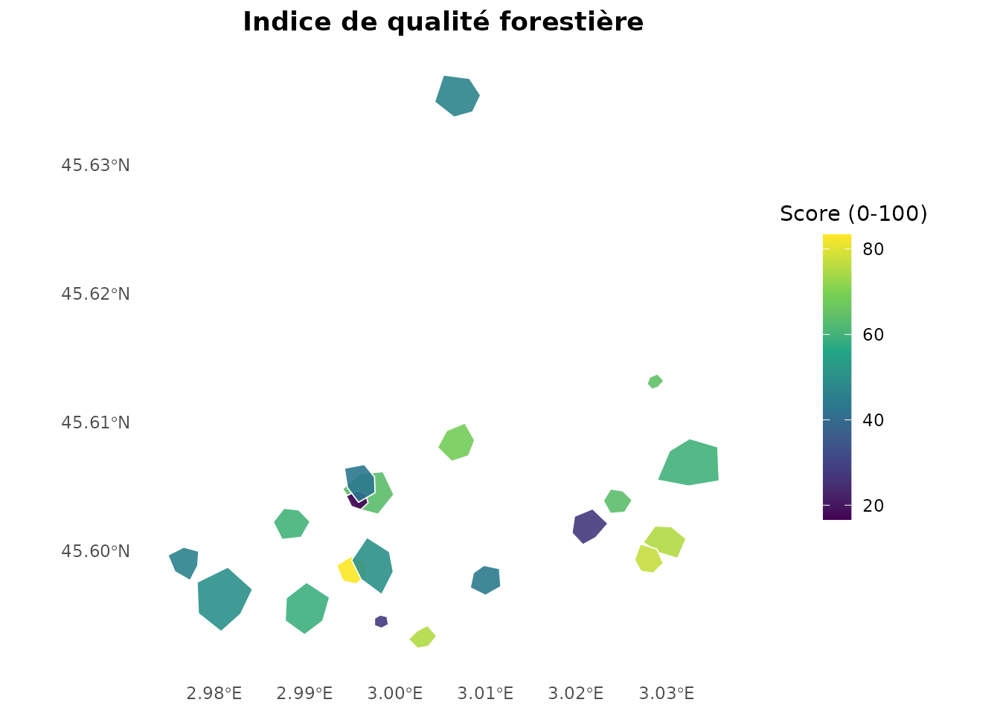

# Démarrage rapide avec nemeton

## Introduction

Le package `nemeton` implémente la méthode Nemeton pour l’analyse
systémique de territoires forestiers. Il fournit des outils pour :

- Calculer des indicateurs biophysiques multi-famille (carbone, eau,
  sols, paysage, etc.)
- Normaliser les valeurs d’indicateurs selon plusieurs méthodes
- Créer des indices composites pour une évaluation holistique
- Visualiser les résultats avec des cartes et graphiques

Cette vignette démontre le workflow complet avec le jeu de données
`massif_demo`.

## Installation

``` r
# Depuis GitHub
remotes::install_github("pobsteta/nemeton")
```

``` r
library(nemeton)
library(ggplot2)
```

## Charger les données de démonstration

Le package inclut un jeu de données synthétique (`massif_demo`)
représentant une zone de 5km × 5km avec 20 parcelles forestières.

``` r
# Charger les parcelles forestières
data(massif_demo_units)

# Inspecter les parcelles
print(massif_demo_units)
#> Simple feature collection with 20 features and 15 fields
#> Geometry type: POLYGON
#> Dimension:     XY
#> Bounding box:  xmin: 698041.8 ymin: 6499215 xmax: 702793.8 ymax: 6504159
#> Projected CRS: RGF93 v1 / Lambert-93
#> First 10 features:
#>    parcel_id      forest_type age_class   management species age
#> 1        P01     Futaie mixte    Mature        Mixte      09  68
#> 2        P02 Futaie résineuse     Moyen   Production      64  33
#> 3        P03  Futaie feuillue  Surannée Conservation      03 104
#> 4        P04  Futaie feuillue  Surannée   Production      03 166
#> 5        P05 Futaie résineuse     Moyen   Production      61  47
#> 6        P06 Futaie résineuse    Mature   Production      61  79
#> 7        P07  Futaie feuillue    Mature        Mixte      03  75
#> 8        P08  Futaie feuillue    Mature   Production      52  71
#> 9        P09     Futaie mixte     Moyen   Production      03  48
#> 10       P10          Taillis  Surannée   Production      52 165
#>    establishment_year density height  dbh volume strata fertility     climate
#> 1                1958     266   30.3 45.8  557.7      4         1 continental
#> 2                1993     465   30.4 57.5 1541.7      1         3  atlantique
#> 3                1922     128   31.7 41.7  232.7      2         2  atlantique
#> 4                1860     104   29.9 42.6  186.1      2         1  atlantique
#> 5                1979     324   27.5 51.5  779.5      2         2  atlantique
#> 6                1947     281   38.6 76.1 2072.1      2         1  atlantique
#> 7                1951     184   33.9 47.1  456.5      2         3 continental
#> 8                1955     169   27.2 38.8  228.3      3         2  montagnard
#> 9                1978     369   24.8 34.0  349.0      4         3  atlantique
#> 10               1861     632   25.7 34.0  619.4      2         2  montagnard
#>    surface_ha                       geometry
#> 1    4.989211 POLYGON ((698299.9 6499928,...
#> 2    5.867935 POLYGON ((701702.2 6500418,...
#> 3    6.557777 POLYGON ((702240.4 6500270,...
#> 4    9.989553 POLYGON ((700641.3 6504129,...
#> 5    5.906395 POLYGON ((699268.2 6500307,...
#> 6    1.048296 POLYGON ((699943.5 6499421,...
#> 7   17.079363 POLYGON ((698500.5 6499360,...
#> 8   11.414577 POLYGON ((699061.9 6499649,...
#> 9   16.105209 POLYGON ((702258.5 6500666,...
#> 10  10.733433 POLYGON ((699897.1 6500739,...

# Statistiques sommaires
cat("\nSurface totale:", sum(massif_demo_units$surface_ha), "ha\n")
#> 
#> Surface totale: 136.0225 ha
table(massif_demo_units$forest_type)
#> 
#>  Futaie feuillue     Futaie mixte Futaie résineuse          Taillis 
#>               11                2                4                3
```

``` r
ggplot(massif_demo_units) +
  geom_sf(aes(fill = forest_type)) +
  theme_minimal() +
  labs(
    title = "Massif Demo - Types forestiers",
    fill = "Type de forêt"
  )
```


Parcelles forestières par type

## Charger les couches spatiales

Utilisez
[`massif_demo_layers()`](https://pobsteta.github.io/nemeton/reference/massif_demo_layers.md)
pour charger tous les rasters et vecteurs associés :

``` r
layers <- massif_demo_layers()
print(layers)
#> 
#> ── nemeton_layers object ───────
#> 
#> ── Rasters (4) ──
#> 
#> • biomass : massif_demo_biomass.tif [not loaded] 
#> • dem : massif_demo_dem.tif [not loaded] 
#> • landcover : massif_demo_landcover.tif [not loaded] 
#> • species_richness : massif_demo_species_richness.tif [not loaded] 
#> 
#> ── Vectors (2) ──
#> 
#> • roads : massif_demo_roads.gpkg [not loaded] 
#> • water : massif_demo_water.gpkg [not loaded]
```

Le jeu de données inclut : - **Rasters** : biomasse, MNT, occupation du
sol, richesse spécifique - **Vecteurs** : réseau routier, cours d’eau

## Calculer les indicateurs

### Indicateurs individuels

``` r
# Carbone (via NDVI)
carbon <- nemeton_compute(
  massif_demo_units,
  layers,
  indicators = "carbon_ndvi"
)

# Eau (TWI - Topographic Wetness Index)
water <- nemeton_compute(
  massif_demo_units,
  layers,
  indicators = "water_twi"
)

# Afficher les résultats
head(carbon[, c("parcel_id", "forest_type", "carbon_ndvi")])
#> Simple feature collection with 6 features and 3 fields
#> Geometry type: POLYGON
#> Dimension:     XY
#> Bounding box:  xmin: 698041.8 ymin: 6499388 xmax: 702507.7 ymax: 6504159
#> Projected CRS: RGF93 v1 / Lambert-93
#>   parcel_id      forest_type carbon_ndvi                       geometry
#> 1       P01     Futaie mixte          NA POLYGON ((698299.9 6499928,...
#> 2       P02 Futaie résineuse          NA POLYGON ((701702.2 6500418,...
#> 3       P03  Futaie feuillue          NA POLYGON ((702240.4 6500270,...
#> 4       P04  Futaie feuillue          NA POLYGON ((700641.3 6504129,...
#> 5       P05 Futaie résineuse          NA POLYGON ((699268.2 6500307,...
#> 6       P06 Futaie résineuse          NA POLYGON ((699943.5 6499421,...
```

### Indicateurs multiples simultanés

``` r
# Calculer 3 indicateurs en une fois
results <- nemeton_compute(
  massif_demo_units,
  layers,
  indicators = c("carbon_ndvi", "water_twi", "landscape_fragmentation")
)

# Vue d'ensemble
summary(results[, c("carbon_ndvi", "water_twi", "landscape_fragmentation")])
#>   carbon_ndvi    water_twi     landscape_fragmentation          geometry 
#>  Min.   : NA   Min.   :4.551   Min.   :1               POLYGON      :20  
#>  1st Qu.: NA   1st Qu.:4.698   1st Qu.:1               epsg:2154    : 0  
#>  Median : NA   Median :4.766   Median :1               +proj=lcc ...: 0  
#>  Mean   :NaN   Mean   :4.745   Mean   :1                                 
#>  3rd Qu.: NA   3rd Qu.:4.798   3rd Qu.:1                                 
#>  Max.   : NA   Max.   :4.887   Max.   :1                                 
#>  NA's   :20
```

## Normalisation

Normalisez les indicateurs pour les rendre comparables (échelle 0-100) :

``` r
# Normalisation min-max
normalized <- normalize_indicators(
  results,
  indicators = c("carbon_ndvi", "water_twi", "landscape_fragmentation"),
  method = "minmax"
)

# Comparer avant/après
cat("\nAvant normalisation (carbone NDVI):\n")
#> 
#> Avant normalisation (carbone NDVI):
summary(results$carbon_ndvi)
#>    Min. 1st Qu.  Median    Mean 3rd Qu.    Max.    NA's 
#>      NA      NA      NA     NaN      NA      NA      20

cat("\nAprès normalisation (carbone NDVI):\n")
#> 
#> Après normalisation (carbone NDVI):
summary(normalized$carbon_ndvi_norm)
#>    Min. 1st Qu.  Median    Mean 3rd Qu.    Max.    NA's 
#>      NA      NA      NA     NaN      NA      NA      20
```

### Méthodes de normalisation

``` r
# z-score (distribution normale centrée-réduite)
norm_zscore <- normalize_indicators(
  results,
  indicators = "carbon_ndvi",
  method = "zscore"
)

# Quantiles (distribution uniforme)
norm_quantile <- normalize_indicators(
  results,
  indicators = "carbon_ndvi",
  method = "quantile"
)
```

## Agrégation en indices composites

Combinez plusieurs indicateurs en un indice unique :

``` r
# Indice composite avec poids égaux
composite <- create_composite_index(
  normalized,
  indicators = c("carbon_ndvi_norm", "water_twi_norm", "landscape_fragmentation_norm"),
  name = "ecosystem_health"
)

# Afficher les résultats
head(composite[, c("parcel_id", "forest_type", "ecosystem_health")])
#> Simple feature collection with 6 features and 3 fields
#> Geometry type: POLYGON
#> Dimension:     XY
#> Bounding box:  xmin: 698041.8 ymin: 6499388 xmax: 702507.7 ymax: 6504159
#> Projected CRS: RGF93 v1 / Lambert-93
#>   parcel_id      forest_type ecosystem_health                       geometry
#> 1       P01     Futaie mixte         47.12649 POLYGON ((698299.9 6499928,...
#> 2       P02 Futaie résineuse         33.06346 POLYGON ((701702.2 6500418,...
#> 3       P03  Futaie feuillue         68.84665 POLYGON ((702240.4 6500270,...
#> 4       P04  Futaie feuillue         47.45315 POLYGON ((700641.3 6504129,...
#> 5       P05 Futaie résineuse         57.39094 POLYGON ((699268.2 6500307,...
#> 6       P06 Futaie résineuse         33.35533 POLYGON ((699943.5 6499421,...
```

### Agrégation pondérée

``` r
# Poids personnalisés (carbone 50%, paysage 30%, eau 20%)
composite_weighted <- create_composite_index(
  normalized,
  indicators = c("carbon_ndvi_norm", "landscape_fragmentation_norm", "water_twi_norm"),
  weights = c(0.5, 0.3, 0.2),
  name = "conservation_index"
)
```

### Méthodes d’agrégation

``` r
# Moyenne géométrique (effets multiplicatifs)
composite_geom <- create_composite_index(
  normalized,
  indicators = c("carbon_ndvi_norm", "water_twi_norm"),
  aggregation = "geometric_mean",
  name = "water_carbon_index"
)

# Minimum (approche conservatrice, facteur limitant)
composite_min <- create_composite_index(
  normalized,
  indicators = c("carbon_ndvi_norm", "water_twi_norm"),
  aggregation = "min",
  name = "minimum_performance"
)
```

## Visualisation

### Cartes thématiques

``` r
plot_indicators_map(
  composite,
  indicators = "ecosystem_health",
  title = "Indice de santé écosystémique",
  legend_title = "Score (0-100)"
)
```


Carte de l’indice de santé écosystémique

### Cartes multiples (facettes)

``` r
plot_indicators_map(
  normalized,
  indicators = c("carbon_ndvi_norm", "water_twi_norm"),
  palette = "viridis",
  facet = TRUE,
  ncol = 2,
  title = "Comparaison carbone vs eau"
)
```


Comparaison carbone vs eau

### Graphique radar

``` r
nemeton_radar(
  normalized,
  unit_id = "P01",
  indicators = c("carbon_ndvi_norm", "water_twi_norm", "landscape_fragmentation_norm"),
  title = "Profil multi-indicateurs - Parcelle P01"
)
```


Profil écosystémique - Parcelle P01

## Workflow complet

Voici un exemple de workflow complet de bout en bout :

``` r
# 1. Charger les données
data(massif_demo_units)
layers <- massif_demo_layers()

# 2. Calculer les indicateurs
results <- nemeton_compute(
  massif_demo_units,
  layers,
  indicators = c(
    "carbon_ndvi", "water_twi", "landscape_fragmentation"
  )
)

# 3. Normaliser (0-100)
normalized <- normalize_indicators(
  results,
  indicators = c(
    "carbon_ndvi", "water_twi", "landscape_fragmentation"
  ),
  method = "minmax"
)

# 4. Créer un indice composite
composite <- create_composite_index(
  normalized,
  indicators = c("carbon_ndvi_norm", "water_twi_norm", "landscape_fragmentation_norm"),
  weights = c(0.4, 0.4, 0.2),
  name = "forest_quality"
)

# 5. Visualiser
plot_indicators_map(
  composite,
  indicators = "forest_quality",
  title = "Indice de qualité forestière",
  legend_title = "Score (0-100)"
)
```



## Analyses avancées

### Inverser un indicateur

Pour les indicateurs où une valeur faible est souhaitable :

``` r
# Exemple: inverser un indicateur
# (Utilisé pour les indicateurs où une valeur faible est souhaitable)
normalized_inv <- invert_indicator(
  normalized,
  indicators = "water_twi_norm",
  suffix = "_inv"
)

# L'indicateur inversé
head(normalized_inv[, c("parcel_id", "water_twi_norm", "water_twi_norm_inv")])
```

### Filtrage et sous-ensembles

``` r
# Sélectionner uniquement les futaies feuillues
broadleaf <- normalized[normalized$forest_type == "Futaie feuillue", ]

# Créer un indice spécifique
broadleaf_index <- create_composite_index(
  broadleaf,
  indicators = c("carbon_ndvi_norm", "water_twi_norm"),
  name = "broadleaf_quality"
)
```

## Internationalisation

Le package supporte le français et l’anglais :

``` r
# Définir la langue
nemeton_set_language("fr") # Français
# nemeton_set_language("en")  # English

# Les messages d'erreur/information seront dans la langue choisie
```

## Export des résultats

``` r
# Export en GeoPackage
sf::st_write(composite, "results/forest_quality.gpkg")

# Export en CSV (sans géométrie)
results_table <- composite |>
  sf::st_drop_geometry()
write.csv(results_table, "results/forest_quality.csv", row.names = FALSE)
```

## Prochaines étapes

- **Analyse temporelle** :
  [`vignette("temporal-analysis_fr")`](https://pobsteta.github.io/nemeton/articles/temporal-analysis_fr.md) -
  Analyse multi-périodes
- **Familles d’indicateurs** :
  [`vignette("indicator-families_fr")`](https://pobsteta.github.io/nemeton/articles/indicator-families_fr.md) -
  Système 12 familles
- **Internationalisation** :
  [`vignette("internationalization")`](https://pobsteta.github.io/nemeton/articles/internationalization.md) -
  Système i18n

## Références

- Méthode Nemeton : Développée par Vivre en Forêt
- Documentation complète :
  [`help(package = "nemeton")`](https://rdrr.io/pkg/nemeton/man)
- Site web : <https://pobsteta.github.io/nemeton/>

## Session Info

``` r
sessionInfo()
#> R version 4.5.2 (2025-10-31)
#> Platform: x86_64-pc-linux-gnu
#> Running under: Ubuntu 24.04.3 LTS
#> 
#> Matrix products: default
#> BLAS:   /usr/lib/x86_64-linux-gnu/openblas-pthread/libblas.so.3 
#> LAPACK: /usr/lib/x86_64-linux-gnu/openblas-pthread/libopenblasp-r0.3.26.so;  LAPACK version 3.12.0
#> 
#> locale:
#>  [1] LC_CTYPE=C.UTF-8       LC_NUMERIC=C           LC_TIME=C.UTF-8       
#>  [4] LC_COLLATE=C.UTF-8     LC_MONETARY=C.UTF-8    LC_MESSAGES=C.UTF-8   
#>  [7] LC_PAPER=C.UTF-8       LC_NAME=C              LC_ADDRESS=C          
#> [10] LC_TELEPHONE=C         LC_MEASUREMENT=C.UTF-8 LC_IDENTIFICATION=C   
#> 
#> time zone: UTC
#> tzcode source: system (glibc)
#> 
#> attached base packages:
#> [1] stats     graphics  grDevices utils     datasets  methods   base     
#> 
#> other attached packages:
#> [1] ggplot2_4.0.1 nemeton_0.6.1
#> 
#> loaded via a namespace (and not attached):
#>  [1] tidyr_1.3.2          sass_0.4.10          generics_0.1.4      
#>  [4] class_7.3-23         KernSmooth_2.23-26   lattice_0.22-7      
#>  [7] digest_0.6.39        magrittr_2.0.4       evaluate_1.0.5      
#> [10] grid_4.5.2           RColorBrewer_1.1-3   fastmap_1.2.0       
#> [13] jsonlite_2.0.0       e1071_1.7-17         DBI_1.2.3           
#> [16] purrr_1.2.1          viridisLite_0.4.2    scales_1.4.0        
#> [19] codetools_0.2-20     textshaping_1.0.4    jquerylib_0.1.4     
#> [22] cli_3.6.5            rlang_1.1.7          units_1.0-0         
#> [25] withr_3.0.2          cachem_1.1.0         yaml_2.3.12         
#> [28] otel_0.2.0           raster_3.6-32        tools_4.5.2         
#> [31] dplyr_1.1.4          exactextractr_0.10.1 vctrs_0.7.1         
#> [34] R6_2.6.1             proxy_0.4-29         lifecycle_1.0.5     
#> [37] classInt_0.4-11      fs_1.6.6             htmlwidgets_1.6.4   
#> [40] ragg_1.5.0           pkgconfig_2.0.3      desc_1.4.3          
#> [43] pkgdown_2.2.0        terra_1.8-93         bslib_0.9.0         
#> [46] pillar_1.11.1        gtable_0.3.6         glue_1.8.0          
#> [49] Rcpp_1.1.1           sf_1.0-24            systemfonts_1.3.1   
#> [52] xfun_0.56            tibble_3.3.1         tidyselect_1.2.1    
#> [55] knitr_1.51           farver_2.1.2         htmltools_0.5.9     
#> [58] whitebox_2.4.3       labeling_0.4.3       rmarkdown_2.30      
#> [61] compiler_4.5.2       S7_0.2.1             sp_2.2-0
```
