# Familles d'indicateurs - Référentiel complet

## Introduction

Le package `nemeton` structure l’évaluation des services écosystémiques
forestiers autour de **12 familles d’indicateurs** couvrant les
dimensions biophysiques, écologiques et socio-économiques. Cette
vignette présente le référentiel complet et démontre l’utilisation du
système de familles.

``` r

library(nemeton)
library(ggplot2)
library(dplyr)
library(sf)
```

## Référentiel des 12 familles

### Vue d’ensemble

| Code | Famille | Description | Nb indicateurs |
|----|----|----|----|
| **C** | Carbone & Vitalité | Stock carbone et santé végétation | 2 |
| **B** | Biodiversité | Diversité structurelle et habitats | 3 |
| **W** | Eau | Régulation hydrique | 3 |
| **A** | Air & Microclimat | Qualité de l’air et régulation climatique | 2 |
| **F** | Fertilité des sols | Qualité pédologique et érosion | 2 |
| **L** | Landscape (Paysage) | Structure et connectivité paysagère | 3 |
| **T** | Temps & Dynamique | Ancienneté et trajectoires | 2 |
| **R** | Risques | Vulnérabilité aux perturbations | 3 |
| **S** | Social & Usages | Accessibilité et services récréatifs | 3 |
| **P** | Production | Productivité forestière | 3 |
| **E** | Énergie | Potentiel énergétique et climat | 2 |
| **N** | Naturalité | Degré de naturalité | 3 |

## Données de démonstration avec 12 familles

Pour cette vignette, nous créons un jeu de données complet avec tous les
indicateurs des 12 familles.

``` r

# Charger les données de base
data(massif_demo_units)

set.seed(42)
n <- nrow(massif_demo_units)

# Créer les indicateurs pour chaque famille
demo_data <- massif_demo_units

# Famille C - Carbone & Vitalité
demo_data$C1 <- runif(n, 80, 250)     # Biomasse carbone (tC/ha)
demo_data$C2 <- runif(n, 0.5, 0.9)    # NDVI (vitalité)

# Famille B - Biodiversité
demo_data$B1 <- sample(0:3, n, replace = TRUE)  # Protection (0-3)
demo_data$B2 <- runif(n, 0.5, 2.5)    # Diversité structurelle (Shannon)
demo_data$B3 <- runif(n, 0.2, 0.95)   # Connectivité (0-1)

# Famille W - Eau
demo_data$W1 <- runif(n, 10, 100)     # Densité réseau hydro (m/ha)
demo_data$W2 <- runif(n, 0, 40)       # % zones humides
demo_data$W3 <- runif(n, 5, 15)       # TWI

# Famille A - Air & Microclimat
demo_data$A1 <- runif(n, 0.4, 0.95)   # Couverture arborée buffer 1km
demo_data$A2 <- runif(n, 50, 95)      # Qualité air

# Famille F - Fertilité sols
demo_data$F1 <- sample(1:5, n, replace = TRUE, prob = c(0.1, 0.3, 0.35, 0.2, 0.05))
demo_data$F2 <- runif(n, 0, 25)       # Pente % (risque érosion)

# Famille L - Paysage
demo_data$L1 <- runif(n, 0.1, 0.8)    # Fragmentation (0-1, faible = mieux)
demo_data$L2 <- runif(n, 0.05, 0.35)  # Ratio lisière

# Famille T - Temps & Dynamique
demo_data$T1 <- demo_data$age         # Ancienneté (années)
demo_data$T2 <- runif(n, 0, 5)        # Taux changement (%/an)

# Famille R - Risques (échelle 0-100)
demo_data$R1 <- runif(n, 5, 80)       # Risque incendie
demo_data$R2 <- runif(n, 10, 70)      # Risque tempête
demo_data$R3 <- runif(n, 15, 75)      # Stress hydrique
demo_data$R4 <- runif(n, 10, 65)      # Risque abroutissement

# Famille S - Social & Usages
demo_data$S1 <- runif(n, 0, 5)        # Densité sentiers (km/ha)
demo_data$S2 <- runif(n, 20, 100)     # Score accessibilité
demo_data$S3 <- runif(n, 500, 50000)  # Population proximité

# Famille P - Production
demo_data$P1 <- demo_data$volume      # Volume sur pied (m³/ha)
demo_data$P2 <- runif(n, 3, 15)       # Productivité (m³/ha/an)
demo_data$P3 <- runif(n, 40, 95)      # Qualité bois

# Famille E - Énergie
demo_data$E1 <- runif(n, 1, 10)       # Potentiel bois-énergie (t/an)
demo_data$E2 <- runif(n, 5, 50)       # Évitement CO2 (tCO2eq/an)

# Famille N - Naturalité
demo_data$N1 <- runif(n, 100, 3000)   # Distance infrastructure (m)
demo_data$N2 <- runif(n, 5, 100)      # Continuité forestière (ha)
demo_data$N3 <- runif(n, 20, 95)      # Score naturalité composite

cat("Dataset avec", n, "parcelles et 29 indicateurs\n")
#> Dataset avec 20 parcelles et 29 indicateurs
```

## Indicateurs par famille

### Famille C : Carbone & Vitalité

``` r

ggplot(demo_data |> st_drop_geometry()) +
  geom_point(aes(x = C1, y = C2, color = forest_type), size = 3, alpha = 0.7) +
  labs(
    title = "Famille C - Carbone & Vitalité",
    x = "C1: Stock carbone (tC/ha)",
    y = "C2: NDVI (vitalité)",
    color = "Type forestier"
  ) +
  theme_minimal() +
  theme(legend.position = "bottom")
```

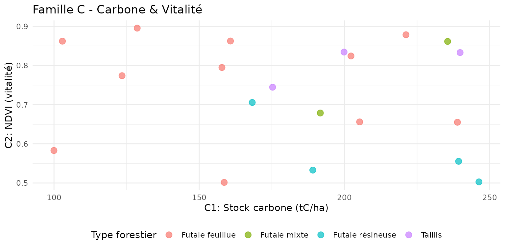

**Interprétation** : - C1 \> 100 tC/ha : Fort stock de carbone - C2
(NDVI) \> 0.7 : Végétation très active

### Famille W : Eau

``` r

library(tidyr)

demo_data |>
  st_drop_geometry() |>
  select(parcel_id, W1, W2, W3) |>
  pivot_longer(cols = c(W1, W2, W3), names_to = "indicator", values_to = "value") |>
  ggplot(aes(x = indicator, y = value, fill = indicator)) +
  geom_boxplot(alpha = 0.7) +
  scale_fill_manual(
    values = c(W1 = "#00838F", W2 = "#0097A7", W3 = "#26C6DA"),
    labels = c("Réseau hydro (m/ha)", "Zones humides (%)", "TWI")
  ) +
  labs(
    title = "Famille W - Distribution des indicateurs Eau",
    x = "Indicateur",
    y = "Valeur"
  ) +
  theme_minimal() +
  theme(legend.position = "none")
```

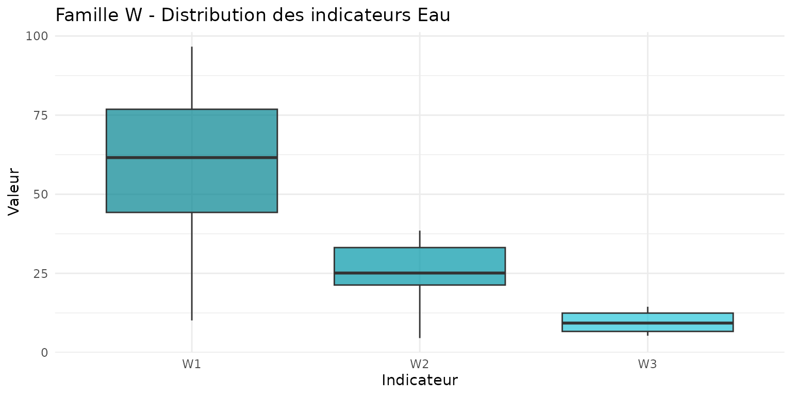

**Interprétation** : - W1 \> 50 m/ha : Dense réseau hydrographique - W2
\> 20% : Zone humide significative - W3 \> 10 : Fort potentiel
d’accumulation d’eau

### Famille B : Biodiversité

``` r

ggplot(demo_data) +
  geom_sf(aes(fill = B2), color = "white", linewidth = 0.3) +
  scale_fill_viridis_c(name = "Shannon\n(diversité)", option = "D") +
  labs(
    title = "B2 - Diversité structurelle",
    subtitle = "Indice de Shannon des strates et âges"
  ) +
  theme_minimal() +
  theme(axis.text = element_blank(), axis.ticks = element_blank())
```

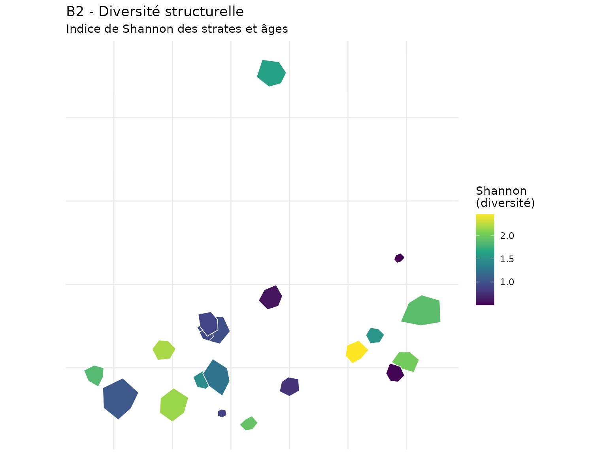

### Famille R : Risques

``` r

demo_data |>
  st_drop_geometry() |>
  select(parcel_id, R1, R2, R3, R4) |>
  tidyr::pivot_longer(cols = c(R1, R2, R3, R4), names_to = "indicator", values_to = "value") |>
  ggplot(aes(x = indicator, y = value, fill = indicator)) +
  geom_boxplot(alpha = 0.8) +
  scale_fill_brewer(palette = "YlOrRd") +
  labs(
    title = "Famille R - Distribution des risques",
    x = "Indicateur",
    y = "Score (0-100)",
    fill = "Indicateur"
  ) +
  theme_minimal()
```

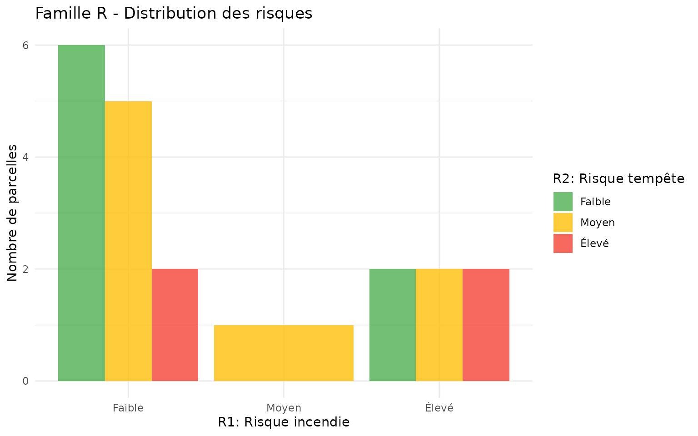

**Interprétation** : - R1, R2, R3, R4 \> 60 : Vulnérabilité élevée -
Risques cumulés (≥2 indicateurs élevés) : Priorité gestion préventive

## Normalisation des indicateurs

Normalisons les indicateurs pour les rendre comparables (échelle 0-100).

``` r

# Indicateurs à normaliser
indicators_to_norm <- c("C1", "C2", "B2", "B3", "W1", "W2", "W3",
                         "A1", "A2", "S1", "S2", "P1", "P2", "P3",
                         "E1", "E2", "N1", "N2", "N3")

# Normalisation min-max
demo_norm <- demo_data

for (ind in indicators_to_norm) {
  values <- demo_norm[[ind]]
  min_val <- min(values, na.rm = TRUE)
  max_val <- max(values, na.rm = TRUE)
  demo_norm[[paste0(ind, "_norm")]] <- (values - min_val) / (max_val - min_val) * 100
}

# Indicateurs inversés (faible = mieux)
inv_indicators <- c("L1", "L2", "T2", "F2")
for (ind in inv_indicators) {
  values <- demo_norm[[ind]]
  min_val <- min(values, na.rm = TRUE)
  max_val <- max(values, na.rm = TRUE)
  demo_norm[[paste0(ind, "_norm")]] <- (1 - (values - min_val) / (max_val - min_val)) * 100
}

# Indicateurs catégoriels transformés
# F1: 1 (très fertile) = 100, 5 (très pauvre) = 20
demo_norm$F1_norm <- (6 - demo_norm$F1) / 4 * 80 + 20

# R1-R4: déjà en 0-100, inverser (faible risque = meilleur score)
demo_norm$R1_norm <- 100 - demo_norm$R1
demo_norm$R2_norm <- 100 - demo_norm$R2
demo_norm$R3_norm <- 100 - demo_norm$R3
demo_norm$R4_norm <- 100 - demo_norm$R4

# B1: 0 = 0, 3 = 100
demo_norm$B1_norm <- demo_norm$B1 / 3 * 100

# T1: log transformation pour ancienneté
demo_norm$T1_norm <- pmin(100, log(demo_norm$T1 + 1) / log(200) * 100)

cat("Indicateurs normalisés créés\n")
#> Indicateurs normalisés créés
```

## Indices composites par famille

Créons des indices agrégés pour chaque famille.

``` r

# Calculer les indices de famille
demo_norm$famille_carbone <- (demo_norm$C1_norm + demo_norm$C2_norm) / 2
demo_norm$famille_biodiversite <- (demo_norm$B1_norm + demo_norm$B2_norm + demo_norm$B3_norm) / 3
demo_norm$famille_eau <- (demo_norm$W1_norm + demo_norm$W2_norm + demo_norm$W3_norm) / 3
demo_norm$famille_air <- (demo_norm$A1_norm + demo_norm$A2_norm) / 2
demo_norm$famille_sol <- (demo_norm$F1_norm + demo_norm$F2_norm) / 2
demo_norm$famille_paysage <- (demo_norm$L1_norm + demo_norm$L2_norm) / 2
demo_norm$famille_temporel <- (demo_norm$T1_norm + demo_norm$T2_norm) / 2
demo_norm$famille_risque <- (demo_norm$R1_norm + demo_norm$R2_norm + demo_norm$R3_norm + demo_norm$R4_norm) / 4
demo_norm$famille_social <- (demo_norm$S1_norm + demo_norm$S2_norm) / 2
demo_norm$famille_production <- (demo_norm$P1_norm + demo_norm$P2_norm + demo_norm$P3_norm) / 3
demo_norm$famille_energie <- (demo_norm$E1_norm + demo_norm$E2_norm) / 2
demo_norm$famille_naturalite <- (demo_norm$N1_norm + demo_norm$N2_norm + demo_norm$N3_norm) / 3

# Afficher les scores moyens par famille
family_means <- demo_norm |>
  st_drop_geometry() |>
  summarise(across(starts_with("famille_"), mean, na.rm = TRUE)) |>
  pivot_longer(everything(), names_to = "famille", values_to = "mean_score") |>
  mutate(famille = gsub("famille_", "", famille)) |>
  arrange(desc(mean_score))

family_means
#> # A tibble: 12 × 2
#>    famille      mean_score
#>    <chr>             <dbl>
#>  1 sol                75.3
#>  2 temporel           70.8
#>  3 risque             58.8
#>  4 paysage            57.6
#>  5 carbone            57.4
#>  6 eau                55.2
#>  7 biodiversite       51.2
#>  8 naturalite         47.2
#>  9 air                46.6
#> 10 production         44.4
#> 11 social             44.1
#> 12 energie            40.9
```

## Visualisation multi-famille

### Radar chart 12 familles

La fonction
[`nemeton_radar()`](https://pobsteta.github.io/nemeton/reference/nemeton_radar.md)
avec `mode = "family"` permet de visualiser le profil complet d’une
parcelle sur les 12 familles :

``` r

# Radar pour une parcelle (mode famille)
nemeton_radar(
  demo_norm,
  unit_id = "P01",
  mode = "family",
  title = "Profil écosystémique - Parcelle P01"
)
```

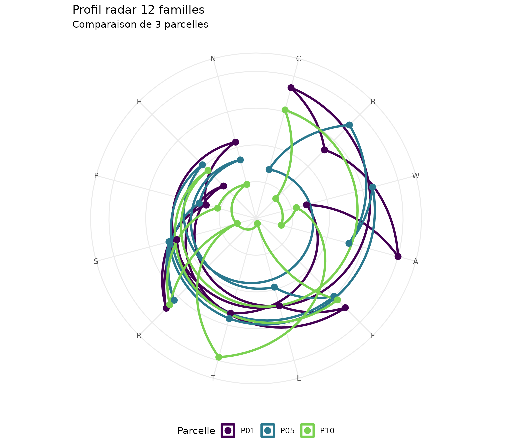

### Comparaison de plusieurs parcelles

``` r

# Comparer plusieurs parcelles sur le même radar
nemeton_radar(
  demo_norm,
  unit_id = c("P01", "P05", "P10"),
  mode = "family",
  title = "Comparaison de 3 parcelles - 12 familles"
)
```

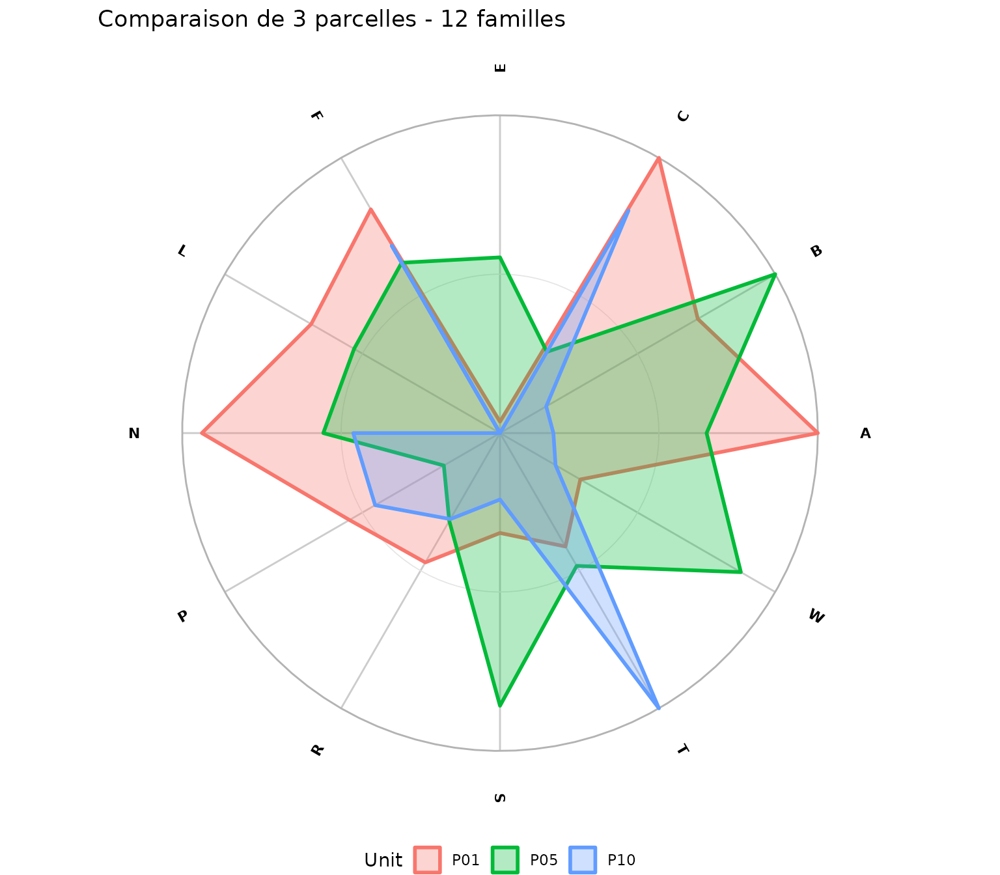

### Cartes des scores de famille

``` r

# Préparer les données pour les cartes
map_data <- demo_norm |>
  select(parcel_id, famille_carbone, famille_biodiversite, famille_eau, famille_production, geometry) |>
  pivot_longer(
    cols = starts_with("famille_"),
    names_to = "family",
    values_to = "score"
  ) |>
  mutate(family = case_when(
    family == "famille_carbone" ~ "Carbone",
    family == "famille_biodiversite" ~ "Biodiversité",
    family == "famille_eau" ~ "Eau",
    family == "famille_production" ~ "Production"
  ))

ggplot(map_data) +
  geom_sf(aes(fill = score), color = "white", linewidth = 0.3) +
  facet_wrap(~family, ncol = 2) +
  scale_fill_viridis_c(name = "Score\n(0-100)", option = "D") +
  labs(
    title = "Scores par famille de services écosystémiques",
    subtitle = "4 familles clés : Carbone, Biodiversité, Eau, Production"
  ) +
  theme_minimal() +
  theme(
    axis.text = element_blank(),
    axis.ticks = element_blank(),
    strip.text = element_text(face = "bold", size = 11)
  )
```

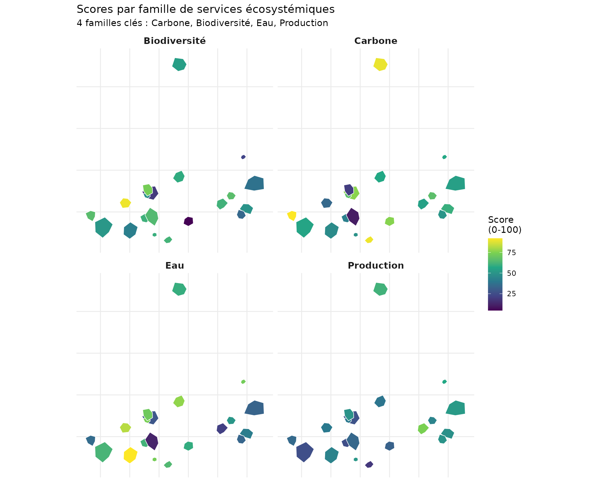

## Analyse croisée inter-familles

### Matrice de corrélations

``` r

# Extraire les scores de famille
family_scores <- demo_norm |>
  st_drop_geometry() |>
  select(starts_with("famille_"))

# Renommer pour lisibilité
names(family_scores) <- gsub("famille_", "", names(family_scores))

# Calculer la matrice de corrélation
cor_matrix <- cor(family_scores, use = "complete.obs")

# Préparer pour ggplot
cor_data <- as.data.frame(as.table(cor_matrix))
names(cor_data) <- c("Family1", "Family2", "Correlation")

ggplot(cor_data, aes(x = Family1, y = Family2, fill = Correlation)) +
  geom_tile(color = "white") +
  geom_text(aes(label = sprintf("%.2f", Correlation)), size = 3) +
  scale_fill_gradient2(
    low = "#2166AC",
    mid = "white",
    high = "#B2182B",
    midpoint = 0,
    limits = c(-1, 1)
  ) +
  labs(
    title = "Corrélations entre familles d'indicateurs",
    subtitle = "Rouge = synergies, Bleu = trade-offs",
    x = "", y = ""
  ) +
  theme_minimal() +
  theme(
    axis.text.x = element_text(angle = 45, hjust = 1),
    panel.grid = element_blank()
  )
```


**Interprétation** : - **Corrélation positive (rouge)** : Synergies (ex:
Carbone × Production) - **Corrélation négative (bleu)** :
Conflits/trade-offs - **Corrélation faible (blanc)** : Indépendance

### Scatter plot des synergies/conflits

``` r

ggplot(demo_norm |> st_drop_geometry(), aes(x = famille_carbone, y = famille_biodiversite)) +
  geom_point(aes(color = famille_production, size = famille_naturalite), alpha = 0.7) +
  geom_smooth(method = "lm", se = TRUE, color = "gray40", linetype = "dashed") +
  scale_color_viridis_c(name = "Production", option = "D") +
  scale_size_continuous(name = "Naturalité", range = c(2, 8)) +
  labs(
    title = "Synergies Carbone-Biodiversité",
    subtitle = "Taille = naturalité, Couleur = production",
    x = "Score Carbone (famille C)",
    y = "Score Biodiversité (famille B)"
  ) +
  theme_minimal()
```

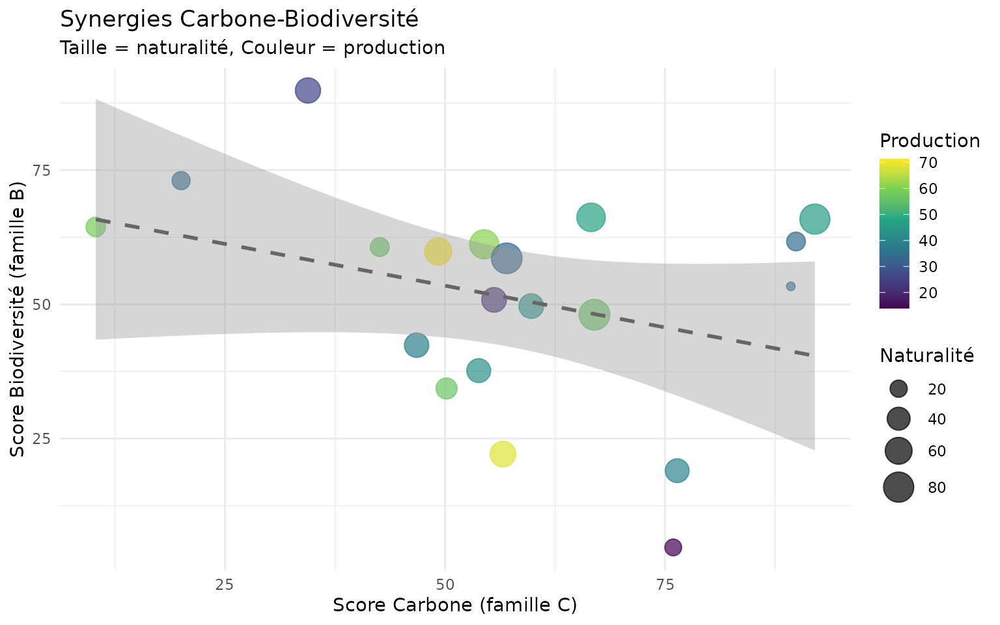

## Identification de hotspots multi-services

``` r

# Identifier les parcelles excellentes sur plusieurs familles
threshold <- 60  # Top 40%

demo_norm <- demo_norm |>
  mutate(
    high_C = famille_carbone >= threshold,
    high_B = famille_biodiversite >= threshold,
    high_W = famille_eau >= threshold,
    high_N = famille_naturalite >= threshold,
    high_P = famille_production >= threshold,
    hotspot_count = high_C + high_B + high_W + high_N + high_P,
    is_hotspot = hotspot_count >= 3
  )

# Cartographier les hotspots
ggplot(demo_norm) +
  geom_sf(aes(fill = factor(hotspot_count)), color = "white", linewidth = 0.5) +
  scale_fill_manual(
    values = c("0" = "#FFEBEE", "1" = "#FFCDD2", "2" = "#EF9A9A",
               "3" = "#E57373", "4" = "#EF5350", "5" = "#C62828"),
    name = "Familles\nélevées"
  ) +
  labs(
    title = "Hotspots multi-services écosystémiques",
    subtitle = sprintf("Seuil = %d/100 (5 familles: C, B, W, N, P)", threshold)
  ) +
  theme_minimal() +
  theme(
    axis.text = element_blank(),
    axis.ticks = element_blank(),
    legend.position = "right"
  )
```

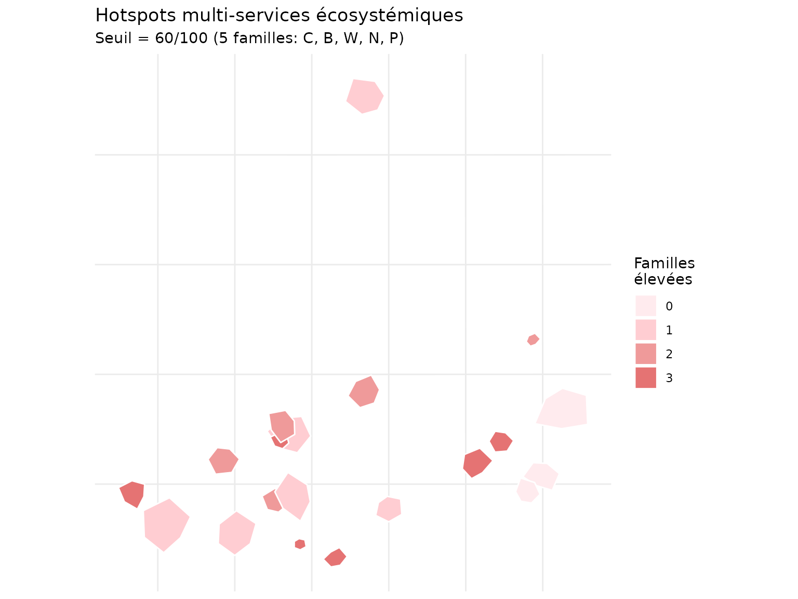

### Statistiques des hotspots

``` r

hotspot_stats <- demo_norm |>
  st_drop_geometry() |>
  group_by(hotspot_count) |>
  summarise(
    n_parcelles = n(),
    surface_totale = round(sum(surface_ha), 1),
    C_mean = round(mean(famille_carbone), 1),
    B_mean = round(mean(famille_biodiversite), 1),
    P_mean = round(mean(famille_production), 1),
    .groups = "drop"
  )

hotspot_stats
#> # A tibble: 4 × 6
#>   hotspot_count n_parcelles surface_totale C_mean B_mean P_mean
#>           <int>       <int>          <dbl>  <dbl>  <dbl>  <dbl>
#> 1             0           3           26.9   54.6   40.6   47.9
#> 2             1           6           64.8   59     39.1   34.8
#> 3             2           5           24.1   42.1   60.9   43.8
#> 4             3           6           20.3   69.9   60.5   52.7
```

## Indice global multi-famille

``` r

# Créer un indice global pondéré
demo_norm <- demo_norm |>
  mutate(
    ecosystem_index = (
      famille_carbone * 0.15 +  # Carbone
      famille_biodiversite * 0.15 +  # Biodiversité
      famille_eau * 0.10 +  # Eau
      famille_air * 0.05 +  # Air
      famille_sol * 0.05 +  # Fertilité
      famille_paysage * 0.05 +  # Paysage
      famille_temporel * 0.05 +  # Temporel
      famille_risque * 0.10 +  # Risques (résilience)
      famille_social * 0.05 +  # Social
      famille_production * 0.10 +  # Production
      famille_energie * 0.05 +  # Énergie
      famille_naturalite * 0.10    # Naturalité
    )
  )

# Carte de l'indice global
ggplot(demo_norm) +
  geom_sf(aes(fill = ecosystem_index), color = "white", linewidth = 0.3) +
  scale_fill_viridis_c(
    name = "Indice\nglobal",
    option = "D"
  ) +
  labs(
    title = "Indice de services écosystémiques global",
    subtitle = "Agrégation pondérée des 12 familles"
  ) +
  theme_minimal() +
  theme(
    axis.text = element_blank(),
    axis.ticks = element_blank()
  )
```

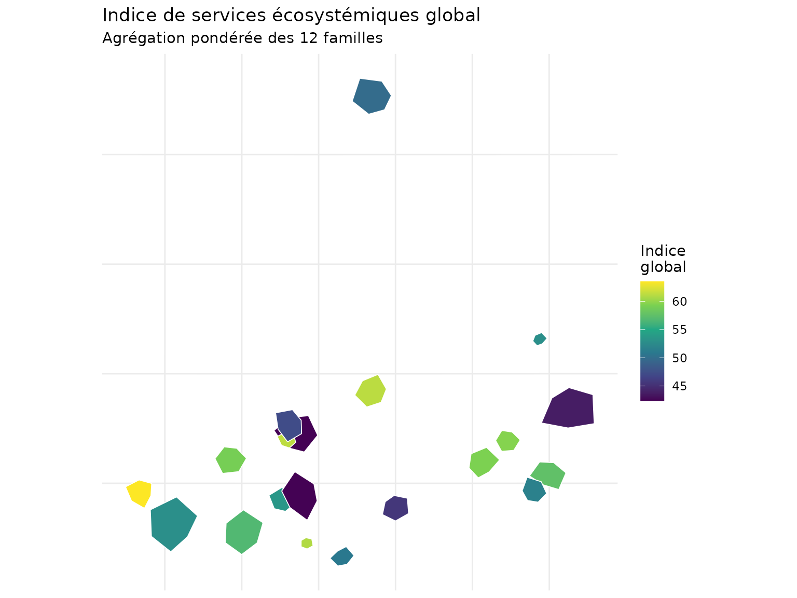

### Distribution de l’indice global

``` r

ggplot(demo_norm |> st_drop_geometry(), aes(x = ecosystem_index)) +
  geom_histogram(bins = 10, fill = "#2E7D32", alpha = 0.7, color = "white") +
  geom_vline(
    aes(xintercept = mean(ecosystem_index)),
    color = "red",
    linetype = "dashed",
    linewidth = 1
  ) +
  annotate("text", x = mean(demo_norm$ecosystem_index) + 3, y = 4,
           label = sprintf("Moyenne: %.1f", mean(demo_norm$ecosystem_index)),
           color = "red", fontface = "bold") +
  labs(
    title = "Distribution de l'indice global",
    x = "Score (0-100)",
    y = "Nombre de parcelles"
  ) +
  theme_minimal()
```

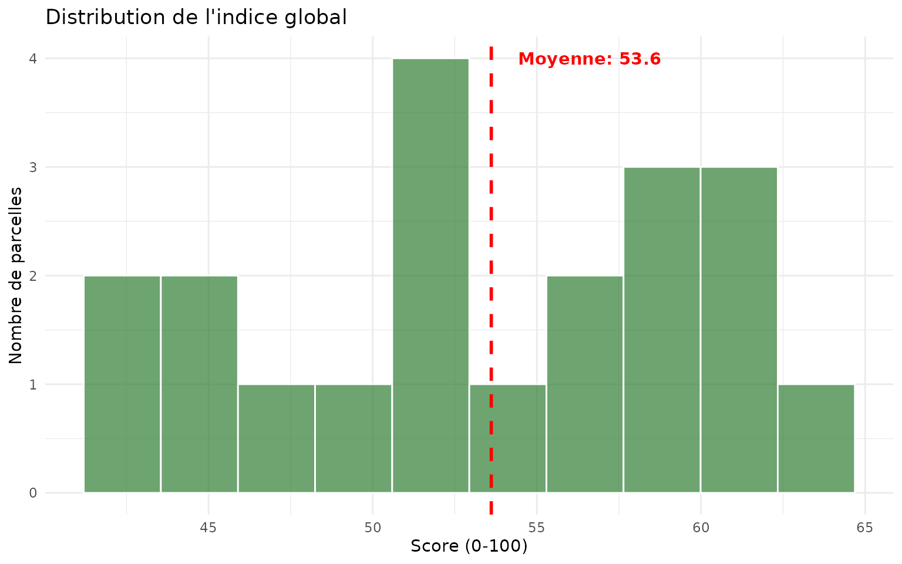

## Bonnes pratiques

### Choix des indicateurs

- Sélectionner les indicateurs pertinents pour les **objectifs de
  gestion**
- Vérifier la **disponibilité des données** (rasters, vecteurs,
  attributs)
- Éviter la redondance entre indicateurs d’une même famille

### Normalisation

- Utiliser **min-max** pour des scores comparables (0-100)
- **Inverser** les indicateurs où faible = mieux (risques,
  fragmentation)
- Documenter les **seuils d’interprétation**

### Agrégation

- **Moyenne arithmétique** : hypothèse de substituabilité
- **Moyenne géométrique** : pénalise les faibles scores
- **Minimum** : approche du facteur limitant
- **Pondération** : refléter les priorités de gestion

## Références

- Guide de démarrage :
  [`vignette("getting-started_fr")`](https://pobsteta.github.io/nemeton/articles/getting-started_fr.md)
- Analyse temporelle :
  [`vignette("temporal-analysis_fr")`](https://pobsteta.github.io/nemeton/articles/temporal-analysis_fr.md)
- Optimisation multi-critère :
  [`vignette("multi-criteria-optimization_fr")`](https://pobsteta.github.io/nemeton/articles/multi-criteria-optimization_fr.md)

## Session Info

``` r

sessionInfo()
#> R version 4.6.1 (2026-06-24)
#> Platform: x86_64-pc-linux-gnu
#> Running under: Ubuntu 24.04.4 LTS
#> 
#> Matrix products: default
#> BLAS:   /usr/lib/x86_64-linux-gnu/openblas-pthread/libblas.so.3 
#> LAPACK: /usr/lib/x86_64-linux-gnu/openblas-pthread/libopenblasp-r0.3.26.so;  LAPACK version 3.12.0
#> 
#> locale:
#>  [1] LC_CTYPE=C.UTF-8       LC_NUMERIC=C           LC_TIME=C.UTF-8       
#>  [4] LC_COLLATE=C.UTF-8     LC_MONETARY=C.UTF-8    LC_MESSAGES=C.UTF-8   
#>  [7] LC_PAPER=C.UTF-8       LC_NAME=C              LC_ADDRESS=C          
#> [10] LC_TELEPHONE=C         LC_MEASUREMENT=C.UTF-8 LC_IDENTIFICATION=C   
#> 
#> time zone: UTC
#> tzcode source: system (glibc)
#> 
#> attached base packages:
#> [1] stats     graphics  grDevices utils     datasets  methods   base     
#> 
#> other attached packages:
#> [1] tidyr_1.3.2     sf_1.1-1        dplyr_1.2.1     ggplot2_4.0.3  
#> [5] nemeton_0.160.0
#> 
#> loaded via a namespace (and not attached):
#>  [1] utf8_1.2.6         sass_0.4.10        generics_0.1.4     class_7.3-23      
#>  [5] KernSmooth_2.23-26 lattice_0.22-9     digest_0.6.39      magrittr_2.0.5    
#>  [9] evaluate_1.0.5     grid_4.6.1         RColorBrewer_1.1-3 fastmap_1.2.0     
#> [13] Matrix_1.7-5       jsonlite_2.0.0     e1071_1.7-17       DBI_1.3.0         
#> [17] mgcv_1.9-4         purrr_1.2.2        viridisLite_0.4.3  scales_1.4.0      
#> [21] codetools_0.2-20   textshaping_1.0.5  jquerylib_0.1.4    cli_3.6.6         
#> [25] rlang_1.3.0        units_1.0-1        splines_4.6.1      withr_3.0.3       
#> [29] cachem_1.1.0       yaml_2.3.12        otel_0.2.0         tools_4.6.1       
#> [33] vctrs_0.7.3        R6_2.6.1           proxy_0.4-29       lifecycle_1.0.5   
#> [37] classInt_0.4-11    fs_2.1.0           htmlwidgets_1.6.4  ragg_1.5.2        
#> [41] pkgconfig_2.0.3    desc_1.4.3         pkgdown_2.2.1      terra_1.9-34      
#> [45] bslib_0.11.0       pillar_1.11.1      gtable_0.3.6       glue_1.8.1        
#> [49] Rcpp_1.1.2         systemfonts_1.3.2  xfun_0.60          tibble_3.3.1      
#> [53] tidyselect_1.2.1   knitr_1.51         farver_2.1.2       nlme_3.1-169      
#> [57] htmltools_0.5.9    rmarkdown_2.31     labeling_0.4.3     compiler_4.6.1    
#> [61] S7_0.2.2
```
