# Optimisation Multi-Critères

## Introduction

La gestion forestière durable nécessite souvent d’équilibrer des
objectifs multiples et potentiellement conflictuels : production de
bois, conservation de la biodiversité, services récréatifs,
séquestration du carbone, etc.

Cette vignette présente les outils d’**optimisation multi-critères** du
package `nemeton` :

1.  **Analyse de Pareto** : Identifier les solutions non-dominées
    (optimales)
2.  **Clustering** : Regrouper les parcelles selon leurs profils
    multi-familles
3.  **Trade-off Analysis** : Visualiser les compromis entre objectifs

``` r

library(nemeton)
library(ggplot2)
library(dplyr)

# Charger le jeu de données de démonstration
data(massif_demo_units)

# Générer des indicateurs synthétiques pour la démonstration
set.seed(42)
n <- nrow(massif_demo_units)

# Indicateurs de chaque famille
massif_demo_units$C1 <- runif(n, 50, 300)  # Biomasse
massif_demo_units$C2 <- runif(n, 0.3, 0.9)  # NDVI
massif_demo_units$B1 <- runif(n, 0, 100)    # Protection
massif_demo_units$B2 <- runif(n, 20, 80)    # Structure
massif_demo_units$B3 <- runif(n, 100, 3000) # Connectivité
massif_demo_units$W1 <- runif(n, 0, 500)    # Eau
massif_demo_units$W2 <- runif(n, 0, 50)
massif_demo_units$W3 <- runif(n, 2, 15)
massif_demo_units$A1 <- runif(n, 40, 95)    # Air
massif_demo_units$A2 <- runif(n, 1, 5)
massif_demo_units$F1 <- runif(n, 30, 90)    # Fertilité
massif_demo_units$F2 <- runif(n, 0, 50)
massif_demo_units$L1 <- runif(n, 0.1, 0.9)  # Paysage
massif_demo_units$L2 <- runif(n, 0, 200)
massif_demo_units$T1 <- runif(n, 20, 150)   # Temps
massif_demo_units$T2 <- runif(n, -20, 20)
massif_demo_units$R1 <- runif(n, 10, 90)    # Risques
massif_demo_units$R2 <- runif(n, 10, 80)
massif_demo_units$R3 <- runif(n, 0, 100)
massif_demo_units$S1 <- runif(n, 0, 5)      # Social
massif_demo_units$S2 <- runif(n, 0, 100)
massif_demo_units$S3 <- runif(n, 0, 50000)
massif_demo_units$P1 <- runif(n, 50, 500)   # Production
massif_demo_units$P2 <- runif(n, 2, 15)
massif_demo_units$P3 <- runif(n, 30, 90)
massif_demo_units$E1 <- runif(n, 1, 12)     # Énergie
massif_demo_units$E2 <- runif(n, 5, 25)
massif_demo_units$N1 <- runif(n, 100, 5000) # Naturalité
massif_demo_units$N2 <- runif(n, 0, 100)
massif_demo_units$N3 <- runif(n, 20, 80)

# Calculer les indices de famille
massif_demo_units <- create_family_index(massif_demo_units)
```

## 1. Analyse de Pareto Optimality

### Concept

Une parcelle est **Pareto-optimale** (non-dominée) si aucune autre
parcelle n’est strictement meilleure sur tous les objectifs
simultanément. Ces parcelles forment la **frontière de Pareto** -
l’ensemble des meilleures solutions possibles où améliorer un objectif
nécessite de dégrader au moins un autre.

### Identifier les Parcelles Pareto-Optimales

``` r

# Exemple 1: Maximiser Carbon (C), Biodiversité (B), et Production (P)
result_pareto <- identify_pareto_optimal(
  massif_demo_units,
  objectives = c("famille_carbone", "famille_biodiversite", "famille_production"),
  maximize = c(TRUE, TRUE, TRUE)
)

# Combien de parcelles sont Pareto-optimales ?
table(result_pareto$is_optimal)
#> 
#> FALSE  TRUE 
#>    12     8

# Quelles parcelles sont optimales ?
result_pareto |>
  sf::st_drop_geometry() |>
  filter(is_optimal) |>
  select(parcel_id, famille_carbone, famille_biodiversite, famille_production, is_optimal)
#>   parcel_id famille_carbone famille_biodiversite famille_production is_optimal
#> 1       P02        56.03319             53.97732           94.52489       TRUE
#> 2       P05        58.05154             59.15995           72.58841       TRUE
#> 3       P06        85.69484             36.87325           70.93276       TRUE
#> 4       P07        69.22355             54.04608           75.04341       TRUE
#> 5       P08        35.29203             84.20560           50.81916       TRUE
#> 6       P10        80.60898             65.43590           49.38143       TRUE
#> 7       P15        29.36510             66.97349           68.08899       TRUE
#> 8       P17        74.72492             49.60679           76.11791       TRUE
```

### Visualisation Spatiale

``` r

# Cartographier les parcelles Pareto-optimales
ggplot(result_pareto) +
  geom_sf(aes(fill = is_optimal), color = "white", size = 0.5) +
  scale_fill_manual(
    values = c("gray70", "red"),
    labels = c("Non-optimal", "Pareto-optimal"),
    name = "Statut"
  ) +
  labs(title = "Parcelles Pareto-Optimales (C, B, P)") +
  theme_minimal()
```

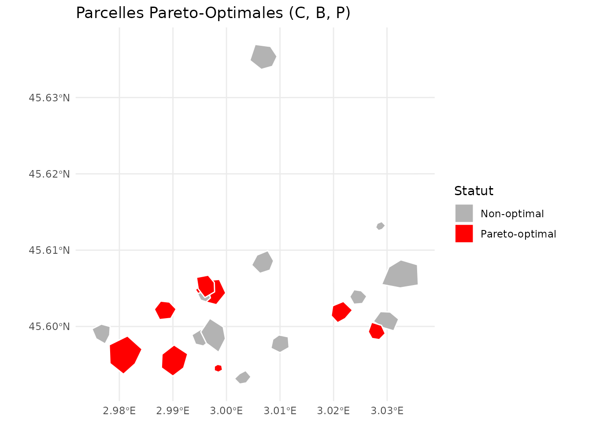

### Objectifs Mixtes (Maximisation + Minimisation)

``` r

# Exemple 2: Maximiser C et B, Minimiser Risque incendie (R1)
result_mixed <- identify_pareto_optimal(
  massif_demo_units,
  objectives = c("famille_carbone", "famille_biodiversite", "R1"),
  maximize = c(TRUE, TRUE, FALSE) # Minimiser R1
)

table(result_mixed$is_optimal)
#> 
#> FALSE  TRUE 
#>    10    10

# Profil des parcelles optimales
result_mixed |>
  sf::st_drop_geometry() |>
  filter(is_optimal) |>
  select(parcel_id, famille_carbone, famille_biodiversite, R1, is_optimal)
#>    parcel_id famille_carbone famille_biodiversite       R1 is_optimal
#> 1        P03       16.100344             68.45678 21.35271       TRUE
#> 2        P04       63.078203             65.15011 32.38454       TRUE
#> 3        P06       85.694843             36.87325 84.81116       TRUE
#> 4        P07       69.223549             54.04608 38.67201       TRUE
#> 5        P08       35.292032             84.20560 77.36057       TRUE
#> 6        P10       80.608984             65.43590 70.05888       TRUE
#> 7        P12        9.858009             30.43549 10.19025       TRUE
#> 8        P15       29.365103             66.97349 64.02557       TRUE
#> 9        P16       70.892118             61.72952 48.42976       TRUE
#> 10       P17       74.724920             49.60679 52.70630       TRUE
```

## 2. Clustering de Parcelles

### K-means Clustering

Le clustering K-means regroupe les parcelles ayant des profils
similaires sur plusieurs familles d’indicateurs.

``` r

# Clustering avec k=3 prédéfini
result_kmeans <- cluster_parcels(
  massif_demo_units,
  families = c("famille_carbone", "famille_biodiversite", "famille_production", "famille_social"),
  k = 3,
  method = "kmeans"
)

# Distribution des clusters
table(result_kmeans$cluster)
#> 
#> 1 2 3 
#> 8 4 8

# Profil moyen de chaque cluster
profiles <- attr(result_kmeans, "cluster_profile")
print(profiles)
#>   famille_carbone famille_biodiversite famille_production famille_social
#> 1        60.15456             63.28843           58.87746       32.81139
#> 2         9.01867             40.19858           15.80131       40.17970
#> 3        51.76739             46.68146           54.21323       63.11771
```

### Visualisation des Clusters

``` r

# Carte des clusters
ggplot(result_kmeans) +
  geom_sf(aes(fill = factor(cluster)), color = "white", size = 0.5) +
  scale_fill_viridis_d(name = "Cluster") +
  labs(title = "Clusters K-means (k=3) sur C, B, P, S") +
  theme_minimal()
```

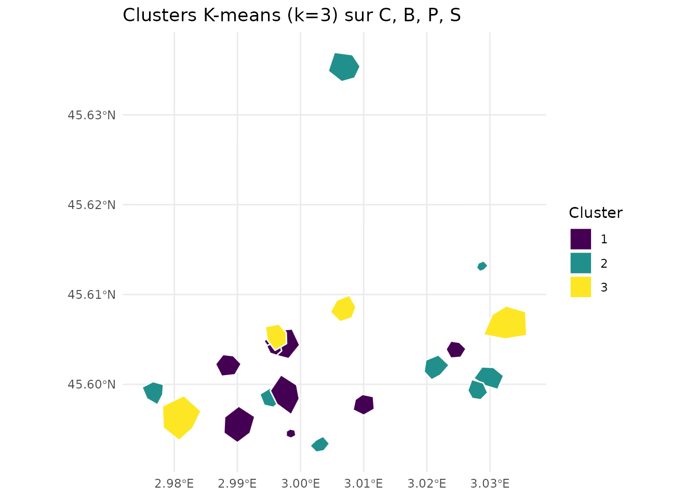

### Auto-détermination du K Optimal

Utiliser l’analyse de silhouette pour trouver automatiquement le nombre
optimal de clusters :

``` r

# Laisser l'algorithme déterminer k optimal
result_auto <- cluster_parcels(
  massif_demo_units,
  families = c("famille_carbone", "famille_biodiversite", "famille_production", "famille_social"),
  k = NULL, # Auto-détermination
  method = "kmeans"
)

# K optimal déterminé
optimal_k <- attr(result_auto, "optimal_k")
print(paste("K optimal:", optimal_k))
#> [1] "K optimal: 6"

# Scores de silhouette pour chaque k testé
silhouette_scores <- attr(result_auto, "silhouette_scores")
print(silhouette_scores)
#>         2         3         4         5         6         7         8         9 
#> 0.2496183 0.3141765 0.3056635 0.3055408 0.3276885 0.3162228 0.3180381 0.3027051 
#>        10 
#> 0.2944059

# Visualiser les scores de silhouette
k_values <- as.integer(names(silhouette_scores))
plot(k_values, silhouette_scores,
  type = "b", pch = 19, col = "blue",
  xlab = "Nombre de clusters (k)",
  ylab = "Score de silhouette moyen",
  main = "Détermination du K Optimal"
)
abline(v = optimal_k, col = "red", lty = 2)
```

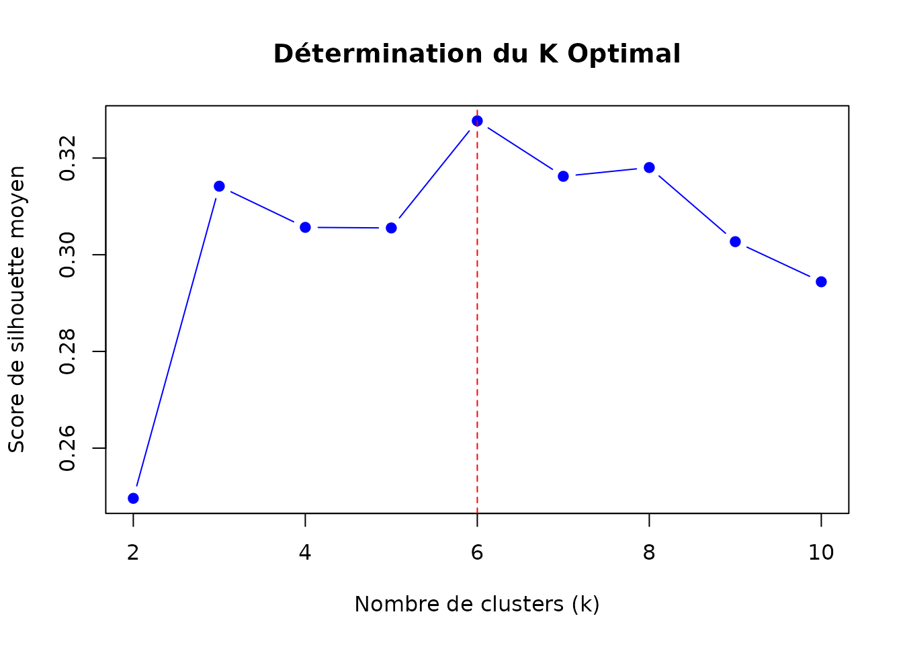

### Clustering Hiérarchique

Alternative au K-means utilisant la méthode de Ward :

``` r

# Clustering hiérarchique
result_hclust <- cluster_parcels(
  massif_demo_units,
  families = c("famille_carbone", "famille_biodiversite", "famille_production", "famille_social"),
  k = 3,
  method = "hierarchical"
)

# Comparer avec K-means
comparison <- data.frame(
  kmeans = result_kmeans$cluster,
  hierarchical = result_hclust$cluster
)
table(comparison)
#>       hierarchical
#> kmeans 1 2 3
#>      1 0 8 0
#>      2 0 0 4
#>      3 7 1 0
```

### Interprétation des Clusters

``` r

# Analyser les profils des clusters
profiles_kmeans <- attr(result_kmeans, "cluster_profile")

# Identifier les caractéristiques de chaque cluster
for (i in seq_len(nrow(profiles_kmeans))) {
  cat("\n=== Cluster", i, "===\n")
  cat("Carbone (C):", round(profiles_kmeans[i, "famille_carbone"], 2), "\n")
  cat("Biodiversité (B):", round(profiles_kmeans[i, "famille_biodiversite"], 2), "\n")
  cat("Production (P):", round(profiles_kmeans[i, "famille_production"], 2), "\n")
  cat("Social (S):", round(profiles_kmeans[i, "famille_social"], 2), "\n")

  # Interprétation
  if (profiles_kmeans[i, "famille_biodiversite"] > 0.7 && profiles_kmeans[i, "famille_carbone"] > 0.7) {
    cat("→ Type: Haute conservation\n")
  } else if (profiles_kmeans[i, "famille_production"] > 0.7) {
    cat("→ Type: Production intensive\n")
  } else if (profiles_kmeans[i, "famille_social"] > 0.7) {
    cat("→ Type: Usage récréatif\n")
  } else {
    cat("→ Type: Usage mixte/équilibré\n")
  }
}
#> 
#> === Cluster 1 ===
#> Carbone (C): 60.15 
#> Biodiversité (B): 63.29 
#> Production (P): 58.88 
#> Social (S): 32.81 
#> → Type: Haute conservation
#> 
#> === Cluster 2 ===
#> Carbone (C): 9.02 
#> Biodiversité (B): 40.2 
#> Production (P): 15.8 
#> Social (S): 40.18 
#> → Type: Haute conservation
#> 
#> === Cluster 3 ===
#> Carbone (C): 51.77 
#> Biodiversité (B): 46.68 
#> Production (P): 54.21 
#> Social (S): 63.12 
#> → Type: Haute conservation
```

## 3. Trade-off Analysis

### Visualiser les Compromis

Les trade-off plots révèlent les relations (synergies ou compromis)
entre paires de services écosystémiques.

``` r

# Trade-off entre Carbone et Biodiversité
plot_tradeoff(
  massif_demo_units,
  x = "famille_carbone",
  y = "famille_biodiversite",
  xlab = "Carbone & Vitalité",
  ylab = "Biodiversité",
  title = "Trade-off: Carbone vs Biodiversité"
)
```

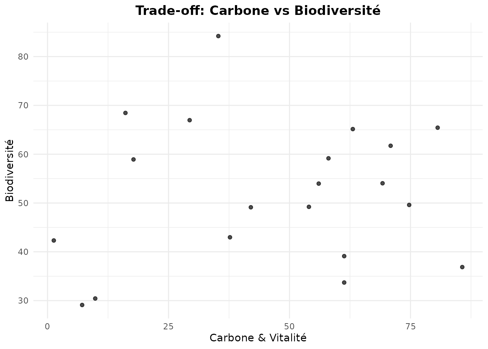

#### Interprétation

- **Corrélation positive** (points alignés diagonalement ↗️) : Synergie
- **Corrélation négative** (points alignés ↘️) : Trade-off/compromis
- **Nuage dispersé** : Pas de relation claire

### Trade-off avec Dimension Supplémentaire (Couleur)

``` r

# Ajouter une 3ème dimension (Production) via la couleur
plot_tradeoff(
  massif_demo_units,
  x = "famille_carbone",
  y = "famille_biodiversite",
  color = "famille_production",
  xlab = "Carbone",
  ylab = "Biodiversité",
  title = "Trade-off C-B (coloré par Production)"
)
```

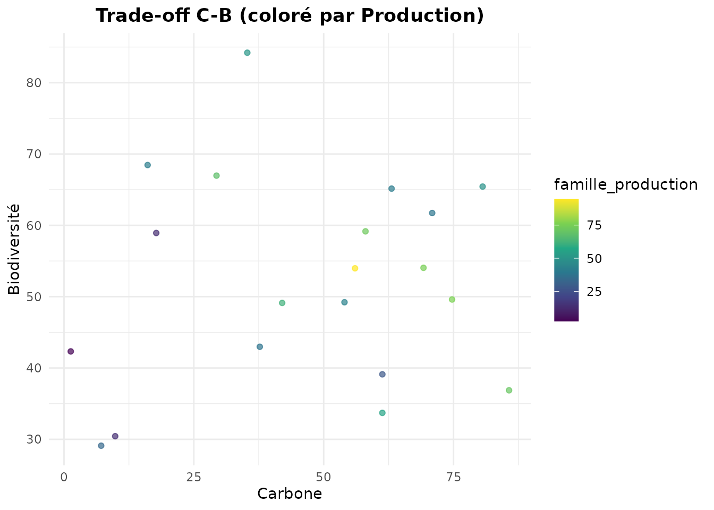

### Overlay de la Frontière de Pareto

Combiner trade-off plot avec l’analyse de Pareto pour identifier
visuellement les meilleures solutions :

``` r

# D'abord identifier les parcelles Pareto-optimales
pareto_result <- identify_pareto_optimal(
  massif_demo_units,
  objectives = c("famille_carbone", "famille_biodiversite"),
  maximize = c(TRUE, TRUE)
)

# Puis tracer avec frontière Pareto
plot_tradeoff(
  pareto_result,
  x = "famille_carbone",
  y = "famille_biodiversite",
  pareto_frontier = TRUE,
  xlab = "Carbone",
  ylab = "Biodiversité",
  title = "Trade-off C-B avec Frontière de Pareto"
)
```

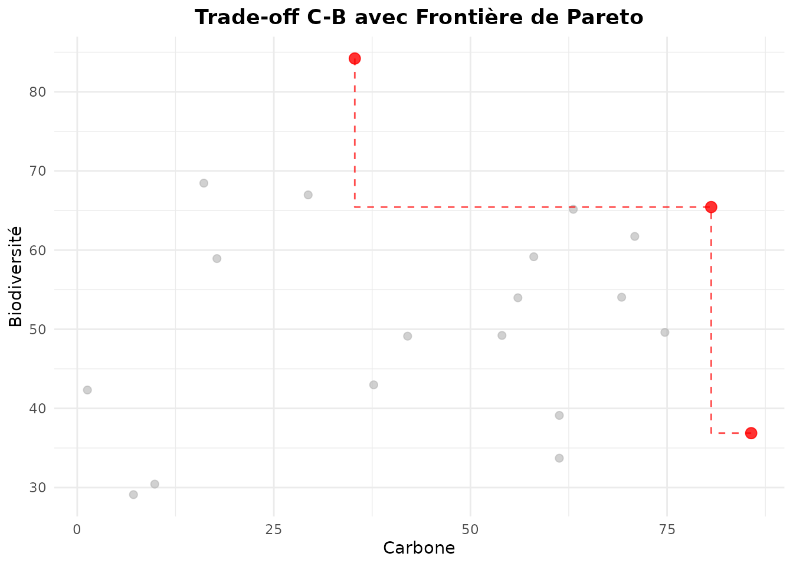

Les points rouges (reliés par la ligne) sont Pareto-optimaux - ils
représentent les meilleures combinaisons possibles de C et B.

### Matrice de Trade-offs

Analyser plusieurs paires d’objectifs simultanément :

``` r

library(patchwork)

# Créer une matrice de trade-off plots
p1 <- plot_tradeoff(massif_demo_units, "famille_carbone", "famille_biodiversite",
  title = "C vs B"
) + theme(legend.position = "none")
p2 <- plot_tradeoff(massif_demo_units, "famille_carbone", "famille_production",
  title = "C vs P"
) + theme(legend.position = "none")
p3 <- plot_tradeoff(massif_demo_units, "famille_biodiversite", "famille_production",
  title = "B vs P"
) + theme(legend.position = "none")
p4 <- plot_tradeoff(massif_demo_units, "famille_production", "famille_energie",
  title = "P vs E"
) + theme(legend.position = "none")
p5 <- plot_tradeoff(massif_demo_units, "famille_social", "famille_naturalite",
  title = "S vs N"
) + theme(legend.position = "none")
p6 <- plot_tradeoff(massif_demo_units, "famille_biodiversite", "famille_naturalite",
  title = "B vs N"
) + theme(legend.position = "none")

(p1 + p2 + p3) / (p4 + p5 + p6) +
  plot_annotation(title = "Matrice de Trade-offs Entre Familles")
```

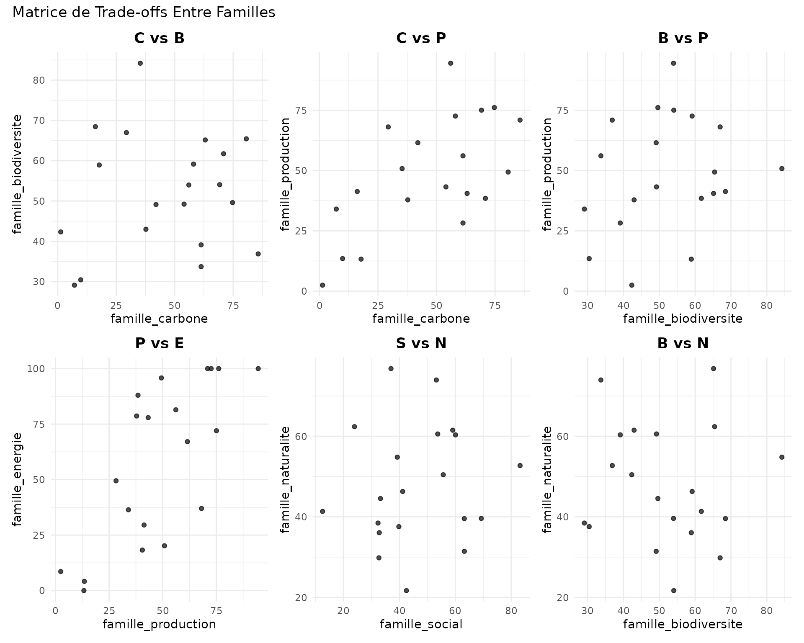

### Étiquetage des Parcelles

Identifier des parcelles spécifiques sur le trade-off plot :

``` r

# Ajouter des labels pour les parcelles Pareto-optimales
plot_tradeoff(
  pareto_result,
  x = "famille_carbone",
  y = "famille_biodiversite",
  pareto_frontier = TRUE,
  label = "parcel_id", # Afficher les identifiants
  xlab = "Carbone",
  ylab = "Biodiversité",
  title = "Parcelles Identifiées sur la Frontière de Pareto"
)
```

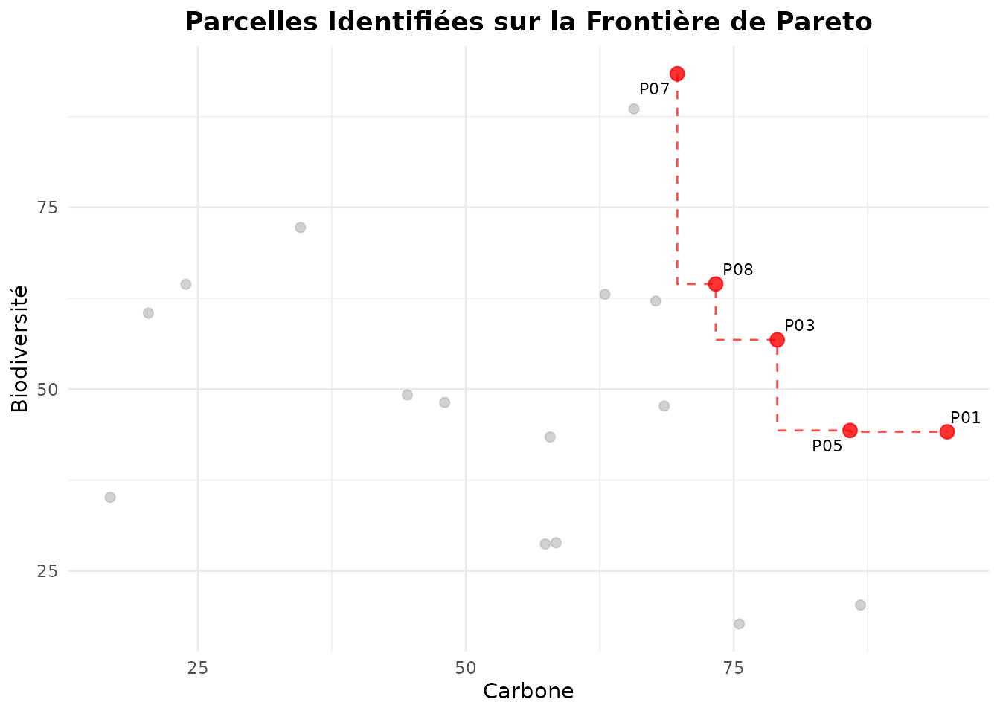

## 4. Cas d’Usage: Sélection de Parcelles pour Conservation

### Objectif

Identifier les **5 meilleures parcelles** pour un projet de conservation
intégrale maximisant simultanément la biodiversité, le carbone, et la
naturalité.

``` r

# Étape 1: Analyse de Pareto sur les 3 objectifs
conservation_pareto <- identify_pareto_optimal(
  massif_demo_units,
  objectives = c("famille_biodiversite", "famille_carbone", "famille_naturalite"),
  maximize = c(TRUE, TRUE, TRUE)
)

# Combien de parcelles Pareto-optimales ?
n_optimal <- sum(conservation_pareto$is_optimal)
cat("Nombre de parcelles Pareto-optimales:", n_optimal, "\n")
#> Nombre de parcelles Pareto-optimales: 4

# Étape 2: Classer les parcelles Pareto-optimales par score composite
conservation_subset <- conservation_pareto |>
  filter(is_optimal) |>
  mutate(composite_score = (famille_biodiversite + famille_carbone + famille_naturalite) / 3) |>
  arrange(desc(composite_score))

# Top 5 parcelles
top5 <- head(conservation_subset, 5)

top5 |>
  sf::st_drop_geometry() |>
  select(parcel_id, famille_biodiversite, famille_carbone, famille_naturalite, composite_score)
#>   parcel_id famille_biodiversite famille_carbone famille_naturalite
#> 1       P10             65.43590        80.60898           62.37741
#> 2       P04             65.15011        63.07820           76.78733
#> 3       P06             36.87325        85.69484           52.72370
#> 4       P08             84.20560        35.29203           54.80803
#>   composite_score
#> 1        69.47410
#> 2        68.33855
#> 3        58.43060
#> 4        58.10189
```

### Visualisation de la Sélection

``` r

# Cartographier les 5 parcelles sélectionnées
conservation_pareto <- conservation_pareto |>
  mutate(
    selected = parcel_id %in% top5$parcel_id
  )

ggplot(conservation_pareto) +
  geom_sf(aes(fill = selected), color = "white", size = 0.5) +
  scale_fill_manual(
    values = c("gray80", "darkgreen"),
    labels = c("Non sélectionné", "Top 5 Conservation"),
    name = "Statut"
  ) +
  labs(title = "Sélection de 5 Parcelles pour Conservation Intégrale") +
  theme_minimal()
```

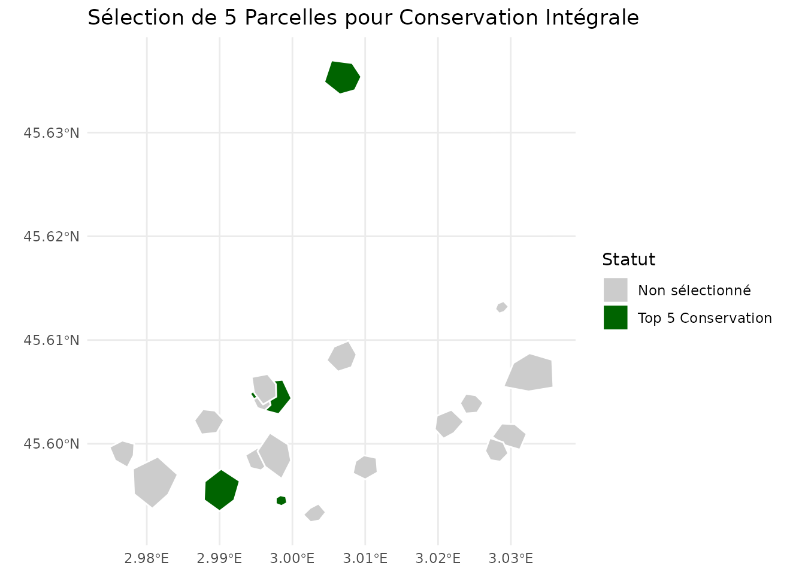

### Trade-off Plot de la Sélection

``` r

# Visualiser les parcelles sélectionnées sur le trade-off B-C
plot_tradeoff(
  conservation_pareto,
  x = "famille_biodiversite",
  y = "famille_carbone",
  color = "famille_naturalite",
  size = "famille_naturalite",
  xlab = "Biodiversité",
  ylab = "Carbone",
  title = "Sélection Conservation (taille/couleur = Naturalité)"
)
```

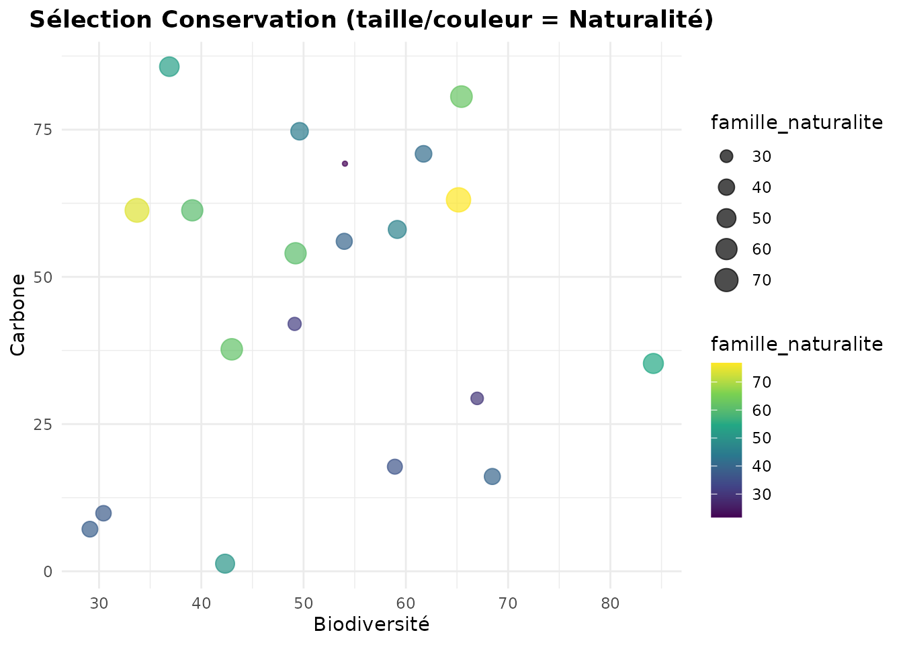

## 5. Cas d’Usage: Zonage Multifonctionnel

### Objectif

Créer un **zonage** de 4 types de gestion basé sur les profils
multi-familles des parcelles.

``` r

# Clustering sur 8 familles représentatives
zonage <- cluster_parcels(
  massif_demo_units,
  families = c(
    "famille_carbone", "famille_biodiversite", "famille_eau", "famille_naturalite", # Conservation
    "famille_production", "famille_energie", # Production
    "famille_social", "famille_air"
  ), # Social
  k = 4,
  method = "kmeans"
)

# Profils des zones
profiles_zonage <- attr(zonage, "cluster_profile")
print(profiles_zonage)
#>   famille_carbone famille_biodiversite famille_eau famille_naturalite
#> 1        68.96946             57.85770    23.88478           60.21410
#> 2        59.86002             47.63249    60.48261           48.03608
#> 3         9.01867             40.19858    36.50350           40.63162
#> 4        26.91916             73.21196    50.95595           41.39627
#>   famille_production famille_energie famille_social famille_air
#> 1           39.15252        62.88334       33.40508    81.53488
#> 2           65.32307        86.34995       55.40481    69.29675
#> 3           15.80131        12.27891       40.17970    36.47150
#> 4           53.40261        28.90418       45.05641    21.72117

# Attribuer des noms de zones selon les profils
zonage <- zonage |>
  mutate(
    zone_name = case_when(
      cluster == 1 ~ "Conservation intégrale",
      cluster == 2 ~ "Production durable",
      cluster == 3 ~ "Usage récréatif",
      cluster == 4 ~ "Gestion mixte",
      TRUE ~ paste("Zone", cluster)
    )
  )

table(zonage$zone_name)
#> 
#> Conservation intégrale          Gestion mixte     Production durable 
#>                      4                      3                      9 
#>        Usage récréatif 
#>                      4
```

### Carte du Zonage

``` r

ggplot(zonage) +
  geom_sf(aes(fill = zone_name), color = "white", size = 0.8) +
  scale_fill_viridis_d(name = "Type de Gestion") +
  labs(title = "Zonage Multifonctionnel Basé sur Clustering") +
  theme_minimal() +
  theme(legend.position = "bottom")
```

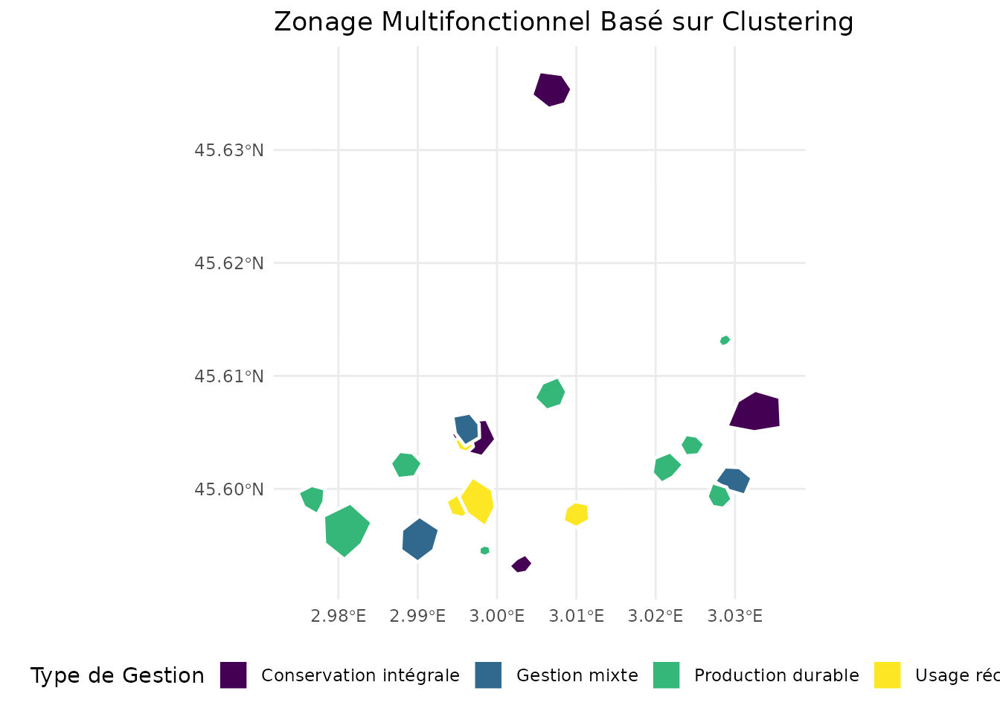

### Statistiques par Zone

``` r

# Résumer les caractéristiques de chaque zone
zonage |>
  sf::st_drop_geometry() |>
  group_by(zone_name) |>
  summarise(
    n_parcelles = n(),
    C_mean = mean(famille_carbone, na.rm = TRUE),
    B_mean = mean(famille_biodiversite, na.rm = TRUE),
    P_mean = mean(famille_production, na.rm = TRUE),
    S_mean = mean(famille_social, na.rm = TRUE),
    N_mean = mean(famille_naturalite, na.rm = TRUE)
  ) |>
  mutate(across(where(is.numeric), ~ round(., 2)))
#> # A tibble: 4 × 7
#>   zone_name              n_parcelles C_mean B_mean P_mean S_mean N_mean
#>   <chr>                        <dbl>  <dbl>  <dbl>  <dbl>  <dbl>  <dbl>
#> 1 Conservation intégrale           4  69.0    57.9   39.2   33.4   60.2
#> 2 Gestion mixte                    3  26.9    73.2   53.4   45.1   41.4
#> 3 Production durable               9  59.9    47.6   65.3   55.4   48.0
#> 4 Usage récréatif                  4   9.02   40.2   15.8   40.2   40.6
```

## Conclusion

Cette vignette a présenté les outils d’optimisation multi-critères du
package `nemeton` :

1.  **Analyse de Pareto** : Identifier les solutions non-dominées pour
    guider les choix de gestion
2.  **Clustering** : Créer des typologies de parcelles et des zonages
    multifonctionnels
3.  **Trade-off Analysis** : Visualiser et quantifier les compromis
    entre services écosystémiques

Ces outils permettent de :

- **Objectiver** les décisions de gestion forestière avec une approche
  scientifique rigoureuse
- **Communiquer** les compromis inévitables entre objectifs conflictuels
- **Optimiser** l’allocation spatiale des usages forestiers à l’échelle
  du territoire
- **Identifier** les parcelles stratégiques pour différents objectifs de
  gestion

## Références

- Obstétar, P. (2025). *nemeton: Ecosystem Services Assessment for
  Forest Management*. R package.
- Miettinen, K. (1998). *Nonlinear Multiobjective Optimization*.
  Springer.
- Jain, A. K., Murty, M. N., & Flynn, P. J. (1999). *Data clustering: a
  review*. ACM Computing Surveys, 31(3), 264-323.
- Poff, N. L., et al. (2010). *The ecological limits of hydrologic
  alteration*. Freshwater Biology, 55(1), 147-170.
