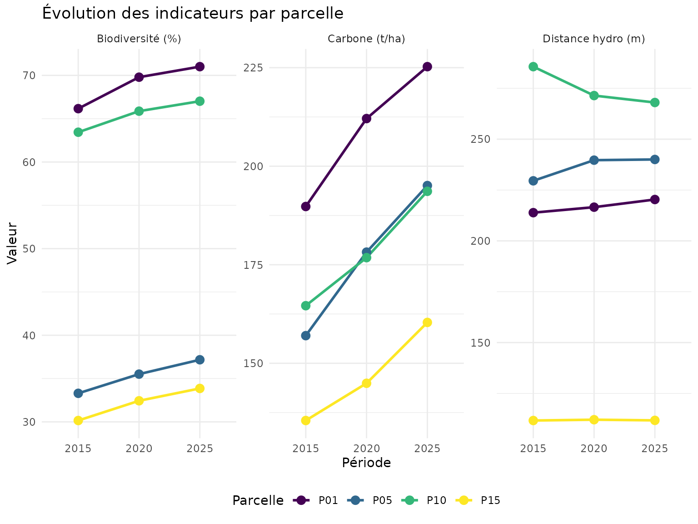
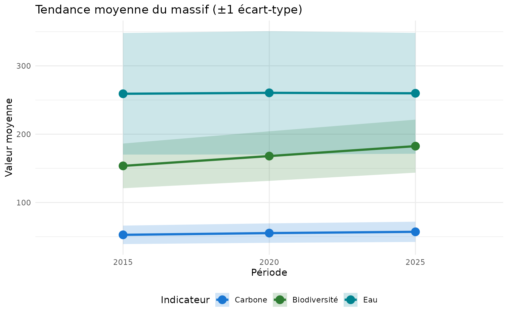
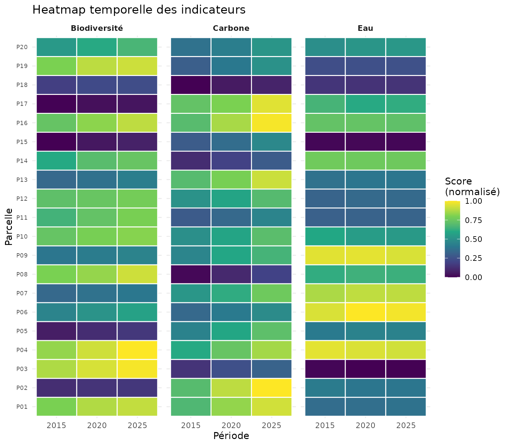
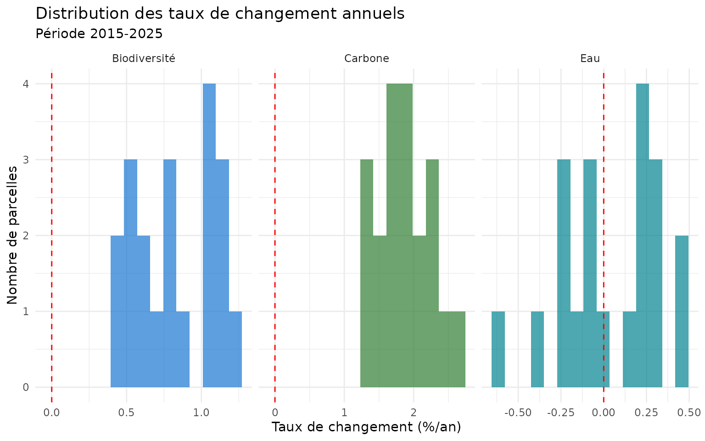
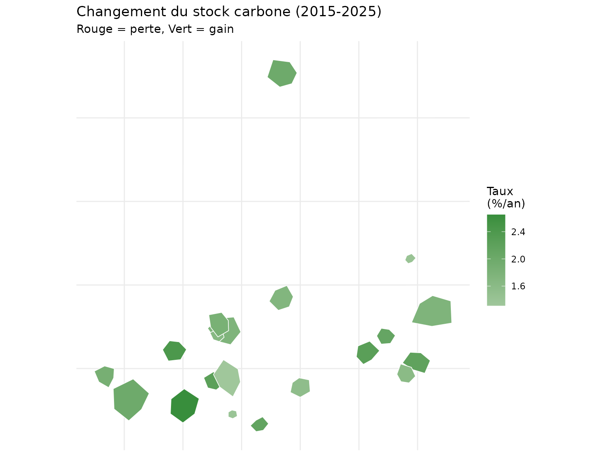
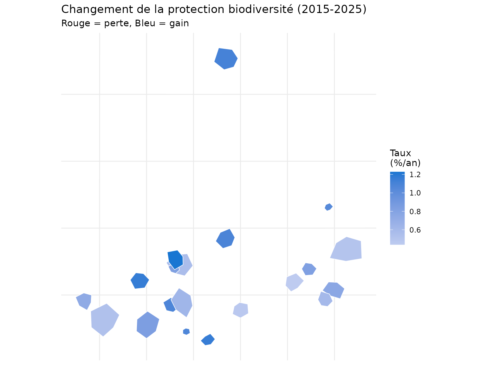
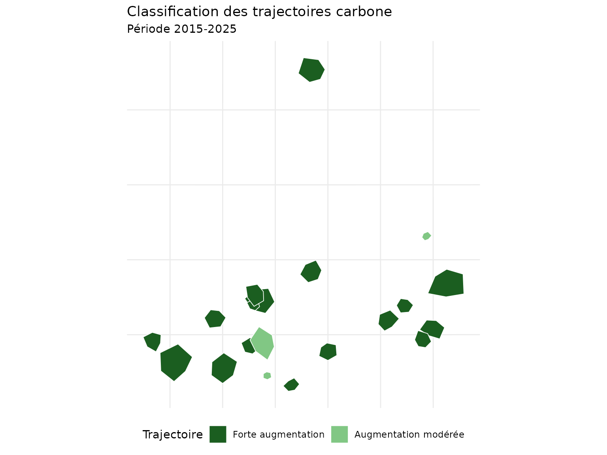
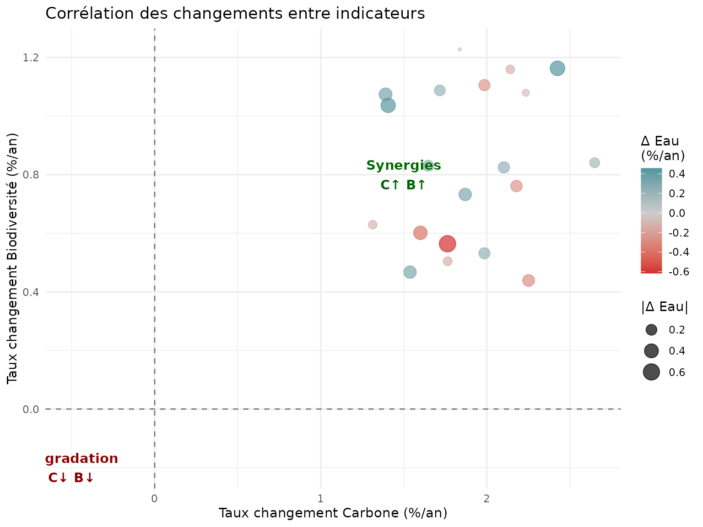

# Analyse temporelle - Suivi multi-périodes

## Introduction

L’analyse temporelle permet de suivre l’évolution des services
écosystémiques forestiers sur plusieurs périodes. Cette vignette
démontre comment utiliser le système
[`nemeton_temporal()`](https://pobsteta.github.io/nemeton/reference/nemeton_temporal.md)
pour : - Comparer les indicateurs à différentes dates - Calculer les
taux de changement - Visualiser les tendances temporelles - Détecter les
ruptures et transitions

``` r

library(nemeton)
library(ggplot2)
library(dplyr)
library(sf)
```

## Données de démonstration

Pour cette vignette, nous créons des données temporelles synthétiques
sur 3 périodes.

``` r

# Charger les données de base
data(massif_demo_units)

# Créer des données pour 3 périodes avec évolution simulée
set.seed(42)
n <- nrow(massif_demo_units)

# Période 2015 - valeurs de base
units_2015 <- massif_demo_units
units_2015$period <- "2015"
units_2015$C1 <- runif(n, 80, 200)  # Carbone biomasse
units_2015$B1 <- runif(n, 30, 70)   # Protection biodiversité
units_2015$W1 <- runif(n, 100, 400) # Distance réseau hydro

# Période 2020 - évolution (+10% carbone, +5% biodiv)
units_2020 <- massif_demo_units
units_2020$period <- "2020"
units_2020$C1 <- units_2015$C1 * runif(n, 1.05, 1.15)
units_2020$B1 <- units_2015$B1 * runif(n, 1.02, 1.08)
units_2020$W1 <- units_2015$W1 * runif(n, 0.95, 1.05)

# Période 2025 - évolution continue
units_2025 <- massif_demo_units
units_2025$period <- "2025"
units_2025$C1 <- units_2020$C1 * runif(n, 1.03, 1.12)
units_2025$B1 <- units_2020$B1 * runif(n, 1.01, 1.06)
units_2025$W1 <- units_2020$W1 * runif(n, 0.98, 1.02)

# Combiner en un seul dataset
temporal_data <- rbind(units_2015, units_2020, units_2025)
temporal_data$period <- factor(temporal_data$period, levels = c("2015", "2020", "2025"))
```

## Visualisation des tendances

### Graphique de tendance par parcelle

``` r

# Sélectionner quelques parcelles pour visualisation
parcels_select <- c("P01", "P05", "P10", "P15")

temporal_subset <- temporal_data |>
  st_drop_geometry() |>
  filter(parcel_id %in% parcels_select) |>
  tidyr::pivot_longer(
    cols = c(C1, B1, W1),
    names_to = "indicator",
    values_to = "value"
  )

# Graphique de tendance
ggplot(temporal_subset, aes(x = period, y = value, color = parcel_id, group = parcel_id)) +
  geom_line(linewidth = 1) +
  geom_point(size = 3) +
  facet_wrap(~indicator, scales = "free_y", labeller = labeller(
    indicator = c(C1 = "Carbone (t/ha)", B1 = "Biodiversité (%)", W1 = "Distance hydro (m)")
  )) +
  scale_color_viridis_d() +
  labs(
    title = "Évolution des indicateurs par parcelle",
    x = "Période",
    y = "Valeur",
    color = "Parcelle"
  ) +
  theme_minimal() +
  theme(legend.position = "bottom")
```



### Tendance moyenne du massif

``` r

# Calculer les moyennes par période
temporal_summary <- temporal_data |>
  st_drop_geometry() |>
  group_by(period) |>
  summarise(
    C1_mean = mean(C1, na.rm = TRUE),
    C1_sd = sd(C1, na.rm = TRUE),
    B1_mean = mean(B1, na.rm = TRUE),
    B1_sd = sd(B1, na.rm = TRUE),
    W1_mean = mean(W1, na.rm = TRUE),
    W1_sd = sd(W1, na.rm = TRUE),
    .groups = "drop"
  )

temporal_summary_long <- temporal_summary |>
  tidyr::pivot_longer(
    cols = -period,
    names_to = c("indicator", "stat"),
    names_sep = "_",
    values_to = "value"
  ) |>
  tidyr::pivot_wider(names_from = stat, values_from = value)

ggplot(temporal_summary_long, aes(x = period, y = mean, group = indicator, color = indicator)) +
  geom_ribbon(aes(ymin = mean - sd, ymax = mean + sd, fill = indicator), alpha = 0.2, color = NA) +
  geom_line(linewidth = 1.2) +
  geom_point(size = 4) +
  scale_color_manual(values = c(C1 = "#2E7D32", B1 = "#1976D2", W1 = "#00838F"),
                     labels = c("Carbone", "Biodiversité", "Eau")) +
  scale_fill_manual(values = c(C1 = "#2E7D32", B1 = "#1976D2", W1 = "#00838F"),
                    labels = c("Carbone", "Biodiversité", "Eau")) +
  labs(
    title = "Tendance moyenne du massif (±1 écart-type)",
    x = "Période",
    y = "Valeur moyenne",
    color = "Indicateur",
    fill = "Indicateur"
  ) +
  theme_minimal() +
  theme(legend.position = "bottom")
```



## Heatmap temporelle

``` r

# Préparer les données pour heatmap
heatmap_data <- temporal_data |>
  st_drop_geometry() |>
  select(parcel_id, period, C1, B1, W1) |>
  tidyr::pivot_longer(cols = c(C1, B1, W1), names_to = "indicator", values_to = "value") |>
  group_by(indicator) |>
  mutate(value_scaled = (value - min(value)) / (max(value) - min(value))) |>
  ungroup()

ggplot(heatmap_data, aes(x = period, y = parcel_id, fill = value_scaled)) +
  geom_tile(color = "white", linewidth = 0.5) +
  facet_wrap(~indicator, labeller = labeller(
    indicator = c(C1 = "Carbone", B1 = "Biodiversité", W1 = "Eau")
  )) +
  scale_fill_viridis_c(name = "Score\n(normalisé)", option = "D") +
  labs(
    title = "Heatmap temporelle des indicateurs",
    x = "Période",
    y = "Parcelle"
  ) +
  theme_minimal() +
  theme(
    axis.text.y = element_text(size = 7),
    strip.text = element_text(face = "bold")
  )
```



## Analyse des changements

### Taux de changement 2015 → 2025

``` r

# Calculer les taux de changement
change_data <- temporal_data |>
  st_drop_geometry() |>
  select(parcel_id, period, C1, B1, W1) |>
  tidyr::pivot_wider(names_from = period, values_from = c(C1, B1, W1)) |>
  mutate(
    C1_rate = ((C1_2025 - C1_2015) / C1_2015) / 10 * 100,  # %/an sur 10 ans
    B1_rate = ((B1_2025 - B1_2015) / B1_2015) / 10 * 100,
    W1_rate = ((W1_2025 - W1_2015) / W1_2015) / 10 * 100
  )

# Afficher les taux
change_data |>
  select(parcel_id, C1_rate, B1_rate, W1_rate) |>
  head(10)
#> # A tibble: 10 × 4
#>    parcel_id C1_rate B1_rate W1_rate
#>    <chr>       <dbl>   <dbl>   <dbl>
#>  1 P01          1.87   0.733   0.302
#>  2 P02          2.25   0.439  -0.263
#>  3 P03          2.18   0.761  -0.244
#>  4 P04          1.99   1.11   -0.231
#>  5 P05          2.43   1.16    0.457
#>  6 P06          1.39   1.07    0.329
#>  7 P07          1.99   0.532   0.220
#>  8 P08          2.65   0.841   0.158
#>  9 P09          1.76   0.504  -0.118
#> 10 P10          1.76   0.564  -0.617
```

### Distribution des taux de changement

``` r

change_long <- change_data |>
  select(parcel_id, C1_rate, B1_rate, W1_rate) |>
  tidyr::pivot_longer(cols = -parcel_id, names_to = "indicator", values_to = "rate") |>
  mutate(indicator = gsub("_rate", "", indicator))

ggplot(change_long, aes(x = rate, fill = indicator)) +
  geom_histogram(bins = 15, alpha = 0.7, position = "identity") +
  geom_vline(xintercept = 0, linetype = "dashed", color = "red") +
  facet_wrap(~indicator, scales = "free_x", labeller = labeller(
    indicator = c(C1 = "Carbone", B1 = "Biodiversité", W1 = "Eau")
  )) +
  scale_fill_manual(values = c(C1 = "#2E7D32", B1 = "#1976D2", W1 = "#00838F")) +
  labs(
    title = "Distribution des taux de changement annuels",
    subtitle = "Période 2015-2025",
    x = "Taux de changement (%/an)",
    y = "Nombre de parcelles"
  ) +
  theme_minimal() +
  theme(legend.position = "none")
```



## Cartes de différence

### Carte du changement de carbone

``` r

# Joindre les taux de changement aux géométries
change_sf <- massif_demo_units |>
  left_join(change_data |> select(parcel_id, C1_rate, B1_rate, W1_rate), by = "parcel_id")

ggplot(change_sf) +
  geom_sf(aes(fill = C1_rate), color = "white", linewidth = 0.3) +
  scale_fill_gradient2(
    low = "#D32F2F",
    mid = "white",
    high = "#388E3C",
    midpoint = 0,
    name = "Taux\n(%/an)"
  ) +
  labs(
    title = "Changement du stock carbone (2015-2025)",
    subtitle = "Rouge = perte, Vert = gain"
  ) +
  theme_minimal() +
  theme(
    axis.text = element_blank(),
    axis.ticks = element_blank()
  )
```



### Carte du changement de biodiversité

``` r

ggplot(change_sf) +
  geom_sf(aes(fill = B1_rate), color = "white", linewidth = 0.3) +
  scale_fill_gradient2(
    low = "#D32F2F",
    mid = "white",
    high = "#1976D2",
    midpoint = 0,
    name = "Taux\n(%/an)"
  ) +
  labs(
    title = "Changement de la protection biodiversité (2015-2025)",
    subtitle = "Rouge = perte, Bleu = gain"
  ) +
  theme_minimal() +
  theme(
    axis.text = element_blank(),
    axis.ticks = element_blank()
  )
```



## Classification des trajectoires

``` r

# Classer les trajectoires de carbone
change_sf <- change_sf |>
  mutate(
    trajectory = case_when(
      C1_rate > 1.5 ~ "Forte augmentation",
      C1_rate > 0.5 ~ "Augmentation modérée",
      abs(C1_rate) <= 0.5 ~ "Stable",
      C1_rate > -1.5 ~ "Diminution modérée",
      TRUE ~ "Forte diminution"
    ),
    trajectory = factor(trajectory, levels = c(
      "Forte augmentation", "Augmentation modérée", "Stable",
      "Diminution modérée", "Forte diminution"
    ))
  )

ggplot(change_sf) +
  geom_sf(aes(fill = trajectory), color = "white", linewidth = 0.3) +
  scale_fill_manual(
    values = c(
      "Forte augmentation" = "#1B5E20",
      "Augmentation modérée" = "#81C784",
      "Stable" = "#FFF9C4",
      "Diminution modérée" = "#EF9A9A",
      "Forte diminution" = "#C62828"
    ),
    name = "Trajectoire"
  ) +
  labs(
    title = "Classification des trajectoires carbone",
    subtitle = "Période 2015-2025"
  ) +
  theme_minimal() +
  theme(
    axis.text = element_blank(),
    axis.ticks = element_blank(),
    legend.position = "bottom"
  )
```



### Statistiques par trajectoire

``` r

# Tableau récapitulatif
trajectory_stats <- change_sf |>
  st_drop_geometry() |>
  group_by(trajectory) |>
  summarise(
    n_parcelles = n(),
    C1_rate_mean = round(mean(C1_rate), 2),
    surface_ha = round(sum(surface_ha), 1),
    .groups = "drop"
  ) |>
  arrange(desc(C1_rate_mean))

trajectory_stats
#> # A tibble: 2 × 4
#>   trajectory           n_parcelles C1_rate_mean surface_ha
#>   <fct>                      <int>        <dbl>      <dbl>
#> 1 Forte augmentation            17         1.98      123. 
#> 2 Augmentation modérée           3         1.37       12.8
```

## Comparaison multi-indicateurs

``` r

# Scatter plot des taux de changement
ggplot(change_data, aes(x = C1_rate, y = B1_rate)) +
  geom_hline(yintercept = 0, linetype = "dashed", alpha = 0.5) +
  geom_vline(xintercept = 0, linetype = "dashed", alpha = 0.5) +
  geom_point(aes(size = abs(W1_rate), color = W1_rate), alpha = 0.7) +
  scale_color_gradient2(low = "#D32F2F", mid = "gray80", high = "#00838F", midpoint = 0) +
  labs(
    title = "Corrélation des changements entre indicateurs",
    x = "Taux changement Carbone (%/an)",
    y = "Taux changement Biodiversité (%/an)",
    color = "Δ Eau\n(%/an)",
    size = "|Δ Eau|"
  ) +
  theme_minimal() +
  annotate("text", x = 1.5, y = 0.8, label = "Synergies\nC↑ B↑", color = "darkgreen", fontface = "bold") +
  annotate("text", x = -0.5, y = -0.2, label = "Dégradation\nC↓ B↓", color = "darkred", fontface = "bold")
```



## Bonnes pratiques

### Alignement spatial

- Assurer la **correspondance spatiale** entre périodes (même emprise,
  mêmes parcelles)
- Utiliser un identifiant unique (`unit_id`) stable dans le temps
- Vérifier les CRS (systèmes de coordonnées) identiques

### Choix des périodes

- Intervalle minimum : 3-5 ans (détecter changements significatifs)
- Cohérence saisonnière : mêmes dates d’acquisition (éviter biais
  phénologiques)
- Documentation des événements : interventions, perturbations naturelles

### Interprétation des taux

- Taux \< 0.5%/an : Changement faible (potentiellement bruit)
- Taux 0.5-2%/an : Changement modéré (trajectoire naturelle)
- Taux \> 2%/an : Changement rapide (intervention ou perturbation)

## Références

- Guide de démarrage :
  [`vignette("getting-started_fr")`](https://pobsteta.github.io/nemeton/articles/getting-started_fr.md)
- Familles d’indicateurs :
  [`vignette("indicator-families_fr")`](https://pobsteta.github.io/nemeton/articles/indicator-families_fr.md)

## Session Info

``` r

sessionInfo()
#> R version 4.6.1 (2026-06-24)
#> Platform: x86_64-pc-linux-gnu
#> Running under: Ubuntu 24.04.4 LTS
#> 
#> Matrix products: default
#> BLAS:   /usr/lib/x86_64-linux-gnu/openblas-pthread/libblas.so.3 
#> LAPACK: /usr/lib/x86_64-linux-gnu/openblas-pthread/libopenblasp-r0.3.26.so;  LAPACK version 3.12.0
#> 
#> locale:
#>  [1] LC_CTYPE=C.UTF-8       LC_NUMERIC=C           LC_TIME=C.UTF-8       
#>  [4] LC_COLLATE=C.UTF-8     LC_MONETARY=C.UTF-8    LC_MESSAGES=C.UTF-8   
#>  [7] LC_PAPER=C.UTF-8       LC_NAME=C              LC_ADDRESS=C          
#> [10] LC_TELEPHONE=C         LC_MEASUREMENT=C.UTF-8 LC_IDENTIFICATION=C   
#> 
#> time zone: UTC
#> tzcode source: system (glibc)
#> 
#> attached base packages:
#> [1] stats     graphics  grDevices utils     datasets  methods   base     
#> 
#> other attached packages:
#> [1] sf_1.1-1        dplyr_1.2.1     ggplot2_4.0.3   nemeton_0.138.2
#> 
#> loaded via a namespace (and not attached):
#>  [1] utf8_1.2.6         sass_0.4.10        generics_0.1.4     tidyr_1.3.2       
#>  [5] class_7.3-23       KernSmooth_2.23-26 digest_0.6.39      magrittr_2.0.5    
#>  [9] evaluate_1.0.5     grid_4.6.1         RColorBrewer_1.1-3 fastmap_1.2.0     
#> [13] jsonlite_2.0.0     e1071_1.7-17       DBI_1.3.0          purrr_1.2.2       
#> [17] viridisLite_0.4.3  scales_1.4.0       codetools_0.2-20   textshaping_1.0.5 
#> [21] jquerylib_0.1.4    cli_3.6.6          rlang_1.2.0        units_1.0-1       
#> [25] withr_3.0.3        cachem_1.1.0       yaml_2.3.12        otel_0.2.0        
#> [29] tools_4.6.1        vctrs_0.7.3        R6_2.6.1           proxy_0.4-29      
#> [33] lifecycle_1.0.5    classInt_0.4-11    fs_2.1.0           htmlwidgets_1.6.4 
#> [37] ragg_1.5.2         pkgconfig_2.0.3    desc_1.4.3         pkgdown_2.2.0     
#> [41] terra_1.9-34       bslib_0.11.0       pillar_1.11.1      gtable_0.3.6      
#> [45] glue_1.8.1         Rcpp_1.1.1-1.1     systemfonts_1.3.2  xfun_0.59         
#> [49] tibble_3.3.1       tidyselect_1.2.1   knitr_1.51         farver_2.1.2      
#> [53] htmltools_0.5.9    labeling_0.4.3     rmarkdown_2.31     compiler_4.6.1    
#> [57] S7_0.2.2
```
