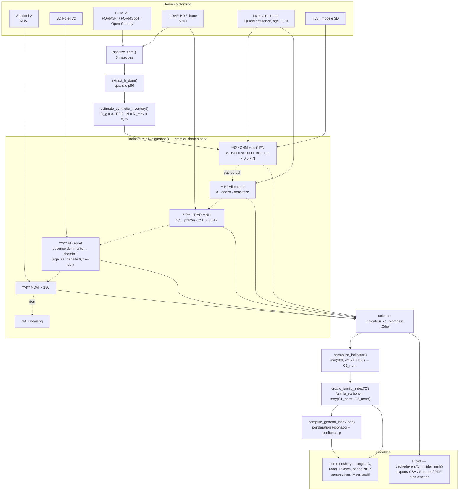

# Fiche indicateur — C1 « Biomasse carbone »

> **Document de référence** — Néméton (package cœur) `0.191.0.9000`, 2026-08-27.
> Complète et détaille la ligne `C1` de [`TABLEAU_INDICATEURS_NDP.md`](TABLEAU_INDICATEURS_NDP.md),
> qui datait de la v0.14.1 et ignorait le chemin CHM introduit par la spec 005.

---

## 1. Carte d'identité

| Élément | Valeur |
|---|---|
| Code | `C1` |
| Nom long / colonne | `indicateur_c1_biomasse` |
| Famille | **C — Carbone & Vitalité** (avec `C2` NDVI), couleur `#228B22` |
| Grandeur mesurée | Stock de carbone de la **biomasse aérienne** (troncs, branches, écorce) |
| Unité brute | **tC/ha** (tonnes de carbone par hectare) |
| Sens | Haut = favorable (pas d'inversion à la normalisation) |
| Normalisation | `ref_max = 150 tC/ha` → `score = min(100, valeur / 150 × 100)` |
| Fonction | `indicateur_c1_biomasse()` — `R/indicators-families.R:337` |
| Statut normalisation | listé dans `.NORMALIZE_RULED` (`R/normalization.R:550`) : règle explicite, jamais d'écrêtage naïf |
| Tests | `tests/testthat/test-indicators-carbon.R`, `test-family-normalisation.R` |

Ce que C1 **ne** mesure **pas** : le carbone du sol, la litière, les racines
(pas de facteur racinaire `R` de l'IPCC), ni le carbone stocké dans les produits
bois. C'est un stock aérien instantané, pas un flux de séquestration — le flux
est porté par `E2` (évitement carbone).

---

## 2. Le principe : cinq chemins, un aiguillage par la donnée disponible

C1 n'a pas « une » formule mais **cinq chemins de calcul**, essayés dans un ordre
fixe. Le premier dont les entrées sont présentes gagne, les suivants ne sont pas
évalués. **Point capital : l'aiguillage se fait sur la forme de la donnée reçue
(colonnes de l'`sf`, couches du `nemeton_layers`, argument `chm`), jamais sur le
NDP.** Le NDP est un *constat* posé par `detect_ndp()` sur les mêmes sources ; il
qualifie le résultat, il ne le pilote pas.

| Ordre | Chemin | Condition de déclenchement | Ligne |
|---|---|---|---|
| 0 | **CHM + tarif IFN** | `chm` fourni **et** colonnes `species` **et** `dbh` | `:352` |
| 1 | **Allométrie âge/densité** | colonnes `species` + `age` + `density` | `:398` |
| 2 | **LiDAR MNH** | couche raster `lidar_mnh` dans `layers` | `:411` |
| 3 | **BD Forêt V2** | couche vecteur `bdforet` → enrichit puis retombe sur le chemin 1 | `:443` |
| 4 | **NDVI** | couche raster `ndvi` dans `layers` | `:456` |
| — | *Aucun* | rien de ce qui précède | `:469` → `NA` + `cli_alert_warning` |

Conséquence pratique : un projet qui possède **à la fois** un CHM avec `dbh` et
un inventaire terrain `age`/`density` sera calculé par le chemin 0, pas par le
chemin 1 — ce qui est le bon choix (le tarif de cubage est mieux fondé que
l'allométrie sur l'âge), mais ce n'est pas ce que « NDP 3 » laisserait deviner.

---

## 3. Le calcul par niveau NDP

### NDP 0 — Découverte (Fibonacci 1, confiance φ 8,3 %)

**Sources** : Sentinel-2, WorldClim, BD TOPO, MNT 25 m.
**Chemin retenu** : 4 (NDVI) ou 3 (BD Forêt V2 si la couche est chargée).

#### 3.0.a Chemin 4 — proxy NDVI

```
C1 = max(0, NDVI_moyen_zonal) × 150
```

`R/indicators-families.R:456-467`. Le NDVI moyen est extrait par unité
(`safe_extract`, `fun = "mean"`), puis multiplié par 150 — la constante est
choisie pour qu'un couvert dense (NDVI ≈ 0,85) rende ~128 tC/ha, dans la
fourchette « forêt tempérée mature 80–150 tC/ha » citée en commentaire du code.

> **C'est un proxy linéaire non calibré, pas un modèle de biomasse.** Le NDVI
> sature autour de 0,8–0,9 bien avant que la biomasse ne sature ; deux
> peuplements de 60 et 200 tC/ha peuvent rendre le même NDVI. À NDP 0 sans CHM,
> C1 mesure surtout « il y a de la végétation verte », et la normalisation
> `/150` rend alors, par construction, `score = NDVI × 100`.

**Exemple chiffré** — hêtraie fermée, NDVI moyen 0,72 :

| Étape | Valeur |
|---|---|
| NDVI zonal | 0,72 |
| C1 brut | 0,72 × 150 = **108 tC/ha** |
| C1 normalisé | min(100, 108/150 × 100) = **72,0** |

#### 3.0.b Chemin 3 — BD Forêt V2

`enrich_parcels_bdforet()` (`R/utils.R:1118`) intersecte les parcelles avec la
BD Forêt V2, retient l'essence **dominante en surface** par parcelle, la traduit
en nom de modèle allométrique (`map_essence_to_species()` : chêne→`Quercus`,
hêtre→`Fagus`, pin/épicéa→`Pinus`, sapin/douglas→`Abies`, sinon `Generic`), puis
**délègue au chemin 1**. Si aucune essence n'est retrouvée
(`all(is.na(enriched$species))`), on retombe sur le chemin 4.

> **À savoir avant d'interpréter** : `age` et `density` ne sont **pas** lus dans
> la BD Forêt — ils sont **écrits en dur**, `age = 60` et `density = 0,7` pour
> toutes les parcelles (`R/utils.R:1206-1207`). Ce chemin ne fait donc varier C1
> **que par l'essence dominante**, sur cinq valeurs possibles :

| Essence déduite | C1 brut | C1 normalisé |
|---|---|---|
| Fagus | 14,1 tC/ha | 9,4 |
| Abies | 10,0 tC/ha | 6,7 |
| Generic | 7,9 tC/ha | 5,3 |
| Quercus | 7,6 tC/ha | 5,1 |
| Pinus | 4,3 tC/ha | 2,9 |

> Autrement dit : à NDP 0, charger la BD Forêt **remplace** un proxy NDVI qui
> discrimine mal (§3.0.a) par une constante par essence qui ne discrimine pas du
> tout, et 5 à 10 fois plus basse. Tant que l'allométrie âge/densité n'est pas
> recalibrée (§ NDP 3), ce chemin est le maillon faible de la cascade.

### NDP 0 « augmenté » — flag `height_ml` (Fibonacci 1, confiance φ inchangée)

C'est le cas le plus important en production aujourd'hui, et il n'existe pas dans
l'ancien tableau. Un **CHM prédit par apprentissage** (FORMS-T, FORMSpoT,
Open-Canopy) est une donnée publique : il **ne change pas le niveau NDP**, il pose
un drapeau vectoriel `augmented = "height_ml"` (`detect_ndp()`, `R/ndp.R:307`,
ADR-011 amendé). Mais il débloque le chemin 0, de loin le mieux fondé.

**Chemin retenu** : 0 (CHM + tarif IFN).

```
H_dom   = quantile(CHM ∩ unité, p = 0,9)                    extract_h_dom()
V_arbre = a_essence × D²  × H_dom                            tarif IFN à variable combinée
C1      = V_arbre × ρ_essence/1000 × BEF × C_frac × N        tC/ha
```

avec, `R/indicators-families.R:352-393` :

| Paramètre | Source | Valeur |
|---|---|---|
| `a`, `b`, `c` | `inst/extdata/ifn_volume_equations.csv`, `lookup_ifn_equation()` | `b = 2.0`, `c = 1.0` sur les 25 lignes ; `a` = facteur de forme 0,42–0,57 ×10⁻⁴ |
| `ρ` (densité du bois) | `inst/extdata/wood_density.csv`, `lookup_species_threshold()` | 430 (ABAL) à 690 kg/m³ (QUPE) |
| `C_frac` | même table, colonne `carbon_content_fraction` | 0,50 |
| `BEF` | argument `bef` de la fonction | **1,30** (défaut IPCC 2006 forêt tempérée) |
| `N` (tiges/ha) | colonne `stems_ha`, sinon `density × 500`, sinon 300 | — |
| `p` (percentile H) | argument `h_dom_percentile` | 0,9 |

Repli essence : une essence absente de la table bascule sur `CONIFER_GENUS` ou
`BROADLEAF_GENUS` via `is_conifer()`. Une essence, un `dbh` ou un `H_dom`
manquant rend `NA` pour l'unité, pas 0.

**D'où viennent `dbh` et `stems_ha` quand il n'y a pas d'inventaire ?** De
l'**inventaire synthétique** (`estimate_synthetic_inventory()`,
`R/synthetic_inventory.R:246`, « chemin NDP 1 synthétique » de la spec 005) :

```
D_g = a_essence × H_dom^0,9              allométrie Charru 2012 × 2017, bornée [dq_min, dq_max]
N   = N_max(D_g, essence) × stocking     auto-éclaircie Charru 2012, stocking = 0,75
```

**Exemple chiffré** — hêtraie (FASY), CHM FORMS-T (hauteur en cm ⇒ **diviser par
100** avant de la passer en argument `chm`), H_dom p90 = 24 m :

| Étape | Calcul | Valeur |
|---|---|---|
| D_g | 1,523 × 24^0,9 | **26,6 cm** |
| N_max | exp(9,790 − 0,296 × ln(26,6)²) | 738 tiges/ha |
| N retenu | 738 × 0,75 | **553 tiges/ha** |
| V/arbre | 0,000039 × 26,6² × 24 | **0,662 m³** |
| Masse de tige | 0,662 × 680/1000 | 0,450 t |
| AGB totale | × 1,30 (BEF) | 0,585 t |
| Carbone/arbre | × 0,50 | 0,293 tC |
| **C1 brut** | × 553 | **162 tC/ha** |
| **C1 normalisé** | min(100, 162/150 × 100) | **100,0 — saturé** |

> Le plafond de 150 tC/ha est franchi par une hêtraie mûre parfaitement
> ordinaire. Sur un projet dominé par des peuplements adultes, ce chemin écrase
> la variabilité inter-unités en haut d'échelle. À garder en tête avant de lire
> un `famille_carbone` : un 100 peut vouloir dire 152 comme 300 tC/ha.

Sources CHM déclarées et câblées sur C1 (`inst/datasources/FR.json`, clé
`consumed_by`) :

| Source | Résolution | Unité stockée | Conversion à faire |
|---|---|---|---|
| `forms_t` (produit `height`) | 10 m | **cm** | `chm = raster / 100` |
| `formspot` (produit `height`) | arbre, sub-métrique | **dm** | `chm = raster / 10` |
| `chm_opencanopy` | selon BD ORTHO | m | aucune |
| `theia_species` | 10 m | classe | fournit `species` |

Avant usage, le CHM doit passer par `sanitize_chm()` (`R/utils-chm.R:109`) :
masque forêt → masque bâti/eau → seuil NDVI → bornes de hauteur plausibles →
masque de pente. Elle rend `list(chm_clean, pct_masked, steps_applied)`.

### NDP 1 — Observation (Fibonacci 1, confiance φ 16,7 %)

**Sources ajoutées** : IGN RGE ALTI, BD ORTHO, **LiDAR HD**.
**Chemin retenu** : 0 si un `dbh` est disponible (le MNH LiDAR est alors passé en
`chm`, flag `augmented = "height_lidar"`), **sinon 2**.

#### Chemin 2 — modèle LiDAR MNH (tutoriel 02)

```
pzabove2 = 100 × part des pixels MNH > 2 m          (taux de couvert)
zmean    = moyenne des pixels MNH > 2 m             (hauteur DE LA CANOPÉE)
AGB      = 2,5 × (pzabove2/100) × zmean^1,5
C1       = AGB × 0,47
```

`R/indicators-families.R:411-441`. `k = 2,5` et fraction carbone `0,47`.

> **Correctif 0.174.0 à connaître** : `zmean` était calculé sur *toutes* les
> cellules, trouées comprises, alors que `pzabove2` porte déjà la fraction de
> couvert — la surface nue pénalisait donc deux fois. Sur le projet Fordead,
> parcelle 1 : 47 % de cellules à exactement 0 m, `zmean` 1,04 m sur l'unité
> contre **6,03 m sur la canopée**, soit C1 0,138 au lieu de 1,913 tC/ha. Un
> facteur 10 à 14 sur trois parcelles. Une unité sans aucune cellule de canopée
> rend désormais **0, pas `NA`** : une coupe rase n'est pas une donnée manquante.

**Exemple chiffré** — futaie fermée sur LiDAR HD, 85 % de couvert, canopée à 18 m :

| Étape | Calcul | Valeur |
|---|---|---|
| pzabove2 | — | 85 % |
| zmean (canopée) | — | 18 m |
| AGB | 2,5 × 0,85 × 18^1,5 | **162,3 t/ha** |
| **C1 brut** | × 0,47 | **76,3 tC/ha** |
| **C1 normalisé** | 76,3/150 × 100 | **50,8** |

Pour comparaison, peuplement clair (60 % de couvert, canopée 12 m) : AGB 62,4 →
**C1 29,3 tC/ha** → score **19,5**.

### NDP 2 — Exploration (Fibonacci 2, confiance φ 33,3 %)

**Sources ajoutées** : drone RGB, LiDAR drone.
**Chemin retenu** : identique au NDP 1 (chemin 2, ou 0 avec `dbh`) — **seule la
résolution du MNH change**. Aucune branche de code spécifique au drone n'existe
dans `indicateur_c1_biomasse()` : le MNH drone est consommé comme un MNH LiDAR HD.

> À noter : `detect_ndp_from_cache()` (`R/ndp.R:552`) plafonne aujourd'hui à
> **NDP 1** — « NDP 2+ : pas encore dans le pipeline ». Un projet ne dépasse
> NDP 1 que par les attributs (`has_drone_rgb`, `has_lidar_drone`) ou par le
> comptage de placettes QField (`field_plots_count ≥ 1` ⇒ NDP 2).

### NDP 3 — Diagnostic (Fibonacci 3, confiance φ 58,3 %)

**Source ajoutée** : inventaire terrain complet (≥ 10 arbres/placette en moyenne
via QField ⇒ NDP 3).
**Chemin retenu** : 0 si `dbh` mesuré + CHM ; **sinon 1**.

#### Chemin 1 — allométrie âge/densité

```
C1 = a_essence × âge^b_essence × densité^c_essence
```

`calculate_allometric_biomass()` / `get_allometric_coefficients()`
(`R/utils.R:618` et `:582`), coefficients dans `R/sysdata.rda`, source
`data-raw/allometric_models.R`. `densité` est ici une **fraction 0–1**, pas des
tiges/ha.

| Essence | a | b | c | Source citée |
|---|---|---|---|---|
| Quercus | 0,012 | 1,65 | 0,85 | Dupouey et al. 2011 |
| Fagus | 0,015 | 1,75 | 0,90 | Bontemps & Duplat 2012 |
| Pinus | 0,010 | 1,55 | 0,80 | Vallet & Pérot 2011 |
| Abies | 0,013 | 1,70 | 0,88 | Wutzler et al. 2008 |
| Generic | 0,011 | 1,68 | 0,85 | Wutzler et al. 2008 |

Essence inconnue → ligne `Generic`. Toute entrée `NA` → `NA`.

**Exemples chiffrés** :

| Essence | Âge | Densité | C1 brut | C1 normalisé |
|---|---|---|---|---|
| Quercus | 80 | 0,70 | **12,2 tC/ha** | 8,2 |
| Fagus | 60 | 0,80 | **15,9 tC/ha** | 10,6 |
| Fagus | 120 | 0,80 | **53,4 tC/ha** | 35,6 |
| Pinus | 80 | 0,70 | **6,7 tC/ha** | 4,5 |
| Abies | 100 | 0,90 | **29,8 tC/ha** | 19,9 |

> **Anomalie à documenter, pas à ignorer.** Le chemin censé être le *plus*
> précis rend les valeurs les *plus basses* : 6 à 53 tC/ha pour des peuplements
> mûrs, là où les chemins CHM et NDVI rendent 76 à 162 tC/ha sur des peuplements
> comparables, et là où le `ref_max` de normalisation vaut 150. L'écart est d'un
> facteur 3 à 10. `data-raw/allometric_models.R` l'annonce lui-même : *« These
> are illustrative coefficients based on literature patterns […] In production,
> these would be extracted from the exact published equations »*, et vise
> 50–200 tC/ha — ce que les coefficients livrés ne produisent pas. Le test
> associé ne contrôle qu'un ordre de grandeur très large (`> 1` et `< 500`), il
> ne rattrape donc pas l'écart. **Un projet qui bascule du chemin 2 au chemin 1
> en acquérant un inventaire verra son C1 chuter, et son `famille_carbone` avec.**
> Le chemin 0 (CHM + `dbh` mesuré) évite complètement ce problème : c'est celui
> à privilégier dès qu'un diamètre terrain existe.

### NDP 4 — Jumeau (Fibonacci 5, confiance φ 100 %)

**Sources ajoutées** : scanner terrestre (TLS), modèle 3D.
**Chemin retenu** : 0, alimenté par un `dbh` mesuré au ruban/TLS, un `stems_ha`
compté et un CHM très haute résolution. Aucune branche dédiée : le gain de NDP 4
est un gain de **qualité d'entrées** du même chemin 0, pas un modèle différent.
Le poids Fibonacci passe à 5 et la confiance à 100 % dans l'indice général.

### Récapitulatif d'une ligne

| NDP | Flag | Chemin | Formule effective | Entrées critiques |
|---|---|---|---|---|
| 0 | — | 4 | `NDVI × 150` | Sentinel-2 |
| 0 | `height_ml` | 0 | `a·D²·H × ρ/1000 × 1,3 × 0,5 × N` | CHM ML + essence (+ D_g synthétique) |
| 0 | — | 3 | → chemin 1 sur attributs BD Forêt | BD Forêt V2 |
| 1 | `height_lidar` | 2 (ou 0) | `2,5 · (pz>2m) · z̄_canopée^1,5 × 0,47` | MNH LiDAR HD |
| 2 | `height_lidar` | 2 (ou 0) | idem, MNH drone | MNH drone |
| 3 | — | 1 (ou 0) | `a · âge^b · densité^c` | essence, âge, densité terrain |
| 4 | — | 0 | tarif IFN sur D et H mesurés | TLS, comptage réel |

---

## 4. De la valeur brute au livrable

```
indicateur_c1_biomasse()  →  colonne `indicateur_c1_biomasse` (tC/ha) dans l'sf
        │
        ├─ normalize_indicator("indicateur_c1_biomasse", v)      R/normalization.R:588
        │      score = min(100, max(0, v / 150 × 100))
        │      → colonne `C1_norm` (via normalize_indicators(suffix = "_norm"))
        │
        ├─ create_family_index(data, family_codes = "C")         R/family-system.R
        │      famille_carbone = moyenne(C1_norm, C2_norm)       poids égaux par défaut,
        │                                                        surchargeables : list(C = c(C1 = .7, C2 = .3))
        │
        ├─ compute_general_index(family_scores, ndp)             R/ndp.R
        │      moyenne des 12 familles pondérée Fibonacci(NDP) + confiance φ
        │      (compute_general_index_mixed() si le NDP diffère par famille)
        │
        └─ nemeton_radar() / plot_indicators_map()               R/visualization.R
```

Détails qui comptent :

- `create_family_index()` **normalise elle-même** les colonnes brutes qu'on lui
  passe. Une colonne déjà en `_norm` est simplement écrêtée `[0,100]`, pas
  normalisée deux fois. C1 étant dans `.NORMALIZE_RULED`, il ne déclenche jamais
  l'avertissement « no normalization rule; naively clamped ».
- Piège corrigé en 0.174.0 : `normalize_indicator("C1", 75)` et
  `normalize_indicator("indicateur_c1_biomasse", 75)` rendent tous deux **50**
  aujourd'hui. Avant le correctif, le code court tombait sur l'écrêtage naïf et
  rendait 75 — un `famille_carbone` faux sans le moindre message.
- `restore_ndp_attributes()` (`R/ndp.R:523`) existe parce que la sérialisation
  Parquet **perd les attributs** : le NDP doit être réinjecté depuis les
  métadonnées du projet après relecture, sinon l'indice général est repondéré
  Fibonacci 1 sans prévenir.

### Ce qui est effectivement livré

**Dans le package cœur (ce dépôt)** — les artefacts sont des *colonnes* et des
*objets R*, pas des fichiers :

| Livrable | Nature | Producteur |
|---|---|---|
| `indicateur_c1_biomasse` | colonne numérique tC/ha de l'`sf` | `nemeton_compute(units, layers, indicators = "indicateur_c1_biomasse")` |
| `C1_norm` | colonne 0–100 | `normalize_indicators()` |
| `famille_carbone` | colonne 0–100 | `create_family_index()` |
| score global + confiance φ | `list(score, ndp, confidence, weight, n_families)` | `compute_general_index()` |
| libellés/infobulles FR-EN | `indicator_labels("C1", lang)` | `R/indicator-config.R` |
| fixture de démo | `data(massif_demo_units)` : `C1` (tC/ha, 20–300) et `C1_norm` | `data-raw/massif_demo.R:441` |

**Sur le disque d'un projet** — arborescence attendue, résolue par
`resolve_project_chm()` / `resolve_project_dem()` (`R/project_layers.R`) :

```
<projet>/
├── cache/layers/
│   ├── chm/          ← CHM Open-Canopy      (priorité 1, alimente le chemin 0)
│   ├── lidar_mnh/    ← MNH LiDAR HD         (priorité 2, chemins 0 et 2)
│   ├── mnh/          ← MNH générique        (priorité 3)
│   ├── lidar_nuage/  ← nuage .laz ; MNH recalculé à la volée via lasR si absent
│   └── chm.tif | mnh.tif                    (fichiers directs)
├── data/chm.tif | data/mnh.tif              (dernier recours)
└── (chm.tif | mnh.tif à la racine — convention opencanopynemeton)
```

La présence de `cache/layers/lidar_mn[ht]` est aussi ce qui fait basculer
`detect_ndp_from_cache()` de NDP 0 à NDP 1.

**Dans l'application `nemetonshiny`** (dépôt séparé, ADR-009 — le cœur ne fait
qu'exporter, l'app présente) :

- onglet **Carbone & Vitalité (C)** : C1 en tC/ha + son score 0–100, libellé et
  infobulle lus dans le cœur via `indicator_labels()` / `indicator_families()`
  (API livrée en 0.170.0, cf. `specs/BRIEF-indicator-families-export.md`) ;
- **radar de synthèse** : `famille_carbone` sur un des 12 axes ;
- **score global + badge NDP** (`compute_general_index()`, jamais un `mean()`) ;
- **perspectives IA** : la valeur C1 et son score entrent dans le prompt du
  profil expert sélectionné (`inst/experts/*.yml`) ;
- **exports** : CSV/Parquet des indicateurs, PDF de plan d'action (spec 037).
  ⚠️ Les `indicators.parquet` persistés avec une version **≤ 0.168.0** portent un
  C1 (et un P1) gonflé ×3–5 par les exposants erronés du tarif IFN — corrigés en
  0.169.0, spec 040. **Ils doivent être recalculés, pas relus.**

---

## 5. Diagramme d'ensemble



---

## 6. Pièges connus — mémo avant de conclure quoi que ce soit sur un C1

1. **`density` porte deux unités différentes selon l'indicateur.** Chemin 1 de C1 :
   fraction 0–1. `indicateur_p1_volume()` et `ensure_inventory_fields()` :
   **tiges/ha**. Or le chemin 0 de C1, faute de colonne `stems_ha`, calcule
   `density × 500`. Un `sf` passé d'abord dans P1 (qui remplit `density` en
   tiges/ha) puis dans C1 sans `stems_ha` produit donc un C1 **surestimé ×500**,
   silencieusement. **Toujours fournir `stems_ha` explicitement**, ou appeler
   `indicateur_c1_biomasse(..., stems_col = "density")`.
2. **Le plafond de 150 tC/ha sature.** Un épicéa H 28 m / D 34 cm / 400 tiges/ha
   rend 163 tC/ha, une hêtraie mûre 162 : score 100 dans les deux cas. Lire la
   colonne brute, pas seulement le score, dès qu'on compare des peuplements
   capitalisés.
3. **Le chemin « inventaire » sous-estime d'un facteur 3 à 10** (cf. §3, NDP 3).
   Coefficients « illustratifs » assumés dans `data-raw/allometric_models.R`.
4. **Le chemin BD Forêt rend une constante par essence** (âge 60 / densité 0,7
   en dur) : 4,3 à 14,1 tC/ha, aucune variabilité intra-essence.
5. **Le NDVI ne discrimine pas la biomasse au-delà de 0,8.** À NDP 0 sans CHM,
   C1 ≈ un indice de verdeur remis à l'échelle.
6. **Unités des CHM publics** : FORMS-T en **cm** (÷100), FORMSpoT en **dm**
   (÷10). Passer le raster brut multiplie C1 par 100 ou 10.
7. **Parquet ≤ 0.168.0 : recalculer.** Exposants du tarif IFN corrigés en 0.169.0.
8. **Attributs NDP perdus à la sérialisation** : sans `restore_ndp_attributes()`,
   l'indice général repondère tout en Fibonacci 1.

---

## 7. Références internes

| Sujet | Fichier |
|---|---|
| Fonction C1 et ses 5 chemins | `R/indicators-families.R:293-474` |
| Allométrie âge/densité | `R/utils.R:582-634`, `data-raw/allometric_models.R` |
| Tarif IFN, densités du bois | `inst/extdata/ifn_volume_equations.csv`, `wood_density.csv` |
| CHM : nettoyage, H_dom | `R/utils-chm.R` (`sanitize_chm:109`, `extract_h_dom:405`) |
| Inventaire synthétique | `R/synthetic_inventory.R`, `R/density_selfthinning.R` |
| Normalisation | `R/normalization.R:588` (règle), `:550` (`.NORMALIZE_RULED`) |
| Agrégation famille | `R/family-system.R` |
| NDP, Fibonacci, φ, flags | `R/ndp.R` |
| Déclaration des sources | `inst/datasources/FR.json` (clés `consumed_by`, `augmented`) |
| Libellés / infobulles | `R/indicator-config.R:10-26` |
| Historique des correctifs | `NEWS.md` — 0.169.0 (spec 040), 0.174.0 (zmean canopée + alias `C1`) |
| Spécifications | `specs/005-opencanopy-integration/`, `specs/038-normalisation-indicateurs/`, `specs/040-volume-mobilisable-desserte/` |
