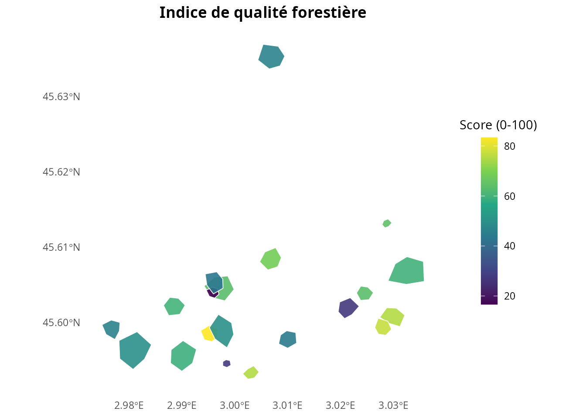

# Démarrage rapide avec nemeton

## Introduction

Le package `nemeton` implémente la méthode Nemeton pour l’analyse
systémique de territoires forestiers. Il fournit des outils pour :

- Calculer des indicateurs biophysiques multi-famille (carbone, eau,
  sols, paysage, etc.)
- Normaliser les valeurs d’indicateurs selon plusieurs méthodes
- Créer des indices composites pour une évaluation holistique
- Visualiser les résultats avec des cartes et graphiques

Cette vignette démontre le workflow complet avec le jeu de données
`massif_demo`.

## Installation

``` r
# Depuis GitHub
remotes::install_github("pobsteta/nemeton")
```

``` r
library(nemeton)
library(ggplot2)
```

## Charger les données de démonstration

Le package inclut un jeu de données synthétique (`massif_demo`)
représentant une zone de 5km × 5km avec 20 parcelles forestières.

``` r
# Charger les parcelles forestières
data(massif_demo_units)

# Inspecter les parcelles
print(massif_demo_units)
#> Simple feature collection with 20 features and 88 fields
#> Geometry type: POLYGON
#> Dimension:     XY
#> Bounding box:  xmin: 698041.8 ymin: 6499215 xmax: 702793.8 ymax: 6504159
#> Projected CRS: RGF93 v1 / Lambert-93
#> First 10 features:
#>    parcel_id      forest_type age_class   management species age
#> 1        P01     Futaie mixte    Mature        Mixte    FASY  68
#> 2        P02 Futaie résineuse     Moyen   Production    PIAB  33
#> 3        P03  Futaie feuillue  Surannée Conservation    QUPE 104
#> 4        P04  Futaie feuillue  Surannée   Production    ABAL 166
#> 5        P05 Futaie résineuse     Moyen   Production    PISY  47
#> 6        P06 Futaie résineuse    Mature   Production    QURO  79
#> 7        P07  Futaie feuillue    Mature        Mixte    PINI  75
#> 8        P08  Futaie feuillue    Mature   Production    LADE  71
#> 9        P09     Futaie mixte     Moyen   Production    PSME  48
#> 10       P10          Taillis  Surannée   Production    CABE 165
#>    establishment_year density height  dbh volume strata fertility     climate
#> 1                1958     266   30.3 45.8  557.7      4         1 continental
#> 2                1993     465   30.4 57.5 1541.7      1         3  atlantique
#> 3                1922     128   31.7 41.7  232.7      2         2  atlantique
#> 4                1860     104   29.9 42.6  186.1      2         1  atlantique
#> 5                1979     324   27.5 51.5  779.5      2         2  atlantique
#> 6                1947     281   38.6 76.1 2072.1      2         1  atlantique
#> 7                1951     184   33.9 47.1  456.5      2         3 continental
#> 8                1955     169   27.2 38.8  228.3      3         2  montagnard
#> 9                1978     369   24.8 34.0  349.0      4         3  atlantique
#> 10               1861     632   25.7 34.0  619.4      2         2  montagnard
#>    surface_ha   area_ha        A1   A1_norm       A2    A2_norm B1   B1_norm
#> 1    4.989211  4.989211 0.5293842  32.76917 41.31477  15.769170  0   0.00000
#> 2    5.867935  5.867935 0.6934514  56.20735 54.25911  83.462924  0   0.00000
#> 3    6.557777  6.557777 1.0000000 100.00000 40.10522   9.443733  2  66.66667
#> 4    9.989553  9.989553 0.8866660  83.80943 47.07552  45.895638  0   0.00000
#> 5    5.906395  5.906395 0.5849180  40.70258 48.98128  55.861977  1  33.33333
#> 6    1.048296  1.048296 0.3000000   0.00000 56.56038  95.497643  2  66.66667
#> 7   17.079363 17.079363 0.7493859  64.19798 57.42131 100.000000  3 100.00000
#> 8   11.414577 11.414577 0.6541358  50.59082 46.65910  43.717908  2  66.66667
#> 9   16.105209 16.105209 0.5931199  41.87426 52.15218  72.444518  0   0.00000
#> 10  10.733433 10.733433 0.7438372  63.40531 41.21596  15.252433  1  33.33333
#>          B2  B2_norm        B3   B3_norm       C1   C1_norm           C2
#> 1  2.556369 41.55096 0.8262637  90.87085 258.9182  91.81550  0.032799533
#> 2  2.387431 35.94171 0.3583569  17.21558 228.1229  78.28157  0.016314059
#> 3  2.482645 39.10309 0.6591732  64.56840 193.5217  63.07502  0.030853722
#> 4  2.177975 28.98713 0.6150537  57.62336 187.2273  60.30875  0.005740350
#> 5  2.455282 38.19456 0.6392320  61.42937 269.4859  96.45981  0.017942008
#> 6  1.853111 18.20065 0.5374482  45.40713 277.5413 100.00000 -0.020873050
#> 7  3.716395 80.06740 0.8842580 100.00000 232.0788  80.02013  0.007636006
#> 8  2.808751 49.93083 0.7366941  76.77131 192.3779  62.57234  0.023693958
#> 9  3.800323 82.85408 0.3922287  22.54749 126.5075  33.62356 -0.031114446
#> 10 2.973928 55.41522 0.6031365  55.74742 132.7189  36.35337  0.007811520
#>     C2_norm        E1     E1_norm        E2   E2_norm F1 F1_norm        F2
#> 1  98.02844 0.6332431  48.4520928 1.2862944  37.35401  3      50 15.017516
#> 2  72.74375 0.5003880   0.1410856 1.1352980  30.18071  3      50 18.802915
#> 3  95.04404 0.5000000   0.0000000 1.0372173  25.52125  3      50  8.778060
#> 4  56.52626 0.5000000   0.0000000 1.6796913  56.04287  4      75 16.643021
#> 5  75.24062 0.5239562   8.7113699 0.5000000   0.00000  4      75 23.180358
#> 6  15.70780 0.5000000   0.0000000 0.5000000   0.00000  2      25  6.919386
#> 7  59.43373 0.7749997 100.0000000 0.9112013  19.53469  5     100  8.984532
#> 8  84.06271 0.5537554  19.5474302 1.8505265  64.15863  4      75 16.153539
#> 9   0.00000 0.7549689  92.7160383 2.6049801 100.00000  1       0 22.044466
#> 10 59.70293 0.6396033  50.7648918 0.5000000   0.00000  3      50 18.450890
#>     F2_norm family_A family_B family_C  family_E family_F family_L family_N
#> 1  63.53406 24.26917 44.14061 94.92197 42.903050 56.76703 31.33202 50.88637
#> 2  79.54881 69.83514 17.71910 75.51266 15.160900 64.77440 88.45910 23.50773
#> 3  37.13702 54.72187 56.77938 79.05953 12.760627 43.56851 64.18903 29.82359
#> 4  70.41103 64.85253 28.87016 58.41750 28.021436 72.70551 56.54965 82.49126
#> 5  98.06830 48.28228 44.31909 85.85022  4.355685 86.53415 29.12421 24.91877
#> 6  29.27359 47.74882 43.42482 57.85390  0.000000 27.13680 73.96207 18.79035
#> 7  38.01053 82.09899 93.35580 69.72693 59.767345 69.00527 31.81030 52.46156
#> 8  68.34019 47.15437 64.45627 73.31753 41.853032 71.67010 54.94544 48.98929
#> 9  93.26272 57.15939 35.13385 16.81178 96.358019 46.63136 20.22083 66.82370
#> 10 78.05951 39.32887 48.16532 48.02815 25.382446 64.02976 56.68762 32.42439
#>    family_P family_R family_S  family_T  family_W        L1   L1_norm        L2
#> 1  47.68739 32.09087 24.30425  54.11307  9.825682 0.2521898  10.97026 0.3017459
#> 2  86.78162 24.35791 24.18268  46.60595 50.880574 0.5743217 100.00000 0.3891689
#> 3  46.78139 42.35100 37.86009  77.38554 23.501831 0.3701597  43.57440 0.4164985
#> 4  48.20880 26.49766 17.50914  38.82146 49.612081 0.3389725  34.95499 0.3934184
#> 5  75.19072 66.66667 81.17865  24.74926 61.265609 0.3539412  39.09197 0.1889777
#> 6  14.75698 13.46698 61.86987  55.77872  4.498593 0.3858981  47.92413 0.4691661
#> 7  86.90201 49.06818 20.55367  31.18672 37.643152 0.3373054  34.49422 0.2235316
#> 8  51.09994 52.78169 59.97402  63.97211 43.968175 0.4188532  57.03213 0.3057835
#> 9  90.63200 59.19507 21.36929  74.07487 44.359948 0.3116164  27.39438 0.1678045
#> 10 73.61026 45.38187 81.27627 100.00000 58.656744 0.4423928  63.53794 0.2953117
#>      L2_norm        N1   N1_norm        N2    N2_norm        N3   N3_norm
#> 1   51.69377 1823.0542  66.05463 200.27051  24.049640  73.73125  62.55485
#> 2   76.91820  670.1452  23.10333 125.83536  14.560032  52.89941  32.85982
#> 3   84.80367 1365.9276  49.02451 101.35012  11.438453  50.19713  29.00781
#> 4   78.14431 2734.2239 100.00000 384.00619  47.473781 100.00000 100.00000
#> 5   19.15645  628.5385  21.55329 238.93704  28.979168  46.84107  24.22387
#> 6  100.00000 1259.2921  45.05183  20.07441   1.076754  37.03275  10.24246
#> 7   29.12638 1368.0672  49.10422 474.54786  59.016780  64.40716  49.26369
#> 8   52.85875 1237.7060  44.24765 432.85168  53.701007  64.23566  49.01923
#> 9   13.04729 1214.2662  43.37441 796.01449 100.000000  69.90222  57.09670
#> 10  49.83731 1339.1892  48.02838 237.28325  28.768329  44.21217  20.47647
#>          P1   P1_norm        P2   P2_norm       P3   P3_norm R1 R1_norm R2
#> 1  383.7837  79.52972  2.000000   0.00000 65.29495  63.53244  1       0  4
#> 2  303.2654  60.34486 10.150362 100.00000 84.57162 100.00000  1       0  2
#> 3  268.2949  52.01252  4.796243  34.30821 60.26851  54.02344  2      25  3
#> 4  250.9696  47.88446  6.134844  50.73203 56.03258  46.00991  1       0  3
#> 5  317.5492  63.74822  8.705667  82.27447 73.76151  79.54946  3      50  3
#> 6   50.0000   0.00000  4.414458  29.62394 39.45421  14.64700  1       0  1
#> 7  469.6968 100.00000  9.919209  97.16390 65.30007  63.54214  4      75  3
#> 8  335.6093  68.05134  4.231110  27.37436 62.30397  57.87411  2      25  4
#> 9  457.5569  97.10745  8.610862  81.11127 81.22943  93.67726  4      75  5
#> 10 387.6384  80.44816  7.831253  71.54595 68.09875  68.83666  4      75  2
#>    R2_norm        R3    R3_norm          S1     S1_norm       S2  S2_norm
#> 1       75 0.3397302  21.272605 0.473262981  30.4048558 49.06710 36.33387
#> 2       25 0.5299777  48.073743 0.004570495   0.2936322 77.80352 72.25440
#> 3       50 0.5582243  52.052986 0.963719475  61.9143116 51.13707 38.92133
#> 4       50 0.3980824  29.492982 0.817609054  52.5274243 20.00000  0.00000
#> 5       50 0.8985756 100.000000 1.162277601  74.6707102 75.09220 68.86525
#> 6        0 0.4755124  40.400942 1.556537495 100.0000000 70.17784 62.72230
#> 7       50 0.3463454  22.204529 0.224703022  14.4360816 57.77993 47.22491
#> 8       75 0.6028886  58.345075 1.039444491  66.7792774 69.31990 61.64987
#> 9      100 0.2070778   2.585199 0.227250712  14.5997583 59.60649 49.50811
#> 10      25 0.4453061  36.145624 1.448289535  93.0455926 76.73387 70.91733
#>           S3    S3_norm        T1   T1_norm        T2   T2_norm        W1
#> 1   1904.090   6.174013  88.06364  57.29425 11.324896  50.93189 0.1862923
#> 2   1000.000   0.000000  82.82317  53.44804  9.198844  39.76386 0.5393849
#> 3   2866.255  12.744614 126.47324  85.48470 14.819030  69.28638 0.4476438
#> 4   1000.000   0.000000  62.19125  38.30539  9.117684  39.33753 1.1437187
#> 5  15643.478 100.000000  10.00000   0.00000 11.052026  49.49852 1.0737964
#> 6   4351.499  22.887318 130.42042  88.38171  6.040972  23.17574 0.0000000
#> 7   1000.000   0.000000  77.26310  49.36727  4.104996  13.00617 0.2170906
#> 8   8540.351  51.492899 136.43831  92.79850  8.319690  35.14572 0.2103747
#> 9   1000.000   0.000000 126.99400  85.86691 13.485767  62.28283 0.7851203
#> 10 12695.145  79.865898 146.25039 100.00000 20.665966 100.00000 1.3757609
#>      W1_norm        W2   W2_norm        W3   W3_norm
#> 1   9.782561  1.119890  10.45221  5.089475  9.242271
#> 2  28.324119  8.374436  78.16072  8.400556 46.156887
#> 3  23.506618  2.896998  27.03841  6.050851 19.960465
#> 4  60.058825  4.913373  45.85774  8.110192 42.919675
#> 5  56.387074  3.125075  29.16711 13.072421 98.242638
#> 6   0.000000  0.000000   0.00000  5.470996 13.495779
#> 7  11.399838 10.714380 100.00000  4.397684  1.529617
#> 8  11.047174  6.589757  61.50386  9.584233 59.353487
#> 9  41.228147  4.205627  39.25218  8.978432 52.599520
#> 10 72.243796  7.721442  72.06616  7.100273 31.660276
#>                          geometry
#> 1  POLYGON ((698299.9 6499928,...
#> 2  POLYGON ((701702.2 6500418,...
#> 3  POLYGON ((702240.4 6500270,...
#> 4  POLYGON ((700641.3 6504129,...
#> 5  POLYGON ((699268.2 6500307,...
#> 6  POLYGON ((699943.5 6499421,...
#> 7  POLYGON ((698500.5 6499360,...
#> 8  POLYGON ((699061.9 6499649,...
#> 9  POLYGON ((702258.5 6500666,...
#> 10 POLYGON ((699897.1 6500739,...

# Statistiques sommaires
cat("\nSurface totale:", sum(massif_demo_units$surface_ha), "ha\n")
#> 
#> Surface totale: 136.0225 ha
table(massif_demo_units$forest_type)
#> 
#>  Futaie feuillue     Futaie mixte Futaie résineuse          Taillis 
#>               11                2                4                3
```

``` r
ggplot(massif_demo_units) +
  geom_sf(aes(fill = forest_type)) +
  theme_minimal() +
  labs(
    title = "Massif Demo - Types forestiers",
    fill = "Type de forêt"
  )
```


Parcelles forestières par type

## Charger les couches spatiales

Utilisez
[`massif_demo_layers()`](https://pobsteta.github.io/nemeton/reference/massif_demo_layers.md)
pour charger tous les rasters et vecteurs associés :

``` r
layers <- massif_demo_layers()
print(layers)
#> 
#> ── nemeton_layers object ───────
#> 
#> ── Rasters (4) ──
#> 
#> • biomass : massif_demo_biomass.tif [not loaded] 
#> • dem : massif_demo_dem.tif [not loaded] 
#> • landcover : massif_demo_landcover.tif [not loaded] 
#> • species_richness : massif_demo_species_richness.tif [not loaded] 
#> 
#> ── Vectors (2) ──
#> 
#> • roads : massif_demo_roads.gpkg [not loaded] 
#> • water : massif_demo_water.gpkg [not loaded]
```

Le jeu de données inclut : - **Rasters** : biomasse, MNT, occupation du
sol, richesse spécifique - **Vecteurs** : réseau routier, cours d’eau

## Calculer les indicateurs

### Indicateurs individuels

``` r
# Carbone (via NDVI)
carbon <- nemeton_compute(
  massif_demo_units,
  layers,
  indicators = "carbon_ndvi"
)

# Eau (TWI - Topographic Wetness Index)
water <- nemeton_compute(
  massif_demo_units,
  layers,
  indicators = "water_twi"
)

# Afficher les résultats
head(carbon[, c("parcel_id", "forest_type", "carbon_ndvi")])
#> Simple feature collection with 6 features and 3 fields
#> Geometry type: POLYGON
#> Dimension:     XY
#> Bounding box:  xmin: 698041.8 ymin: 6499388 xmax: 702507.7 ymax: 6504159
#> Projected CRS: RGF93 v1 / Lambert-93
#>   parcel_id      forest_type carbon_ndvi                       geometry
#> 1       P01     Futaie mixte          NA POLYGON ((698299.9 6499928,...
#> 2       P02 Futaie résineuse          NA POLYGON ((701702.2 6500418,...
#> 3       P03  Futaie feuillue          NA POLYGON ((702240.4 6500270,...
#> 4       P04  Futaie feuillue          NA POLYGON ((700641.3 6504129,...
#> 5       P05 Futaie résineuse          NA POLYGON ((699268.2 6500307,...
#> 6       P06 Futaie résineuse          NA POLYGON ((699943.5 6499421,...
```

### Indicateurs multiples simultanés

``` r
# Calculer 3 indicateurs en une fois
results <- nemeton_compute(
  massif_demo_units,
  layers,
  indicators = c("carbon_ndvi", "water_twi", "landscape_fragmentation")
)

# Vue d'ensemble
summary(results[, c("carbon_ndvi", "water_twi", "landscape_fragmentation")])
#>   carbon_ndvi    water_twi     landscape_fragmentation          geometry 
#>  Min.   : NA   Min.   :3.118   Min.   :34.30           POLYGON      :20  
#>  1st Qu.: NA   1st Qu.:3.294   1st Qu.:34.67           epsg:2154    : 0  
#>  Median : NA   Median :3.474   Median :35.50           +proj=lcc ...: 0  
#>  Mean   :NaN   Mean   :3.501   Mean   :35.66                             
#>  3rd Qu.: NA   3rd Qu.:3.642   3rd Qu.:36.42                             
#>  Max.   : NA   Max.   :4.224   Max.   :37.80                             
#>  NA's   :20    NA's   :8
```

## Normalisation

Normalisez les indicateurs pour les rendre comparables (échelle 0-100) :

``` r
# Normalisation min-max
normalized <- normalize_indicators(
  results,
  indicators = c("carbon_ndvi", "water_twi", "landscape_fragmentation"),
  method = "minmax"
)

# Comparer avant/après
cat("\nAvant normalisation (carbone NDVI):\n")
#> 
#> Avant normalisation (carbone NDVI):
summary(results$carbon_ndvi)
#>    Min. 1st Qu.  Median    Mean 3rd Qu.    Max.    NA's 
#>      NA      NA      NA     NaN      NA      NA      20

cat("\nAprès normalisation (carbone NDVI):\n")
#> 
#> Après normalisation (carbone NDVI):
summary(normalized$carbon_ndvi_norm)
#>    Min. 1st Qu.  Median    Mean 3rd Qu.    Max.    NA's 
#>      NA      NA      NA     NaN      NA      NA      20
```

### Méthodes de normalisation

``` r
# z-score (distribution normale centrée-réduite)
norm_zscore <- normalize_indicators(
  results,
  indicators = "carbon_ndvi",
  method = "zscore"
)

# Quantiles (distribution uniforme)
norm_quantile <- normalize_indicators(
  results,
  indicators = "carbon_ndvi",
  method = "quantile"
)
```

## Agrégation en indices composites

Combinez plusieurs indicateurs en un indice unique :

``` r
# Indice composite avec poids égaux
composite <- create_composite_index(
  normalized,
  indicators = c("carbon_ndvi_norm", "water_twi_norm", "landscape_fragmentation_norm"),
  name = "ecosystem_health"
)

# Afficher les résultats
head(composite[, c("parcel_id", "forest_type", "ecosystem_health")])
#> Simple feature collection with 6 features and 3 fields
#> Geometry type: POLYGON
#> Dimension:     XY
#> Bounding box:  xmin: 698041.8 ymin: 6499388 xmax: 702507.7 ymax: 6504159
#> Projected CRS: RGF93 v1 / Lambert-93
#>   parcel_id      forest_type ecosystem_health                       geometry
#> 1       P01     Futaie mixte        30.042166 POLYGON ((698299.9 6499928,...
#> 2       P02 Futaie résineuse         9.909873 POLYGON ((701702.2 6500418,...
#> 3       P03  Futaie feuillue        68.999055 POLYGON ((702240.4 6500270,...
#> 4       P04  Futaie feuillue        68.571429 POLYGON ((700641.3 6504129,...
#> 5       P05 Futaie résineuse        50.480305 POLYGON ((699268.2 6500307,...
#> 6       P06 Futaie résineuse         8.571429 POLYGON ((699943.5 6499421,...
```

### Agrégation pondérée

``` r
# Poids personnalisés (carbone 50%, paysage 30%, eau 20%)
composite_weighted <- create_composite_index(
  normalized,
  indicators = c("carbon_ndvi_norm", "landscape_fragmentation_norm", "water_twi_norm"),
  weights = c(0.5, 0.3, 0.2),
  name = "conservation_index"
)
```

### Méthodes d’agrégation

``` r
# Moyenne géométrique (effets multiplicatifs)
composite_geom <- create_composite_index(
  normalized,
  indicators = c("carbon_ndvi_norm", "water_twi_norm"),
  aggregation = "geometric_mean",
  name = "water_carbon_index"
)

# Minimum (approche conservatrice, facteur limitant)
composite_min <- create_composite_index(
  normalized,
  indicators = c("carbon_ndvi_norm", "water_twi_norm"),
  aggregation = "min",
  name = "minimum_performance"
)
```

## Visualisation

### Cartes thématiques

``` r
plot_indicators_map(
  composite,
  indicators = "ecosystem_health",
  title = "Indice de santé écosystémique",
  legend_title = "Score (0-100)"
)
```


Carte de l’indice de santé écosystémique

### Cartes multiples (facettes)

``` r
plot_indicators_map(
  normalized,
  indicators = c("carbon_ndvi_norm", "water_twi_norm"),
  palette = "viridis",
  facet = TRUE,
  ncol = 2,
  title = "Comparaison carbone vs eau"
)
```


Comparaison carbone vs eau

### Graphique radar

``` r
nemeton_radar(
  normalized,
  unit_id = "P01",
  indicators = c("carbon_ndvi_norm", "water_twi_norm", "landscape_fragmentation_norm"),
  title = "Profil multi-indicateurs - Parcelle P01"
)
```


Profil écosystémique - Parcelle P01

## Workflow complet

Voici un exemple de workflow complet de bout en bout :

``` r
# 1. Charger les données
data(massif_demo_units)
layers <- massif_demo_layers()

# 2. Calculer les indicateurs
results <- nemeton_compute(
  massif_demo_units,
  layers,
  indicators = c(
    "carbon_ndvi", "water_twi", "landscape_fragmentation"
  )
)

# 3. Normaliser (0-100)
normalized <- normalize_indicators(
  results,
  indicators = c(
    "carbon_ndvi", "water_twi", "landscape_fragmentation"
  ),
  method = "minmax"
)

# 4. Créer un indice composite
composite <- create_composite_index(
  normalized,
  indicators = c("carbon_ndvi_norm", "water_twi_norm", "landscape_fragmentation_norm"),
  weights = c(0.4, 0.4, 0.2),
  name = "forest_quality"
)

# 5. Visualiser
plot_indicators_map(
  composite,
  indicators = "forest_quality",
  title = "Indice de qualité forestière",
  legend_title = "Score (0-100)"
)
```



## Analyses avancées

### Inverser un indicateur

Pour les indicateurs où une valeur faible est souhaitable :

``` r
# Exemple: inverser un indicateur
# (Utilisé pour les indicateurs où une valeur faible est souhaitable)
normalized_inv <- invert_indicator(
  normalized,
  indicators = "water_twi_norm",
  suffix = "_inv"
)

# L'indicateur inversé
head(normalized_inv[, c("parcel_id", "water_twi_norm", "water_twi_norm_inv")])
```

### Filtrage et sous-ensembles

``` r
# Sélectionner uniquement les futaies feuillues
broadleaf <- normalized[normalized$forest_type == "Futaie feuillue", ]

# Créer un indice spécifique
broadleaf_index <- create_composite_index(
  broadleaf,
  indicators = c("carbon_ndvi_norm", "water_twi_norm"),
  name = "broadleaf_quality"
)
```

## Internationalisation

Le package supporte le français et l’anglais :

``` r
# Définir la langue
nemeton_set_language("fr") # Français
# nemeton_set_language("en")  # English

# Les messages d'erreur/information seront dans la langue choisie
```

## Export des résultats

``` r
# Export en GeoPackage
sf::st_write(composite, "results/forest_quality.gpkg")

# Export en CSV (sans géométrie)
results_table <- composite |>
  sf::st_drop_geometry()
write.csv(results_table, "results/forest_quality.csv", row.names = FALSE)
```

## Prochaines étapes

- **Analyse temporelle** :
  [`vignette("temporal-analysis_fr")`](https://pobsteta.github.io/nemeton/articles/temporal-analysis_fr.md) -
  Analyse multi-périodes
- **Familles d’indicateurs** :
  [`vignette("indicator-families_fr")`](https://pobsteta.github.io/nemeton/articles/indicator-families_fr.md) -
  Système 12 familles
- **Internationalisation** :
  [`vignette("internationalization")`](https://pobsteta.github.io/nemeton/articles/internationalization.md) -
  Système i18n

## Références

- Méthode Nemeton : Développée par Vivre en Forêt
- Documentation complète :
  [`help(package = "nemeton")`](https://rdrr.io/pkg/nemeton/man)
- Site web : <https://pobsteta.github.io/nemeton/>

## Session Info

``` r
sessionInfo()
#> R version 4.5.2 (2025-10-31)
#> Platform: x86_64-pc-linux-gnu
#> Running under: Ubuntu 24.04.3 LTS
#> 
#> Matrix products: default
#> BLAS:   /usr/lib/x86_64-linux-gnu/blas/libblas.so.3.12.0 
#> LAPACK: /usr/lib/x86_64-linux-gnu/lapack/liblapack.so.3.12.0  LAPACK version 3.12.0
#> 
#> locale:
#>  [1] LC_CTYPE=C.UTF-8       LC_NUMERIC=C           LC_TIME=C.UTF-8       
#>  [4] LC_COLLATE=C.UTF-8     LC_MONETARY=C.UTF-8    LC_MESSAGES=C.UTF-8   
#>  [7] LC_PAPER=C.UTF-8       LC_NAME=C              LC_ADDRESS=C          
#> [10] LC_TELEPHONE=C         LC_MEASUREMENT=C.UTF-8 LC_IDENTIFICATION=C   
#> 
#> time zone: Europe/Paris
#> tzcode source: system (glibc)
#> 
#> attached base packages:
#> [1] stats     graphics  grDevices utils     datasets  methods   base     
#> 
#> other attached packages:
#> [1] ggplot2_4.0.2  nemeton_0.13.0
#> 
#> loaded via a namespace (and not attached):
#>  [1] tidyr_1.3.2          rappdirs_0.3.4       sass_0.4.10         
#>  [4] generics_0.1.4       class_7.3-23         KernSmooth_2.23-26  
#>  [7] lattice_0.22-7       digest_0.6.39        magrittr_2.0.4      
#> [10] evaluate_1.0.5       grid_4.5.2           RColorBrewer_1.1-3  
#> [13] fastmap_1.2.0        jsonlite_2.0.0       e1071_1.7-17        
#> [16] DBI_1.2.3            promises_1.5.0       purrr_1.2.1         
#> [19] viridisLite_0.4.3    scales_1.4.0         codetools_0.2-20    
#> [22] textshaping_1.0.4    jquerylib_0.1.4      cli_3.6.5           
#> [25] rlang_1.1.7          units_1.0-0          withr_3.0.2         
#> [28] cachem_1.1.0         yaml_2.3.12          otel_0.2.0          
#> [31] raster_3.6-32        tools_4.5.2          dplyr_1.2.0         
#> [34] exactextractr_0.10.1 vctrs_0.7.1          R6_2.6.1            
#> [37] proxy_0.4-29         lifecycle_1.0.5      classInt_0.4-11     
#> [40] fs_1.6.6             htmlwidgets_1.6.4    ragg_1.5.0          
#> [43] pkgconfig_2.0.3      desc_1.4.3           pkgdown_2.2.0       
#> [46] terra_1.8-93         bslib_0.10.0         pillar_1.11.1       
#> [49] later_1.4.5          gtable_0.3.6         glue_1.8.0          
#> [52] Rcpp_1.1.1           sf_1.0-24            systemfonts_1.3.1   
#> [55] xfun_0.56            tibble_3.3.1         tidyselect_1.2.1    
#> [58] knitr_1.51           dichromat_2.0-0.1    farver_2.1.2        
#> [61] htmltools_0.5.9      labeling_0.4.3       rmarkdown_2.30      
#> [64] compiler_4.5.2       S7_0.2.1             sp_2.2-0
```
