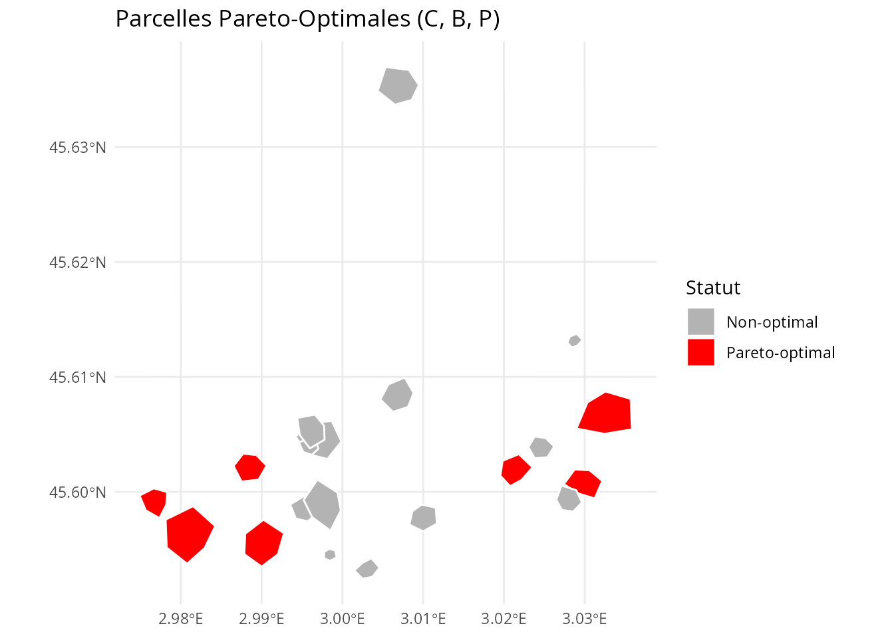
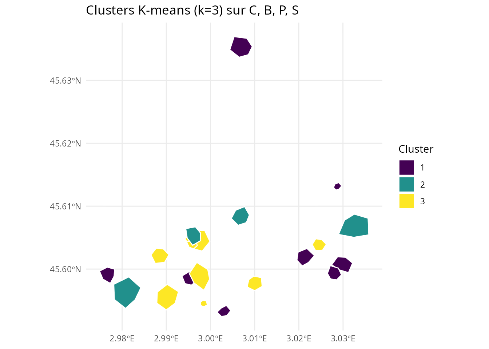
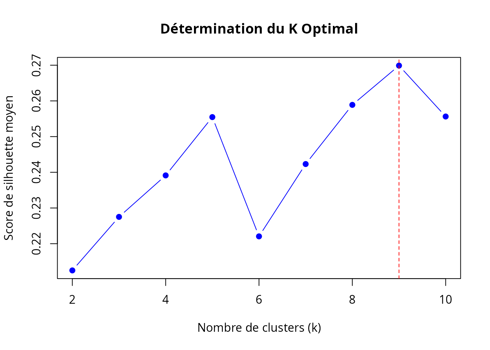
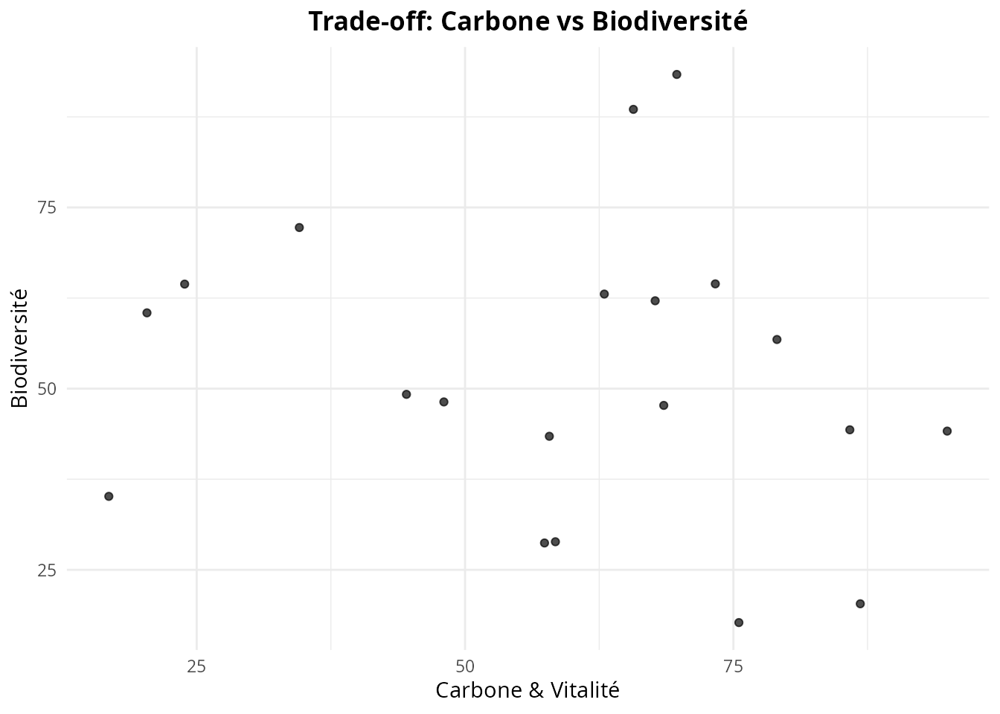
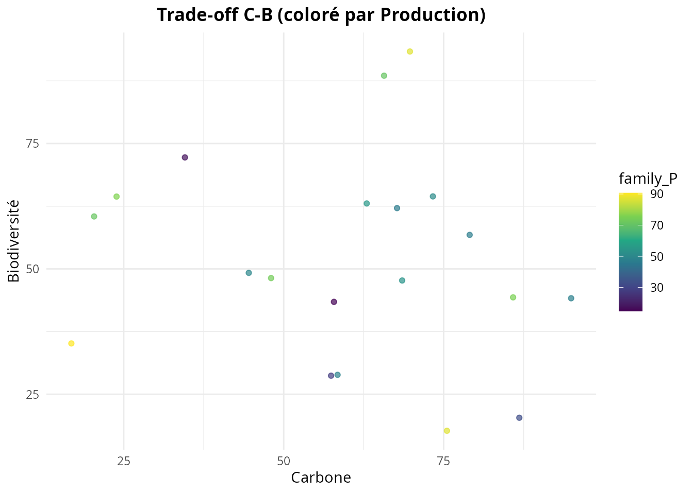
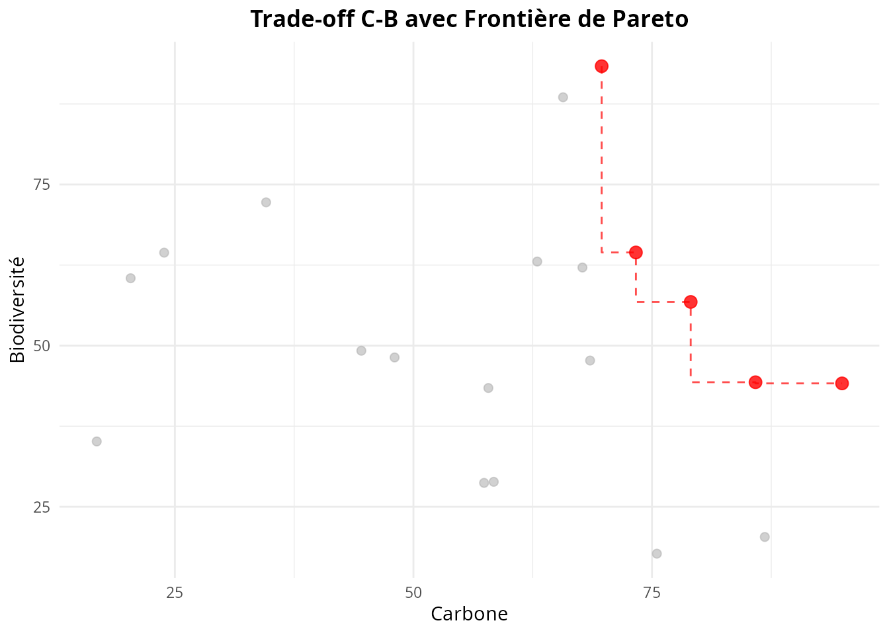
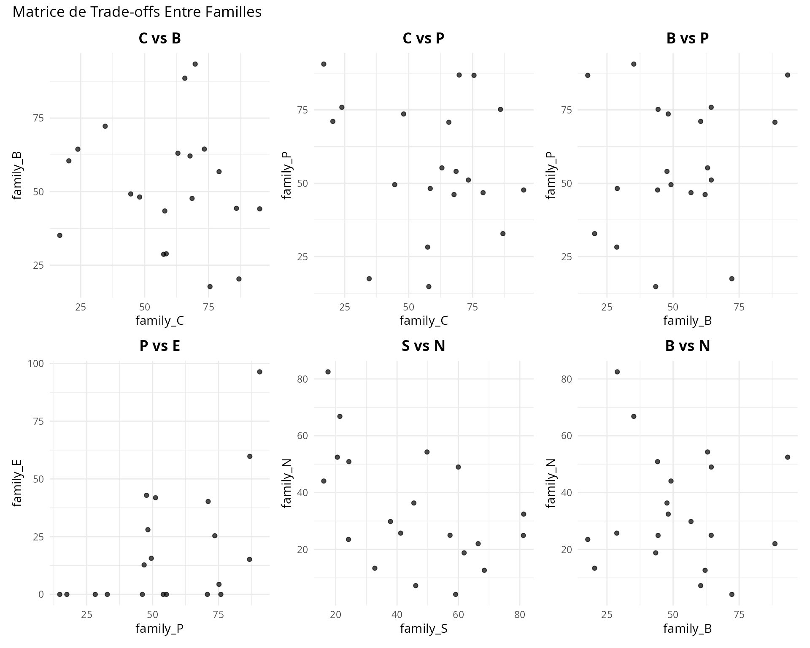
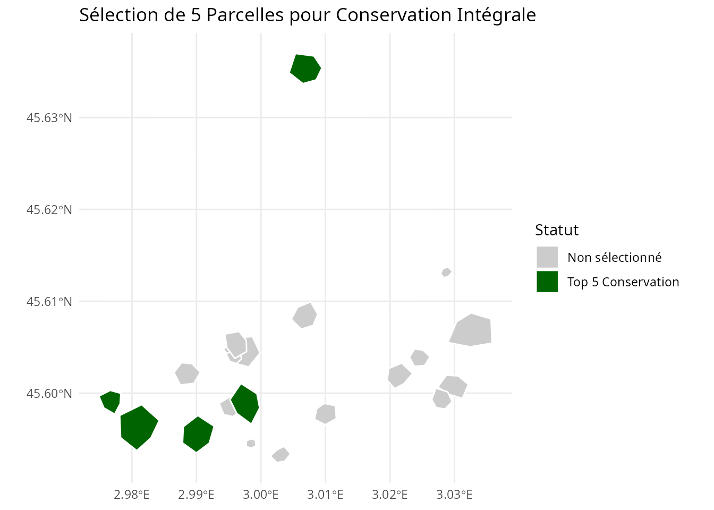
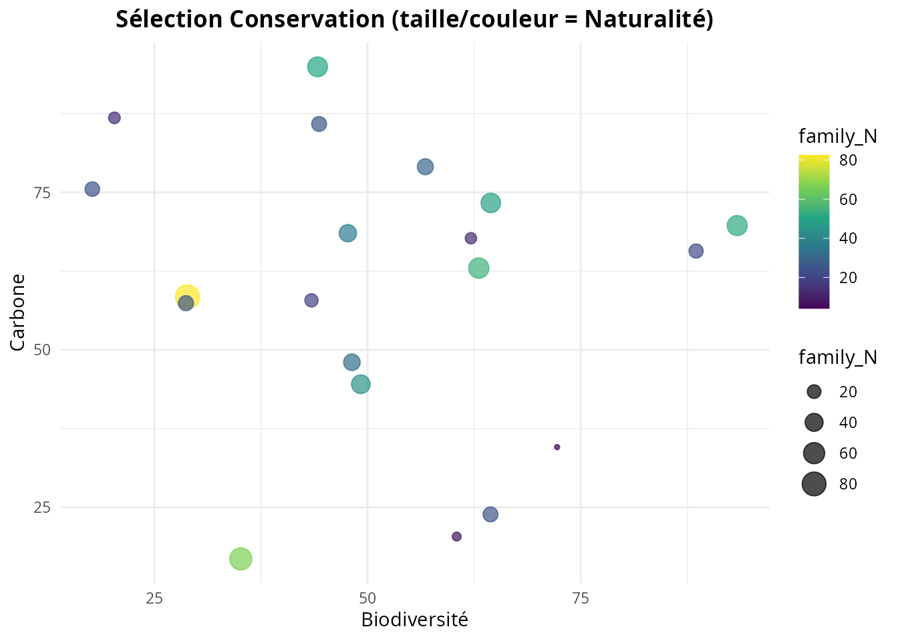
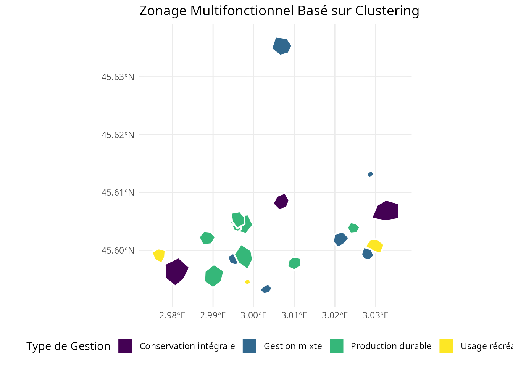

# Optimisation Multi-Critères

## Introduction

La gestion forestière durable nécessite souvent d’équilibrer des
objectifs multiples et potentiellement conflictuels : production de
bois, conservation de la biodiversité, services récréatifs,
séquestration du carbone, etc.

Cette vignette présente les outils d’**optimisation multi-critères** du
package `nemeton` (v0.4.0) :

1.  **Analyse de Pareto** : Identifier les solutions non-dominées
    (optimales)
2.  **Clustering** : Regrouper les parcelles selon leurs profils
    multi-familles
3.  **Trade-off Analysis** : Visualiser les compromis entre objectifs

``` r
library(nemeton)
library(ggplot2)
library(dplyr)

# Le jeu de données étendu est disponible via LazyData
```

## 1. Analyse de Pareto Optimality

### Concept

Une parcelle est **Pareto-optimale** (non-dominée) si aucune autre
parcelle n’est strictement meilleure sur tous les objectifs
simultanément. Ces parcelles forment la **frontière de Pareto** -
l’ensemble des meilleures solutions possibles où améliorer un objectif
nécessite de dégrader au moins un autre.

### Identifier les Parcelles Pareto-Optimales

``` r
# Exemple 1: Maximiser Carbon (C), Biodiversité (B), et Production (P)
result_pareto <- identify_pareto_optimal(
  massif_demo_units_extended,
  objectives = c("family_C", "family_B", "family_P"),
  maximize = c(TRUE, TRUE, TRUE)
)

# Combien de parcelles sont Pareto-optimales ?
table(result_pareto$is_optimal)
#> 
#> FALSE  TRUE 
#>    13     7

# Quelles parcelles sont optimales ?
result_pareto %>%
  sf::st_drop_geometry() %>%
  filter(is_optimal) %>%
  select(name, family_C, family_B, family_P, is_optimal)
#>        name family_C family_B family_P is_optimal
#> 1 Parcel_01 94.92197 44.14061 47.68739       TRUE
#> 2 Parcel_02 75.51266 17.71910 86.78162       TRUE
#> 3 Parcel_03 79.05953 56.77938 46.78139       TRUE
#> 4 Parcel_05 85.85022 44.31909 75.19072       TRUE
#> 5 Parcel_07 69.72693 93.35580 86.90201       TRUE
#> 6 Parcel_08 73.31753 64.45627 51.09994       TRUE
#> 7 Parcel_09 16.81178 35.13385 90.63200       TRUE
```

### Visualisation Spatiale

``` r
# Cartographier les parcelles Pareto-optimales
ggplot(result_pareto) +
  geom_sf(aes(fill = is_optimal), color = "white", size = 0.5) +
  scale_fill_manual(
    values = c("gray70", "red"),
    labels = c("Non-optimal", "Pareto-optimal"),
    name = "Statut"
  ) +
  labs(title = "Parcelles Pareto-Optimales (C, B, P)") +
  theme_minimal()
```



### Objectifs Mixtes (Maximisation + Minimisation)

``` r
# Exemple 2: Maximiser C et B, Minimiser Risque incendie (R1)
result_mixed <- identify_pareto_optimal(
  massif_demo_units_extended,
  objectives = c("family_C", "family_B", "R1"),
  maximize = c(TRUE, TRUE, FALSE)  # Minimiser R1
)

table(result_mixed$is_optimal)
#> 
#> FALSE  TRUE 
#>    14     6

# Profil des parcelles optimales
result_mixed %>%
  sf::st_drop_geometry() %>%
  filter(is_optimal) %>%
  select(name, family_C, family_B, R1, is_optimal)
#>        name family_C family_B R1 is_optimal
#> 1 Parcel_01 94.92197 44.14061  1       TRUE
#> 2 Parcel_03 79.05953 56.77938  2       TRUE
#> 3 Parcel_05 85.85022 44.31909  3       TRUE
#> 4 Parcel_07 69.72693 93.35580  4       TRUE
#> 5 Parcel_08 73.31753 64.45627  2       TRUE
#> 6 Parcel_12 65.68338 88.53671  1       TRUE
```

## 2. Clustering de Parcelles

### K-means Clustering

Le clustering K-means regroupe les parcelles ayant des profils
similaires sur plusieurs familles d’indicateurs.

``` r
# Clustering avec k=3 prédéfini
result_kmeans <- cluster_parcels(
  massif_demo_units_extended,
  families = c("family_C", "family_B", "family_P", "family_S"),
  k = 3,
  method = "kmeans"
)

# Distribution des clusters
table(result_kmeans$cluster)
#> 
#> 1 2 3 
#> 8 4 8

# Profil moyen de chaque cluster
profiles <- attr(result_kmeans, "cluster_profile")
print(profiles)
#>   family_C family_B family_P family_S
#> 1 70.64928 36.67757 49.25494 29.92551
#> 2 32.69497 63.34291 81.12851 36.32015
#> 3 61.99780 60.78833 50.53400 66.00966
```

### Visualisation des Clusters

``` r
# Carte des clusters
ggplot(result_kmeans) +
  geom_sf(aes(fill = factor(cluster)), color = "white", size = 0.5) +
  scale_fill_viridis_d(name = "Cluster") +
  labs(title = "Clusters K-means (k=3) sur C, B, P, S") +
  theme_minimal()
```



### Auto-détermination du K Optimal

Utiliser l’analyse de silhouette pour trouver automatiquement le nombre
optimal de clusters :

``` r
# Laisser l'algorithme déterminer k optimal
result_auto <- cluster_parcels(
  massif_demo_units_extended,
  families = c("family_C", "family_B", "family_P", "family_S"),
  k = NULL,  # Auto-détermination
  method = "kmeans"
)

# K optimal déterminé
optimal_k <- attr(result_auto, "optimal_k")
print(paste("K optimal:", optimal_k))
#> [1] "K optimal: 9"

# Scores de silhouette pour chaque k testé
silhouette_scores <- attr(result_auto, "silhouette_scores")
print(silhouette_scores)
#>         2         3         4         5         6         7         8         9 
#> 0.2125173 0.2275088 0.2391278 0.2554618 0.2220507 0.2423108 0.2588862 0.2698886 
#>        10 
#> 0.2556270

# Visualiser les scores de silhouette
k_values <- as.integer(names(silhouette_scores))
plot(k_values, silhouette_scores,
     type = "b", pch = 19, col = "blue",
     xlab = "Nombre de clusters (k)",
     ylab = "Score de silhouette moyen",
     main = "Détermination du K Optimal")
abline(v = optimal_k, col = "red", lty = 2)
```



### Clustering Hiérarchique

Alternative au K-means utilisant la méthode de Ward :

``` r
# Clustering hiérarchique
result_hclust <- cluster_parcels(
  massif_demo_units_extended,
  families = c("family_C", "family_B", "family_P", "family_S"),
  k = 3,
  method = "hierarchical"
)

# Comparer avec K-means
comparison <- data.frame(
  kmeans = result_kmeans$cluster,
  hierarchical = result_hclust$cluster
)
table(comparison)
#>       hierarchical
#> kmeans 1 2 3
#>      1 5 3 0
#>      2 0 1 3
#>      3 0 8 0
```

### Interprétation des Clusters

``` r
# Analyser les profils des clusters
profiles_kmeans <- attr(result_kmeans, "cluster_profile")

# Identifier les caractéristiques de chaque cluster
for (i in 1:nrow(profiles_kmeans)) {
  cat("\n=== Cluster", i, "===\n")
  cat("Carbone (C):", round(profiles_kmeans[i, "family_C"], 2), "\n")
  cat("Biodiversité (B):", round(profiles_kmeans[i, "family_B"], 2), "\n")
  cat("Production (P):", round(profiles_kmeans[i, "family_P"], 2), "\n")
  cat("Social (S):", round(profiles_kmeans[i, "family_S"], 2), "\n")

  # Interprétation
  if (profiles_kmeans[i, "family_B"] > 0.7 && profiles_kmeans[i, "family_C"] > 0.7) {
    cat("→ Type: Haute conservation\n")
  } else if (profiles_kmeans[i, "family_P"] > 0.7) {
    cat("→ Type: Production intensive\n")
  } else if (profiles_kmeans[i, "family_S"] > 0.7) {
    cat("→ Type: Usage récréatif\n")
  } else {
    cat("→ Type: Usage mixte/équilibré\n")
  }
}
#> 
#> === Cluster 1 ===
#> Carbone (C): 70.65 
#> Biodiversité (B): 36.68 
#> Production (P): 49.25 
#> Social (S): 29.93 
#> → Type: Haute conservation
#> 
#> === Cluster 2 ===
#> Carbone (C): 32.69 
#> Biodiversité (B): 63.34 
#> Production (P): 81.13 
#> Social (S): 36.32 
#> → Type: Haute conservation
#> 
#> === Cluster 3 ===
#> Carbone (C): 62 
#> Biodiversité (B): 60.79 
#> Production (P): 50.53 
#> Social (S): 66.01 
#> → Type: Haute conservation
```

## 3. Trade-off Analysis

### Visualiser les Compromis

Les trade-off plots révèlent les relations (synergies ou compromis)
entre paires de services écosystémiques.

``` r
# Trade-off entre Carbone et Biodiversité
plot_tradeoff(
  massif_demo_units_extended,
  x = "family_C",
  y = "family_B",
  xlab = "Carbone & Vitalité",
  ylab = "Biodiversité",
  title = "Trade-off: Carbone vs Biodiversité"
)
```



#### Interprétation

- **Corrélation positive** (points alignés diagonalement ↗️) : Synergie
- **Corrélation négative** (points alignés ↘️) : Trade-off/compromis
- **Nuage dispersé** : Pas de relation claire

### Trade-off avec Dimension Supplémentaire (Couleur)

``` r
# Ajouter une 3ème dimension (Production) via la couleur
plot_tradeoff(
  massif_demo_units_extended,
  x = "family_C",
  y = "family_B",
  color = "family_P",
  xlab = "Carbone",
  ylab = "Biodiversité",
  title = "Trade-off C-B (coloré par Production)"
)
```



### Overlay de la Frontière de Pareto

Combiner trade-off plot avec l’analyse de Pareto pour identifier
visuellement les meilleures solutions :

``` r
# D'abord identifier les parcelles Pareto-optimales
pareto_result <- identify_pareto_optimal(
  massif_demo_units_extended,
  objectives = c("family_C", "family_B"),
  maximize = c(TRUE, TRUE)
)

# Puis tracer avec frontière Pareto
plot_tradeoff(
  pareto_result,
  x = "family_C",
  y = "family_B",
  pareto_frontier = TRUE,
  xlab = "Carbone",
  ylab = "Biodiversité",
  title = "Trade-off C-B avec Frontière de Pareto"
)
```



Les points rouges (reliés par la ligne) sont Pareto-optimaux - ils
représentent les meilleures combinaisons possibles de C et B.

### Matrice de Trade-offs

Analyser plusieurs paires d’objectifs simultanément :

``` r
library(patchwork)

# Créer une matrice de trade-off plots
p1 <- plot_tradeoff(massif_demo_units_extended, "family_C", "family_B",
                     title = "C vs B") + theme(legend.position = "none")
p2 <- plot_tradeoff(massif_demo_units_extended, "family_C", "family_P",
                     title = "C vs P") + theme(legend.position = "none")
p3 <- plot_tradeoff(massif_demo_units_extended, "family_B", "family_P",
                     title = "B vs P") + theme(legend.position = "none")
p4 <- plot_tradeoff(massif_demo_units_extended, "family_P", "family_E",
                     title = "P vs E") + theme(legend.position = "none")
p5 <- plot_tradeoff(massif_demo_units_extended, "family_S", "family_N",
                     title = "S vs N") + theme(legend.position = "none")
p6 <- plot_tradeoff(massif_demo_units_extended, "family_B", "family_N",
                     title = "B vs N") + theme(legend.position = "none")

(p1 + p2 + p3) / (p4 + p5 + p6) +
  plot_annotation(title = "Matrice de Trade-offs Entre Familles")
```



### Étiquetage des Parcelles

Identifier des parcelles spécifiques sur le trade-off plot :

``` r
# Ajouter des labels pour les parcelles Pareto-optimales
plot_tradeoff(
  pareto_result,
  x = "family_C",
  y = "family_B",
  pareto_frontier = TRUE,
  label = "name",  # Afficher les noms
  xlab = "Carbone",
  ylab = "Biodiversité",
  title = "Parcelles Identifiées sur la Frontière de Pareto"
)
```


## 4. Cas d’Usage: Sélection de Parcelles pour Conservation

### Objectif

Identifier les **5 meilleures parcelles** pour un projet de conservation
intégrale maximisant simultanément la biodiversité, le carbone, et la
naturalité.

``` r
# Étape 1: Analyse de Pareto sur les 3 objectifs
conservation_pareto <- identify_pareto_optimal(
  massif_demo_units_extended,
  objectives = c("family_B", "family_C", "family_N"),
  maximize = c(TRUE, TRUE, TRUE)
)

# Combien de parcelles Pareto-optimales ?
n_optimal <- sum(conservation_pareto$is_optimal)
cat("Nombre de parcelles Pareto-optimales:", n_optimal, "\n")
#> Nombre de parcelles Pareto-optimales: 8

# Étape 2: Classer les parcelles Pareto-optimales par score composite
conservation_subset <- conservation_pareto %>%
  filter(is_optimal) %>%
  mutate(composite_score = (family_B + family_C + family_N) / 3) %>%
  arrange(desc(composite_score))

# Top 5 parcelles
top5 <- head(conservation_subset, 5)

top5 %>%
  sf::st_drop_geometry() %>%
  select(name, family_B, family_C, family_N, composite_score)
#>        name family_B family_C family_N composite_score
#> 1 Parcel_07 93.35580 69.72693 52.46156        71.84810
#> 2 Parcel_01 44.14061 94.92197 50.88637        63.31632
#> 3 Parcel_08 64.45627 73.31753 48.98929        62.25436
#> 4 Parcel_18 63.04992 62.97529 54.28779        60.10433
#> 5 Parcel_04 28.87016 58.41750 82.49126        56.59298
```

### Visualisation de la Sélection

``` r
# Cartographier les 5 parcelles sélectionnées
conservation_pareto <- conservation_pareto %>%
  mutate(
    selected = name %in% top5$name
  )

ggplot(conservation_pareto) +
  geom_sf(aes(fill = selected), color = "white", size = 0.5) +
  scale_fill_manual(
    values = c("gray80", "darkgreen"),
    labels = c("Non sélectionné", "Top 5 Conservation"),
    name = "Statut"
  ) +
  labs(title = "Sélection de 5 Parcelles pour Conservation Intégrale") +
  theme_minimal()
```



### Trade-off Plot de la Sélection

``` r
# Visualiser les parcelles sélectionnées sur le trade-off B-C
plot_tradeoff(
  conservation_pareto,
  x = "family_B",
  y = "family_C",
  color = "family_N",
  size = "family_N",
  xlab = "Biodiversité",
  ylab = "Carbone",
  title = "Sélection Conservation (taille/couleur = Naturalité)"
)
```



## 5. Cas d’Usage: Zonage Multifonctionnel

### Objectif

Créer un **zonage** de 4 types de gestion basé sur les profils
multi-familles des parcelles.

``` r
# Clustering sur 8 familles représentatives
zonage <- cluster_parcels(
  massif_demo_units_extended,
  families = c("family_C", "family_B", "family_W", "family_N",  # Conservation
               "family_P", "family_E",                            # Production
               "family_S", "family_A"),                           # Social
  k = 4,
  method = "kmeans"
)

# Profils des zones
profiles_zonage <- attr(zonage, "cluster_profile")
print(profiles_zonage)
#>   family_C family_B family_W family_N family_P  family_E family_S family_A
#> 1 35.63441 62.98255 49.48810 42.18054 82.87250 65.451418 29.33653 74.05585
#> 2 57.75064 63.41323 43.62682 28.05449 58.17645  8.948895 65.43480 42.88935
#> 3 77.27847 48.11494 12.60870 33.16677 36.40858 18.554559 41.34474 42.24662
#> 4 65.20213 32.08343 53.14786 37.58738 49.92845  9.802700 29.53996 65.46039

# Attribuer des noms de zones selon les profils
zonage <- zonage %>%
  mutate(
    zone_name = case_when(
      cluster == 1 ~ "Conservation intégrale",
      cluster == 2 ~ "Production durable",
      cluster == 3 ~ "Usage récréatif",
      cluster == 4 ~ "Gestion mixte",
      TRUE ~ paste("Zone", cluster)
    )
  )

table(zonage$zone_name)
#> 
#> Conservation intégrale          Gestion mixte     Production durable 
#>                      3                      6                      8 
#>        Usage récréatif 
#>                      3
```

### Carte du Zonage

``` r
ggplot(zonage) +
  geom_sf(aes(fill = zone_name), color = "white", size = 0.8) +
  scale_fill_viridis_d(name = "Type de Gestion") +
  labs(title = "Zonage Multifonctionnel Basé sur Clustering") +
  theme_minimal() +
  theme(legend.position = "bottom")
```



### Statistiques par Zone

``` r
# Résumer les caractéristiques de chaque zone
zonage %>%
  sf::st_drop_geometry() %>%
  group_by(zone_name) %>%
  summarise(
    n_parcelles = n(),
    C_mean = mean(family_C, na.rm = TRUE),
    B_mean = mean(family_B, na.rm = TRUE),
    P_mean = mean(family_P, na.rm = TRUE),
    S_mean = mean(family_S, na.rm = TRUE),
    N_mean = mean(family_N, na.rm = TRUE)
  ) %>%
  mutate(across(where(is.numeric), ~ round(., 2)))
#> # A tibble: 4 × 7
#>   zone_name              n_parcelles C_mean B_mean P_mean S_mean N_mean
#>   <chr>                        <dbl>  <dbl>  <dbl>  <dbl>  <dbl>  <dbl>
#> 1 Conservation intégrale           3   35.6   63.0   82.9   29.3   42.2
#> 2 Gestion mixte                    6   65.2   32.1   49.9   29.5   37.6
#> 3 Production durable               8   57.8   63.4   58.2   65.4   28.0
#> 4 Usage récréatif                  3   77.3   48.1   36.4   41.3   33.2
```

## Conclusion

Cette vignette a présenté les outils d’optimisation multi-critères du
package `nemeton` (v0.4.0) :

1.  **Analyse de Pareto** : Identifier les solutions non-dominées pour
    guider les choix de gestion
2.  **Clustering** : Créer des typologies de parcelles et des zonages
    multifonctionnels
3.  **Trade-off Analysis** : Visualiser et quantifier les compromis
    entre services écosystémiques

Ces outils permettent de :

- **Objectiver** les décisions de gestion forestière avec une approche
  scientifique rigoureuse
- **Communiquer** les compromis inévitables entre objectifs conflictuels
- **Optimiser** l’allocation spatiale des usages forestiers à l’échelle
  du territoire
- **Identifier** les parcelles stratégiques pour différents objectifs de
  gestion

## Références

- Obstétar, P. (2025). *nemeton: Ecosystem Services Assessment for
  Forest Management*. R package version 0.4.0.
- Miettinen, K. (1998). *Nonlinear Multiobjective Optimization*.
  Springer.
- Jain, A. K., Murty, M. N., & Flynn, P. J. (1999). *Data clustering: a
  review*. ACM Computing Surveys, 31(3), 264-323.
- Poff, N. L., et al. (2010). *The ecological limits of hydrologic
  alteration*. Freshwater Biology, 55(1), 147-170.
