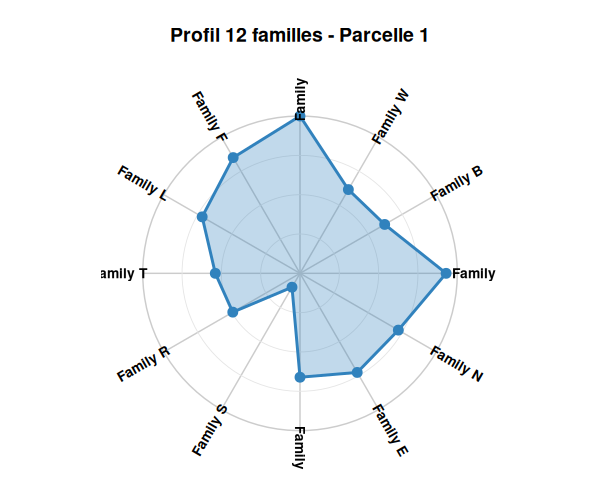
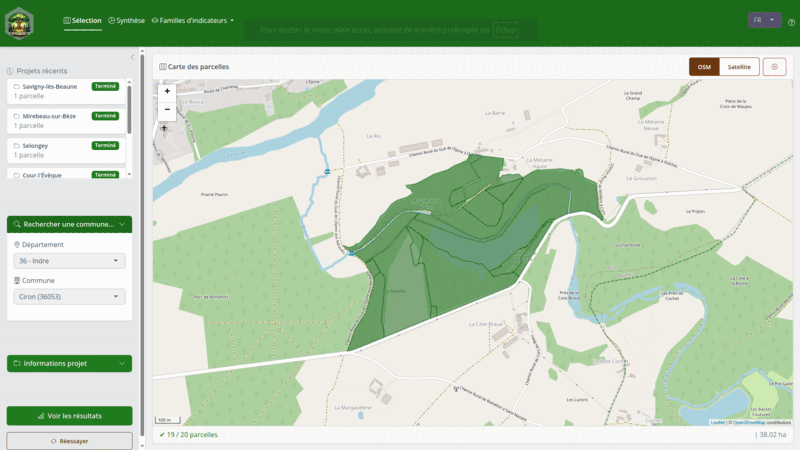

# nemeton

> **Analyse systémique de territoires forestiers selon la méthode
> Nemeton**

`nemeton` est un package R pour l’analyse intégrée d’écosystèmes
forestiers. Il calcule, normalise et visualise des **indicateurs
biophysiques multi-famille** pour la gestion forestière durable.

## Fonctionnalités

**12 familles d’indicateurs** avec 31 sous-indicateurs :

| Famille | Description           | Indicateurs |
|---------|-----------------------|-------------|
| **C**   | Carbone & Vitalité    | C1-C2       |
| **B**   | Biodiversité          | B1-B3       |
| **W**   | Eau & Régulation      | W1-W3       |
| **A**   | Air & Microclimat     | A1-A2       |
| **F**   | Fertilité Sols        | F1-F2       |
| **L**   | Paysage               | L1-L2       |
| **T**   | Temporel              | T1-T2       |
| **R**   | Risques & Résilience  | R1-R3       |
| **S**   | Social & Usages       | S1-S3       |
| **P**   | Production & Économie | P1-P3       |
| **E**   | Énergie & Climat      | E1-E2       |
| **N**   | Naturalité            | N1-N3       |

**Outils d’analyse** : Pareto, clustering, trade-offs, radar 12-axes,
corrélations.

## Installation

``` r
# install.packages("remotes")
remotes::install_github("pobsteta/nemeton")
```

**Prérequis** : R \>= 4.1.0, `sf`, `terra`, `ggplot2`

## Quick Start

``` r
library(nemeton)

# Charger le dataset de démonstration (20 parcelles, 12 familles)
data(massif_demo_units)

# Visualiser le profil radar d'une parcelle
nemeton_radar(massif_demo_units, unit_id = 1, mode = "family")
```



``` r
# Identifier les parcelles Pareto-optimales
pareto <- identify_pareto_optimal(
  massif_demo_units,
  objectives = c("family_C", "family_B"),
  maximize = c(TRUE, TRUE)
)

# Trade-offs avec frontière de Pareto
plot_tradeoff(pareto, x = "family_C", y = "family_B", pareto_frontier = TRUE)
```


## Application Interactive (nemetonApp)

Pour une utilisation sans code, lancez l’application Shiny :

``` r
library(nemeton)
run_app()
```

L’application permet de :

- Rechercher et sélectionner des parcelles cadastrales par commune
- Calculer automatiquement les 31 indicateurs (12 familles)
- Visualiser les résultats (radar, cartes, histogrammes)
- Exporter en PDF ou GeoPackage (auto-sauvegarde dans `exports/`)
- Commenter chaque famille avec assistance IA (ellmer)
- Consulter les profils d’experts personnalisables (YAML)



## Workflow avec vos données

``` r
library(nemeton)
library(sf)

# 1. Créer les unités d'analyse
units <- nemeton_units("parcelles.gpkg")

# 2. Cataloguer les couches spatiales
layers <- nemeton_layers(
  rasters = list(biomass = "biomass.tif", dem = "dem.tif"),
  vectors = list(roads = "roads.gpkg", water = "water.gpkg")
)

# 3. Calculer les indicateurs
results <- nemeton_compute(units, layers, indicators = "all")

# 4. Normaliser (échelle 0-100)
normalized <- normalize_indicators(results, method = "minmax")

# 5. Créer un indice composite
health <- create_composite_index(
  normalized,
  indicators = c("carbon_norm", "biodiversity_norm", "water_norm"),
  name = "ecosystem_health"
)

# 6. Visualiser
plot_indicators_map(health, indicators = "ecosystem_health", palette = "RdYlGn")
```

## Documentation

``` r
# Vignettes
vignette("getting-started_fr", package = "nemeton")
vignette("nemetonapp-guide_fr", package = "nemeton")
vignette("indicator-families_fr", package = "nemeton")
vignette("temporal-analysis_fr", package = "nemeton")

# Aide
?nemeton_compute
?create_family_index
?run_app
```

## Licence

MIT - Voir [LICENSE](https://pobsteta.github.io/nemeton/LICENSE)

## Citation

    Obstetar, P. (2026). nemeton: Systemic Forest Analysis Using the Nemeton Method.
    R package version 0.13.0. https://github.com/pobsteta/nemeton

------------------------------------------------------------------------

**Developpe avec** ❤️ **et** [Claude
Code](https://claude.com/claude-code)
