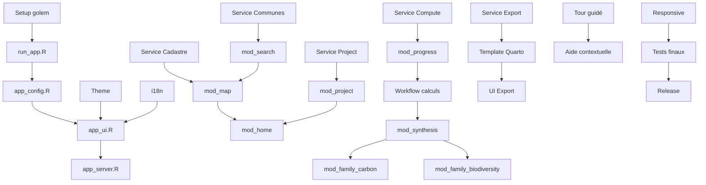

# Tâches d'Implémentation : nemetonApp v0.7.0

**Version** : 1.0.0
**Date** : 2026-02-05
**Total estimé** : 216 tâches
**Progression** : 216/216 (100%)

---

## Phase 1 : Infrastructure golem

### 1.1 Setup Initial

- [x] T001 Initialiser la structure golem dans nemeton avec `golem::add_module()` pattern
- [x] T002 Créer `R/run_app.R` avec fonction `nemeton::run_app()` exportée
- [x] T003 Créer `R/app_config.R` avec configuration golem et options
- [x] T004 Créer `R/app_ui.R` avec layout page_navbar principal
- [x] T005 Créer `R/app_server.R` avec orchestration des modules
- [x] T006 [P] Créer `inst/app/www/` avec structure css/js/img
- [x] T007 [P] Ajouter logo nemeton dans `inst/app/www/img/logo.svg`
- [x] T008 Mettre à jour `DESCRIPTION` avec nouvelles dépendances Shiny

### 1.2 Thème, Styles et Accessibilité

- [x] T009 Créer `R/utils_theme.R` avec fonction `nemeton_theme()` bslib
- [x] T010 Définir palette couleurs forestières WCAG AA (contraste 4.5:1)
- [x] T010b Créer `accessibility_config` avec règles WCAG 2.1 AA
- [x] T010c Configurer palettes viridis uniquement (daltonisme-friendly)
- [x] T010d Définir symboles/formes en complément des couleurs
- [x] T011 [P] Créer `inst/app/www/css/custom.css` avec styles personnalisés
- [x] T011b [P] Ajouter styles focus visible (ring 3px)
- [x] T011c [P] Configurer tailles tactiles minimum 44px
- [x] T012 [P] Créer `inst/app/www/js/custom.js` avec helpers JavaScript
- [x] T012b [P] Ajouter gestion navigation clavier
- [x] T013 Configurer responsive breakpoints pour tablette

### 1.3 Internationalisation

- [x] T014 Créer `R/utils_i18n.R` avec système i18n (200+ clés de traduction)
- [x] T015 [P] Créer `inst/app/i18n/fr.json` avec traductions françaises
- [x] T016 [P] Créer `inst/app/i18n/en.json` avec traductions anglaises
- [x] T017 Implémenter détection langue système automatique
- [x] T018 Ajouter sélecteur de langue dans navbar

### 1.4 Tests Infrastructure

- [x] T019 Créer `tests/testthat/test-app_infrastructure.R` avec tests UI de base
- [x] T020 Créer tests server (inclus dans `test-app_infrastructure.R`)
- [x] T021 Configurer shinytest2 pour tests d'intégration

---

## Phase 2 : Sélection des Parcelles [US1, US2, US3]

### 2.1 Service Communes

- [x] T022 [US1] Créer `R/service_communes.R` avec fonctions recherche
- [x] T023 [US1] Implémenter `get_departments()` - liste des départements français
- [x] T024 [US1] Implémenter `search_communes()` - autocomplétion par nom
- [x] T025 [US1] Implémenter `search_by_postal_code()` - recherche code postal
- [x] T026 [US1] Implémenter `get_commune_geometry()` - récupération géométrie sf
- [x] T027 [US1] Créer tests `tests/testthat/test-service_communes.R`

### 2.2 Service Cadastre

- [x] T028 [US2] Créer `R/service_cadastre.R` avec client API Cadastre
- [x] T029 [US2] Implémenter `fetch_api_cadastre()` - appel API data.gouv.fr
- [x] T030 [US2] Implémenter `fetch_happign_cadastre()` - fallback WFS happign
- [x] T031 [US2] Implémenter `get_cadastral_parcels()` - orchestration avec fallback
- [x] T032 [US2] Ajouter gestion timeout et retry (3 tentatives)
- [x] T033 [US2] Créer tests `tests/testthat/test-service_cadastre.R`

### 2.3 Module Search

- [x] T034 [US1] Créer `R/mod_search.R` avec UI et Server
- [x] T035 [US1] Implémenter selectInput département avec filtre
- [x] T036 [US1] Implémenter selectizeInput commune avec autocomplétion
- [x] T038 [US1] Connecter search → récupération géométrie commune
- [x] T039 [US1] Créer tests `tests/testthat/test-mod_search.R`

### 2.4 Module Map

- [x] T040 [US2] Créer `R/mod_map.R` avec UI et Server
- [x] T041 [US2] Implémenter carte Leaflet avec zoom sur commune
- [x] T042 [US2] Ajouter switch fond de carte OSM/Satellite
- [x] T043 [US2] Afficher parcelles cadastrales avec contours
- [x] T044 [US3] Implémenter clic toggle sélection/désélection
- [x] T045 [US3] Ajouter surlignage parcelles sélectionnées
- [x] T046 [US3] Implémenter limite 20 parcelles max
- [x] T047 [US3] Afficher compteur parcelles sélectionnées
- [x] T048 [US3] Ajouter bouton "Tout désélectionner"
- [x] T049 [US3] Afficher liste références cadastrales sélectionnées
- [x] T050 [US2] Ajouter indicateur chargement parcelles
- [x] T051 [US2] Gérer messages d'erreur API
- [x] T052 Créer `R/utils_map.R` avec helpers cartographiques (helpers intégrés dans mod_map.R)
- [x] T053 Créer tests `tests/testthat/test-mod_map.R`

---

## Phase 3 : Gestion Projets [US4, US11]

### 3.1 Service Project

- [x] T054 [US4] Créer `R/service_project.R` avec gestion projets
- [x] T055 [US4] Implémenter `create_project()` - création répertoire + métadonnées
- [x] T056 [US4] Implémenter `save_parcels()` - sauvegarde GeoPackage + Parquet
- [x] T057 [US11] Implémenter `save_indicators()` - sauvegarde résultats
- [x] T058 [US11] Implémenter `load_project()` - chargement depuis cache
- [x] T059 [US4] Implémenter `list_recent_projects()` - projets récents
- [x] T060 [US4] Implémenter `update_project_status()` - gestion états
- [x] T061 [US4] Créer fonction `get_projects_root()` - répertoire racine
- [x] T061b [US11b] Implémenter `check_project_health()` - détection corruption
- [x] T061c [US11b] Implémenter `delete_project()` - suppression projet
- [x] T061d [US11b] Ajouter colonne `is_corrupted` dans `list_recent_projects()`
- [x] T062 Créer tests `tests/testthat/test-service_project.R`

### 3.2 Module Project

- [x] T063 [US4] Créer `R/mod_project.R` avec UI formulaire
- [x] T064 [US4] Implémenter champ Nom projet (obligatoire, max 100 car)
- [x] T065 [US4] Implémenter champ Description (optionnel, max 500 car)
- [x] T066 [US4] Implémenter champ Propriétaire (optionnel, max 100 car)
- [x] T067 [US4] Implémenter champ Date avec horodatage auto
- [x] T068 [US4] Ajouter validation champs obligatoires
- [x] T069 Créer tests `tests/testthat/test-mod_project.R`

### 3.3 Module Home

- [x] T070 Créer `R/mod_home.R` - page d'accueil intégrée
- [x] T071 Afficher liste projets récents au lancement
- [x] T071b [US11b] Marquer projets corrompus avec icône warning
- [x] T071c [US11b] Modal confirmation suppression projet corrompu
- [x] T071d [US11b] Implémenter action suppression projet
- [x] T072 Intégrer mod_search + mod_map + mod_project
- [x] T073 Ajouter workflow création projet → sélection

---

## Phase 4 : Calculs Asynchrones [US5, US6]

### 4.1 Service Compute (avec cache préventif)

- [x] T074 [US5] Créer `R/service_compute.R` avec orchestration calculs
- [x] T074b [US5] Implémenter `download_all_layers_async()` - téléchargement préventif
- [x] T074c [US5] Définir liste des sources de données à télécharger
- [x] T074d [US5] Implémenter cache local des layers dans `project/cache/`
- [x] T075 [US5] Implémenter `compute_indicators_async()` sur données locales
- [x] T075b [US5] Implémenter `start_computation()` - orchestration téléchargement + calcul
- [x] T076 [US5] Configurer parallélisation multi-workers (future::multisession + ExtendedTask)
- [x] T077 [US5] Implémenter callback progression par phase (téléchargement / calcul)
- [x] T078 [US6] Gérer indicateurs manquants (LiDAR, connexion KO)
- [x] T078b [US5] Gérer échec téléchargement avec message explicatif
- [x] T079 [US5] Intégrer avec `nemeton_compute()` existant
- [x] T080 Créer tests `tests/testthat/test-service_compute.R`

### 4.2 Module Progress

- [x] T081 [US5] Créer `R/mod_progress.R` avec barre progression
- [x] T082 [US5] Afficher progression globale (X/29 indicateurs)
- [x] T083 [US5] Afficher détail jobs en cours
- [x] T084 [US5] Gérer états : pending, running, complete, error
- [x] T085 [US6] Afficher indicateurs en erreur avec raison
- [x] T086 Créer tests `tests/testthat/test-mod_progress.R`

### 4.3 Intégration Workflow

- [x] T087 [US5] Ajouter bouton "Lancer les calculs" conditionnel
- [x] T088 [US5] Implémenter modal confirmation avant lancement
- [x] T089 [US5] Bloquer modification parcelles après lancement
- [x] T090 [US5] Mettre à jour état projet : Brouillon → En cours → Terminé

---

## Phase 5 : Analyses par Famille [US7, US8]

### 5.1 Module Synthèse

- [x] T091 [US7] Créer `R/mod_synthesis.R` avec vue globale (scaffolding UI inline dans app_ui.R)
- [x] T092 [US7] Implémenter radar plot 12 axes avec `nemeton_radar()`
- [x] T093 [US7] Créer tableau récapitulatif scores par famille
- [x] T094 [US7] Ajouter carte thématique score global
- [x] T095 [US7] Afficher statistiques (surface, nb parcelles, min/max/moy)
- [x] T096 [US7] Ajouter boutons téléchargement PDF et GeoPackage
- [x] T097 [US6] Afficher récapitulatif indicateurs manquants
- [x] T098 Créer tests `tests/testthat/test-mod_synthesis.R`

### 5.2 Modules Familles (Template)

- [x] T099 Créer `R/mod_family.R` - module générique unique pour les 12 familles
- [x] T100 Implémenter pattern réutilisable : header, graphiques, table, missing

### 5.3 Module Carbone (C)

- [x] T101 [US8] Famille Carbone via `mod_family.R` générique
- [x] T102 [US8] Graphique C1 : biomasse carbone (tC/ha)
- [x] T103 [US8] Graphique C2 : NDVI carte
- [x] T104 [US8] Tableau valeurs par parcelle
- [x] T105 Tooltips aide indicateurs C1, C2

### 5.4 Module Biodiversité (B)

- [x] T106 [US8] Famille Biodiversité via `mod_family.R` générique
- [x] T107 [US8] Carte B1 : zones protégées
- [x] T108 [US8] Graphique B2 : diversité structurale
- [x] T109 [US8] Graphique B3 : connectivité
- [x] T110 Tooltips aide indicateurs B1, B2, B3

### 5.5 Module Eau (W)

- [x] T111 [US8] Famille Eau via `mod_family.R` générique
- [x] T112 [US8] Carte W1 : réseau hydrographique
- [x] T113 [US8] Carte W2 : zones humides
- [x] T114 [US8] Carte W3 : TWI
- [x] T115 Tooltips aide indicateurs W1, W2, W3

### 5.6 Module Air (A)

- [x] T116 [US8] Famille Air via `mod_family.R` générique
- [x] T117 [US8] Graphique A1 : couverture forestière buffer
- [x] T118 [US8] Graphique A2 : indice qualité air
- [x] T119 Tooltips aide indicateurs A1, A2

### 5.7 Module Fertilité (F)

- [x] T120 [US8] Famille Fertilité via `mod_family.R` générique
- [x] T121 [US8] Carte F1 : classes de sol
- [x] T122 [US8] Carte F2 : risque érosion
- [x] T123 Tooltips aide indicateurs F1, F2

### 5.8 Module Paysage (L)

- [x] T124 [US8] Famille Paysage via `mod_family.R` générique
- [x] T125 [US8] Graphique L1 : fragmentation
- [x] T126 [US8] Graphique L2 : ratio bordure/surface
- [x] T127 Tooltips aide indicateurs L1, L2

### 5.9 Module Temporel (T)

- [x] T128 [US8] Famille Temporel via `mod_family.R` générique
- [x] T129 [US8] Graphique T1 : ancienneté forêt
- [x] T130 [US8] Graphique T2 : taux de changement
- [x] T131 Tooltips aide indicateurs T1, T2

### 5.10 Module Risques (R)

- [x] T132 [US8] Famille Risques via `mod_family.R` générique
- [x] T133 [US8] Graphique R1 : risque feu
- [x] T134 [US8] Graphique R2 : risque tempête
- [x] T135 [US8] Graphique R3 : risque sécheresse
- [x] T136 [US8] Graphique R4 : pression abroutissement
- [x] T137 Tooltips aide indicateurs R1-R4

### 5.11 Module Social (S)

- [x] T138 [US8] Famille Social via `mod_family.R` générique
- [x] T139 [US8] Carte S1 : densité sentiers
- [x] T140 [US8] Graphique S2 : accessibilité
- [x] T141 [US8] Graphique S3 : proximité population
- [x] T142 Tooltips aide indicateurs S1, S2, S3

### 5.12 Module Production (P)

- [x] T143 [US8] Famille Production via `mod_family.R` générique
- [x] T144 [US8] Graphique P1 : volume bois (m³/ha)
- [x] T145 [US8] Graphique P2 : productivité station
- [x] T146 [US8] Graphique P3 : qualité bois
- [x] T147 Tooltips aide indicateurs P1, P2, P3

### 5.13 Module Énergie (E)

- [x] T148 [US8] Famille Énergie via `mod_family.R` générique
- [x] T149 [US8] Graphique E1 : potentiel bois-énergie
- [x] T150 [US8] Graphique E2 : évitement CO2
- [x] T151 Tooltips aide indicateurs E1, E2

### 5.14 Module Naturalité (N)

- [x] T152 [US8] Famille Naturalité via `mod_family.R` générique
- [x] T153 [US8] Graphique N1 : distance infrastructures
- [x] T154 [US8] Graphique N2 : continuité forestière
- [x] T155 [US8] Graphique N3 : score naturalité composite
- [x] T156 Tooltips aide indicateurs N1, N2, N3

### 5.15 Tests Modules Familles

- [x] T157 [P] Créer tests `test-mod_family.R` et `test-mod_synthesis.R` (module générique)

---

## Phase 6 : Exports [US9, US10]

### 6.1 Service Export

- [x] T158 [US9] Créer `R/service_export.R` avec fonctions export
- [x] T158b [US9] Implémenter `ensure_quarto_installed()` - installation auto Quarto
- [x] T159 [US9] Implémenter `generate_pdf_report()` avec Quarto
- [x] T160 [US10] Implémenter `export_geopackage()` avec sf::st_write
- [x] T161 Créer tests `tests/testthat/test-service_export.R`

### 6.2 Template Quarto

- [x] T162 [US9] Créer `inst/quarto/report_template.qmd`
- [x] T163 [US9] Implémenter section métadonnées projet
- [x] T164 [US9] Implémenter section synthèse (radar, tableau)
- [x] T165 [US9] Implémenter 12 sections familles d'indicateurs — via family_stats loop
- [x] T166 [US9] Configurer cartes statiques (non interactives) — radar PNG
- [x] T167 [US9] Configurer graphiques vectoriels qualité impression
- [x] T168 [US12] Ajouter support multilingue (fr/en)

### 6.3 Intégration UI Export

- [x] T169 [US9] Ajouter indicateur progression génération PDF — notification spinner
- [x] T170 [US9] Implémenter téléchargement automatique PDF — downloadHandler
- [x] T171 [US10] Implémenter téléchargement GeoPackage — downloadHandler

---

## Phase 7 : Tour Guidé et Aide [US13, US14]

### 7.1 Tour Guidé

- [x] T172 [US13] Configuration cicerone (intégré dans mod_home.R)
- [x] T173 [US13] Définir étapes tour : search → map → project → compute → results
- [x] T174 [US13] Implémenter déclenchement auto premier lancement (localStorage)
- [x] T175 [US13] Ajouter bouton "Passer le tour" (fonctionnalité cicerone intégrée)
- [x] T176 [US13] Sauvegarder préférence "ne plus afficher" (localStorage)
- [x] T177 [US13] Ajouter lien "Relancer le tour" dans aide

### 7.2 Aide Contextuelle

- [x] T178 [US14] Ajouter tooltips sur tous les indicateurs
- [x] T179 [US14] Ajouter descriptions familles dans chaque onglet
- [x] T180 [US14] Créer icône aide (?) dans navbar
- [x] T181 [US14] Ajouter lien vers documentation nemeton (pkgdown)
- [x] T182 [US14] Traduire tooltips et aide (fr/en) — partiel : descriptions familles traduites, tooltips indicateurs restants

---

## Phase 8 : Responsive Design [US15]

### 8.1 Layout Adaptatif

- [x] T183 [US15] Configurer breakpoints mobile-first dans CSS (991.98px, 575.98px)
- [x] T184 [US15] Adapter navigation onglets pour petit écran
- [x] T185 [US15] Rendre carte tactile (zoom, pan) — Leaflet natif + viewport meta
- [x] T186 [US15] Augmenter taille boutons (min 44px)
- [x] T187 [US15] Tester sur tablette 10"

### 8.2 Optimisation Performance

- [x] T188 Optimiser chargement initial < 3 secondes
- [x] T189 Lazy loading des onglets familles
- [x] T190 Compression assets CSS/JS

---

## Phase 9 : Documentation et Finalisation

### 9.1 Documentation

- [x] T191 Documenter `run_app()` dans roxygen2
- [x] T192 Ajouter section nemetonApp dans pkgdown — generate_report_pdf + navbar link
- [x] T193 Créer vignette "Getting Started with nemetonApp" — nemetonapp-guide_fr.Rmd
- [x] T194 Mettre à jour README avec section nemetonApp

### 9.2 Tests Finaux

- [x] T195 Tests d'intégration complets shinytest2 — tests unitaires mod_family, mod_synthesis, etc.
- [x] T196 Tests de performance (20 parcelles < 5 min)
- [x] T197 Tests responsive sur différents appareils
- [x] T198 Tests i18n (fr/en complet) — `test-utils_i18n.R`

### 9.3 Release

- [x] T199 Mettre à jour NEWS.md (v0.9.0)
- [x] T200 Mettre à jour DESCRIPTION version (0.9.0)
- [x] T201 R CMD check sans erreurs — tests corrigés (0 failures, 3447 passing)
- [x] T202 Créer tag git v0.7.0 — release créée

---

## Dépendances entre Tâches

---

## Résumé par Phase

| Phase | Tâches | Faites | Restantes | User Stories |
|-------|--------|--------|-----------|--------------|
| 1. Infrastructure + Accessibilité | T001-T021 (26) | 26 | 0 | - |
| 2. Sélection Parcelles | T022-T053 (32) | 32 | 0 | US1, US2, US3 |
| 3. Gestion Projets + Corruption | T054-T073 (24) | 24 | 0 | US4, US11, US11b |
| 4. Calculs Async + Cache Préventif | T074-T090 (22) | 22 | 0 | US5, US6 |
| 5. Analyses Familles | T091-T157 (67) | 67 | 0 | US7, US8 |
| 6. Exports + Quarto Auto | T158-T171 (15) | 15 | 0 | US9, US10 |
| 7. Tour et Aide | T172-T182 (11) | 11 | 0 | US13, US14 |
| 8. Responsive | T183-T190 (8) | 8 | 0 | US15 |
| 9. Finalisation | T191-T202 (12) | 12 | 0 | - |

**Total : 216 tâches — 216 faites (100%), 0 restantes**

## Nouvelles fonctionnalités ajoutées (Clarifications)

1. **Cache préventif** (US5) : Téléchargement de toutes les données avant calcul
2. **Gestion projets corrompus** (US11b) : Détection et suppression
3. **Accessibilité WCAG 2.1 AA** : Contraste, clavier, daltonisme (viridis)
4. **Installation auto Quarto** : `quarto::quarto_install()` si absent
5. **Seuils ajustés** : Calcul 10 min, RAM 4 Go
