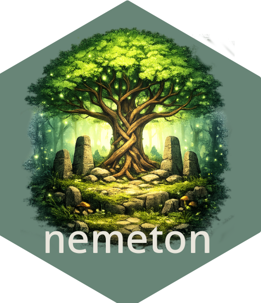

# nemeton 

<!-- badges: start -->
[](https://github.com/pobsteta/nemeton/actions/workflows/R-CMD-check.yaml)
[](https://github.com/pobsteta/nemeton/releases/tag/v0.2.0)
[](https://github.com/pobsteta/nemeton)
[](https://lifecycle.r-lib.org/articles/stages.html#experimental)
[](https://opensource.org/licenses/MIT)
<!-- badges: end -->

> **Systemic forest territory analysis using the Nemeton method**

`nemeton` is an R package for integrated analysis of forest ecosystems from open spatial data. It implements the Nemeton method to calculate, normalize, and visualize **multi-family biophysical indicators** essential for sustainable forest management.

## ✨ Key Features

- 🌳 **Multi-family system**: 12 indicator families (5 implemented: C, W, F, L + infrastructure)
- 📊 **15 sub-indicators**: Carbon (C1, C2), Water (W1-W3), Soils (F1-F2), Landscape (L1-L2) + legacy
- ⏱️ **Temporal analysis**: Multi-period datasets, change rate calculation, visualizations
- 📈 **Advanced normalization**: min-max, z-score, quantiles, by family, with reference
- 🎯 **Flexible aggregation**: 4 methods (mean, weighted, geometric, harmonic)
- 🗺️ **Rich visualizations**: Maps, multi-family radar charts, temporal trends, heatmaps
- 🔄 **Integrated workflow**: From raw data to composite indices
- 📦 **Production-ready**: 661 tests, >70% coverage, 100% backward compatible

## 📋 Prerequisites

- R ≥ 4.1.0
- Spatial packages: `sf`, `terra`, `exactextractr`
- Visualization: `ggplot2`, `tidyr`

## 🚀 Installation

```r
# From GitHub (development version)
# install.packages("remotes")
remotes::install_github("pobsteta/nemeton")
```

## 🎯 Quick Start

### Multi-Family Workflow v0.2.0 (Recommended)

```r
library(nemeton)

# Load demo dataset (136 ha, 20 forest parcels)
data(massif_demo_units)
layers <- massif_demo_layers()

# Compute indicators from 4 families
results <- nemeton_compute(
  massif_demo_units,
  layers,
  indicators = c("C1", "C2", "W1", "W2", "W3", "F1", "F2", "L1", "L2")
)

# Create family composite indices
family_scores <- create_family_index(results)

# Visualize with 12-family radar chart
nemeton_radar(family_scores, mode = "family")
```

### Temporal Analysis

```r
# Create multi-period dataset
temporal <- nemeton_temporal(
  periods = list(
    "2015" = units_2015,
    "2020" = units_2020,
    "2025" = units_2025
  ),
  id_column = "parcel_id"
)

# Calculate change rates
rates <- calculate_change_rate(
  temporal,
  indicators = c("carbon", "biodiversity"),
  type = "both"
)

# Visualize trends
plot_temporal_trend(temporal, indicator = "carbon")
```

## 📚 Documentation

Complete documentation with examples:

```r
# Main help page
?nemeton

# Browse vignettes
browseVignettes("nemeton")

# Specific vignettes
vignette("getting-started", package = "nemeton")
vignette("indicator-families", package = "nemeton")
vignette("temporal-analysis", package = "nemeton")
vignette("internationalization", package = "nemeton")
```

**Online documentation**: https://pobsteta.github.io/nemeton/

## 🌍 Internationalization

The package supports bilingual operation (French/English):

```r
# Set language
nemeton_set_language("en")  # English
nemeton_set_language("fr")  # French (default)

# Check current language
Sys.getenv("NEMETON_LANG")
```

See `vignette("internationalization")` for details.

## 📊 Indicator Families (12-Family Framework)

| Code | Family | Status v0.2.0 | Sub-indicators |
|------|--------|---------------|----------------|
| **C** | Carbon/Vitality | ✅ Implemented | C1 (biomass), C2 (NDVI) |
| **W** | Water | ✅ Implemented | W1 (network), W2 (wetlands), W3 (TWI) |
| **F** | Soil Fertility | ✅ Implemented | F1 (fertility), F2 (erosion) |
| **L** | Landscape | ✅ Partial | L1 (fragmentation), L2 (edge) |
| **B** | Biodiversity | ⏳ v0.3.0+ | - |
| **A** | Air/Microclimate | ⏳ v0.3.0+ | - |
| **T** | Time/Dynamics | ⏳ v0.3.0+ | - |
| **R** | Resilience/Risks | ⏳ v0.3.0+ | - |
| **S** | Social/Uses | ⏳ v0.4.0+ | - |
| **P** | Productive | ⏳ v0.4.0+ | - |
| **E** | Energy/Climate | ⏳ v0.4.0+ | - |
| **N** | Naturalness | ⏳ v0.3.0+ | - |

## 🛣️ Roadmap

- **v0.3.0** (Q1 2026): Families B, R, T, N (biodiversity, risks, dynamics, naturalness)
- **v0.4.0** (Q2 2026): Families S, P, A (social, productive, air quality)
- **v0.5.0** (Q3 2026): Family E, Shiny dashboard, complete framework

## 🤝 Contributing

Contributions are welcome! Please see:
- [Technical Specification](SPECIFICATION_TECHNIQUE.md)
- [Release Instructions](RELEASE_INSTRUCTIONS.md)
- [GitHub Issues](https://github.com/pobsteta/nemeton/issues)

## 📜 License

MIT License - See [LICENSE](LICENSE) file

## 📖 Citation

```r
citation("nemeton")
```

## 🙏 Acknowledgments

The Nemeton method was developed by **Vivre en Forêt** for systemic forest ecosystem assessment.

This package implements the method for reproducible spatial analysis with open data.

---

**Links**:
- 🌐 Website: https://pobsteta.github.io/nemeton/
- 📦 CRAN: *Coming soon*
- 🐛 Issues: https://github.com/pobsteta/nemeton/issues
- 📰 Changelog: [NEWS.md](NEWS.md)
